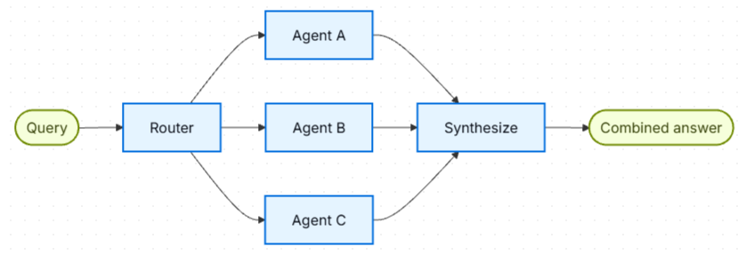
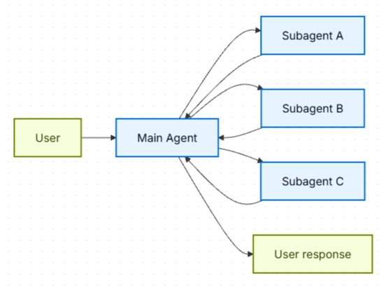

# LangChain/LangGraph AI Agents Notes

## Table of contents

- [Multi-Tool AI Agents: Building Block (or Foundation) for Multi-Agent Systems](#multi-tool-ai-agents-building-block-or-foundation-for-multi-agent-systems)
  - [Insights summary](#insights-summary)
  - [1. Query transformation](#1-query-transformation)
  - [2. Why multiple tool calls?](#2-why-multiple-tool-calls)
  - [3. What gives the LLM this freedom?](#3-what-gives-the-llm-this-freedom)
  - [4. Responsibilities](#4-responsibilities)
  - [5. Old ReAct approach](#5-old-react-approach)
  - [6. `RemainingSteps`](#6-remainingsteps)
  - [7. Old hard limit](#7-old-hard-limit)
  - [8. Current LangChain/LangGraph direction](#8-current-langchainlanggraph-direction)
  - [9. Current way to control limits](#9-current-way-to-control-limits)
  - [Mental model](#mental-model)
- [Hybrid Workflow-Agent Architecture with Custom LangGraph Workflows](#hybrid-workflow-agent-architecture-with-custom-langgraph-workflows)
  - [Explicit orchestration without a router or supervisor](#explicit-orchestration-without-a-router-or-supervisor)
  - [Agents as graph nodes](#agents-as-graph-nodes)
  - [Bounded loops](#bounded-loops)
  - [Hybrid architecture mental model](#hybrid-architecture-mental-model)
- [Multi-Agent System Patterns](#multi-agent-system-patterns)
  - [Agent tools](#agent-tools)
  - [Specialized agents](#specialized-agents)
  - [Router pattern](#router-pattern)
  - [Supervisor pattern](#supervisor-pattern)
  - [Router versus supervisor](#router-versus-supervisor)
  - [Workflow-like versus agentic orchestration](#workflow-like-versus-agentic-orchestration)
  - [Nested agent and tool hierarchy](#nested-agent-and-tool-hierarchy)
  - [Multi-agent mental model](#multi-agent-mental-model)

## Multi-Tool AI Agents: Building Block (or Foundation) for Multi-Agent Systems

### Insights summary

* LangGraph supports two common agent-building styles: explicit node-based graphs with predefined conditional routes, and ReAct-style agents that provide a ready-made reasoning-and-action loop with automatic tool selection.
* Tools are typically registered as Python functions whose type hints define the input schema and whose docstrings describe their purpose. The model uses this metadata to discover and invoke the appropriate function.
* The model chooses a tool by comparing the user's request with the available tool descriptions. Descriptions should therefore state clearly when a tool is appropriate, which arguments it accepts, and what it returns.
* A useful tool contract is specific and self-contained. For example: `search_customer(name: str) -> dict` finds customer records by name and should be used when a request concerns a particular customer's details.
* Inspecting agent state makes the execution path visible: which tool was selected, the arguments supplied to it, the result it produced, and how that result influenced the next tool call or final response. This is valuable for debugging and improving an agent.
* In a multi-tool workflow, the model can pass information through a sequence such as `search_customer` -> `get_orders` -> `calculate_total`. With clear tool contracts, the model can coordinate this sequence without application code hardcoding every transition.
* Tool chaining should still be verified with representative test prompts. If the model repeatedly chooses the wrong tool or order, refine the descriptions, schemas, and returned data rather than assuming the orchestration will always be correct.
* ReAct-style agents built on LangGraph include the tool-calling loop and support error and retry handling, which is often simpler than manually constructing nodes and conditional edges for routine agents.
* LangSmith and Langfuse provide observability for agent runs. Their traces can show the observable model and tool-call sequence, inputs, intermediate outputs, and final response in a timeline or span hierarchy.
* Trace metadata can include token usage, latency, and error status, depending on the model provider and instrumentation. These measurements help diagnose slow, expensive, or failed executions in both LangSmith and Langfuse.
* Tool-using agents are a building block for multi-agent systems. A researcher, writer, and reviewer can each receive a specialized tool set, while a supervisor coordinates their responsibilities and handoffs.
* Prefer returning dictionaries, lists, or other structured values from tools when practical. Structured output lets the model access named fields directly instead of extracting facts from free-form text.
* Tool-selection quality depends heavily on description quality. Run sample queries, inspect the resulting traces, and revise ambiguous descriptions when the agent selects an unsuitable tool.
* Tools should handle expected failures explicitly. Wrap fallible operations in appropriate exception handling and return a structured result such as `{"error": "Customer not found", "details": "..."}` so the agent can respond or recover consistently.

### 1. Query transformation

* The LLM itself can rewrite a user query into multiple search queries.
* Example:

  * `beach towns in Cornwall`
  * `best beaches in Cornwall`
  * `top seaside towns Cornwall`
* These variants are **not hardcoded** and are **not generated by LangGraph**.
* They are probabilistically generated by the LLM from the same tool description/schema.

### 2. Why multiple tool calls?

* The LLM decides how many tool calls to generate.
* There is no code like:

```python
for _ in range(3):
```

* It may generate 1, 2, 3, or more calls depending on the task and context.

### 3. What gives the LLM this freedom?

Old code:

```python
llm_with_tools = llm_model.bind_tools(TOOLS)
response = llm_with_tools.invoke(messages)
```

`bind_tools()` exposes:

* tool name
* description
* parameters/schema

The LLM then decides:

* whether to call a tool
* which tool
* how many calls
* what arguments/queries to generate

### 4. Responsibilities

```text
LLM
→ decides tool usage + generates query arguments

LangChain
→ exposes/binds tool schemas to the LLM

LangGraph
→ orchestrates and executes the tool/LLM loop
```

### 5. Old ReAct approach

```python
create_react_agent(...)
```

handled internally:

```text
LLM
 ↓
tool call
 ↓
tool execution
 ↓
tool result
 ↓
LLM again
 ↓
repeat or final answer
```

So no need to manually implement retries.

### 6. `RemainingSteps`

Old code:

```python
class AgentState(TypedDict):
    messages: ...
    remaining_steps: RemainingSteps
```

The code only **declared** it.

It did not manually:

* initialize it
* decrement it
* check it

LangGraph's prebuilt `create_react_agent()` managed it internally.

Conceptually:

```text
remaining_steps ≈ recursion_limit - steps_taken
```

So retries were **not unlimited**.

### 7. Old hard limit

The old LangGraph execution had a recursion/graph-step limit, commonly defaulting to around **25 graph steps**.

Therefore:

```text
LLM → tool → LLM → tool → ...
```

could not continue forever.

### 8. Current LangChain/LangGraph direction

Old:

```python
from langgraph.prebuilt import create_react_agent
```

Current:

```python
from langchain.agents import create_agent
```

Example:

```python
agent = create_agent(
    model=llm_model,
    tools=TOOLS,
    system_prompt="You are a helpful assistant..."
)
```

For a basic agent you usually no longer need:

* manual `bind_tools()`
* `RemainingSteps`
* custom `AgentState`
* `ToolNode`
* custom `llm_node`
* manual `StateGraph` wiring

### 9. Current way to control limits

Use middleware when explicit limits are required, e.g.:

```python
ModelCallLimitMiddleware(...)
```

or

```python
ToolCallLimitMiddleware(...)
```

For example:

```python
from langchain.agents import create_agent
from langchain.agents.middleware import ModelCallLimitMiddleware

travel_info_agent = create_agent(
    model=llm_model,
    tools=TOOLS,
    system_prompt=(
        "You are a helpful assistant that can search travel information "
        "and get the weather forecast. "
        "Only use the tools to find the information you need "
        "(including town names)."
    ),
    middleware=[
        ModelCallLimitMiddleware(
            run_limit=5,
            exit_behavior="end",
        )
    ],
)
```

`ModelCallLimitMiddleware` is specifically intended to constrain model calls in one agent run or across a conversation. There is also `ToolCallLimitMiddleware` if you want to limit tool executions instead.

For simple examples, though, it is recommended to **not add either one** and just let `create_agent()` manage the normal *model → tools → model* loop.


### Mental model

```text
User request
    ↓
LLM sees tools + schemas
    ↓
LLM decides:
  - answer directly, OR
  - generate one/multiple tool calls
    ↓
LangGraph executes tools
    ↓
results return to LLM
    ↓
LLM may call tools again
    ↓
final answer
```

**Key takeaway:** tool selection, query rewriting, and number of tool calls are primarily **LLM decisions**; LangChain exposes the tools, while LangGraph manages the execution loop and limits.

## Hybrid Workflow-Agent Architecture with Custom LangGraph Workflows

LangGraph calls this design a **custom workflow**. The application defines an
explicit graph containing sequential stages, conditional branches, loops, or
parallel paths. A node can still contain a complete agent with its own model,
prompt, and tools. This makes it possible to combine predictable application
control with agentic behavior only where it is useful. See the
[LangChain custom-workflow documentation](https://docs.langchain.com/oss/python/langchain/multi-agent/custom-workflow).

### Explicit orchestration without a router or supervisor

A router or supervisor agent is optional when the required execution order is
already known. The graph can encode the routing directly:

```text
START
  ↓
Agent A
  ↓
Agent B
  ↓
check_result
  ├─ good → Agent C → END
  └─ bad  → Agent B   (bounded loop)
```

In this design, conditional edges implement the routing policy. The workflow
does not spend an additional model call asking a supervisor which node should
run next.

### Agents as graph nodes

Each agent can be created independently with `create_agent(...)` and a
specialized tool set. A LangGraph node invokes that agent and writes the relevant
result back to the shared workflow state.

The responsibilities remain separate:

* The **outer LangGraph workflow** determines which agent or deterministic step
  runs next.
* Each **inner agent** decides how to use its own tools and when its local
  model-tool loop is complete.
* The **shared graph state** carries validated inputs, outputs, counters, and
  other context between nodes.

This composition also allows ordinary Python functions, direct model calls,
retrievers, and complete agents to coexist in the same graph.

### Bounded loops

Every loop should have an explicit termination rule. A common approach stores
an attempt counter in graph state and routes according to a condition such as
`attempts < 3`.

The graph-wide `recursion_limit` can be supplied as a second layer of protection:

```python
result = workflow.invoke(
    initial_state,
    config={"recursion_limit": 20},
)
```

The state counter expresses the intended business rule, while
`recursion_limit` limits total graph supersteps and protects against unexpected
cycles. It should be treated as a safety backstop rather than the loop's primary
termination condition. See the LangGraph documentation on
[creating loops and imposing recursion limits](https://docs.langchain.com/oss/python/langgraph/use-graph-api#create-and-control-loops).

### Hybrid architecture mental model

```text
Deterministic outer workflow
        ↓
Selected agentic nodes
        ↓
Local model ↔ tool loops
```

This is a **hybrid workflow-agent architecture**: orchestration remains
deterministic at the graph level, while selected nodes retain agentic freedom
inside their assigned boundaries. LangGraph explicitly supports
[mixing workflows and agents](https://docs.langchain.com/oss/python/langgraph/workflows-agents).

## Multi-Agent System Patterns

### Agent tools

Tools let an agent perform work outside the language model, such as:

* querying a SQL database
* calling a REST API
* checking room availability
* retrieving destination or weather information

For example, an accommodation agent can combine a hotel database tool with a
guesthouse *(B&B - Bed and Breakfast)* availability API:

```text
User: Find an available hotel in Baku
  -> Accommodation Agent
  -> SQL availability tool
  -> Matching hotel rooms
```

The tool performs the external operation; the agent decides when to call it,
which arguments to supply, and how to present its result.

### Specialized agents

A specialized agent has a narrow responsibility, a focused prompt, and only the
tools needed for that responsibility. For example:

```text
Travel Information Agent
  |-- destination-search tool
  `-- weather tool

Accommodation Agent
  |-- hotel-database tool
  `-- guesthouse-availability API
```

Specialization creates clearer boundaries and smaller tool sets, which can make
tool selection easier to test and improve.

### Router pattern

A router examines an incoming request, classifies its intent, and dispatches it
to the relevant specialist. In a simple single-route design, one specialist
handles the request and the workflow then ends:

```text
User request
     |
   Router
   /    \
Travel  Accommodation
Agent   Agent
   \    /
     END
```

Examples:

* `What are the main attractions in Sheki?` -> Travel Information Agent
* `Which hotel rooms are available in Baku?` -> Accommodation Agent

This form of routing works like a switchboard: classify, hand off, and return a
result. More general router implementations can also select zero or multiple
specialists, run independent requests in parallel, and synthesize their
outputs. See the [LangChain router documentation](https://docs.langchain.com/oss/python/langchain/multi-agent/router):

**Router**

In the **router** architecture, a routing step classifies input and directs it to specialized agents. This is useful when you have distinct **verticals** (separate knowledge domains that each require their own agent).




***Key characteristics***
- Router decomposes the query
- Zero or more specialized agents are invoked in parallel
- Results are synthesized into a coherent response  ​

***When to use***
- Use the router pattern when you have distinct verticals (separate knowledge domains that each require their own agent), need to query multiple sources in parallel, and want to synthesize results into a combined response.


### Supervisor pattern

A supervisor is an agent that coordinates other specialized agents. It can
decompose a request, choose one or several specialists, decide their order,
revisit an earlier specialist, and combine the results into a final response.
In that sense, it acts as an **agent of agents**.

```text
User: Find an Azerbaijani mountain town with pleasant weather, then find accommodation there.
  -> Supervisor
  -> Travel Information Agent
  -> Suggested destination: Quba
  -> Supervisor
  -> Accommodation Agent
  -> Available stays in Quba
  -> Supervisor's combined response
```

Supervisor-based systems commonly expose specialist agents to the supervisor as
tools. The supervisor manages the overall context and delegates focused tasks,
while each specialist controls its own local tool calls. See the
[LangChain subagents documentation](https://docs.langchain.com/oss/python/langchain/multi-agent/subagents).

**Subagents**

In the **subagents** architecture, a central main agent (often referred to as a **supervisor**) coordinates subagents by calling them as tools. The main agent decides which subagent to invoke, what input to provide, and how to combine results. Subagents are stateless—they don’t remember past interactions, with all conversation memory maintained by the main agent. This provides context isolation: each subagent invocation works in a clean context window, preventing context bloat in the main conversation.



**Key characteristics**
- ***Centralized control***: All routing passes through the main agent
- ***No direct user interaction***: Subagents return results to the main agent, not the user (though you can use interrupts within a subagent to allow user interaction)
- ***Subagents via tools***: Subagents are invoked via tools
- ***Parallel execution***: The main agent can invoke multiple subagents in a single turn

> **Supervisor vs. Router**: A supervisor agent (this pattern) is different from a router. The supervisor is a full agent that maintains conversation context and dynamically decides which subagents to call across multiple turns. A router is typically a single classification step that dispatches to agents without maintaining ongoing conversation state.  

**When to use**  
- Use the subagents pattern when you have multiple distinct domains (e.g., calendar, email, CRM, database), subagents don’t need to converse directly with users, or you want centralized workflow control. For simpler cases with just a few tools, use a single agent.

> **Need user interaction within a subagent?** While subagents typically return results to the main agent rather than conversing directly with users, you can use interrupts within a subagent to pause execution and gather user input. This is useful when a subagent needs clarification or approval before proceeding. The main agent remains the orchestrator, but the subagent can collect information from the user mid-task.

### Router versus supervisor

| Aspect | Router | Supervisor |
|---|---|---|
| Main purpose | Classification and dispatch | Coordination and task decomposition |
| Specialists per request | Usually one in a simple design; possibly several independent routes | One or several, possibly called repeatedly |
| Can revisit a specialist? | Not normally in a one-pass route | Yes |
| Best fit | Clear, separable request categories | Multi-step requests with dependencies |
| Main model decision | Which route or routes match the request | Which agents to call, in what order, and whether more work is needed |
| Mental analogy | Switchboard | Manager |

A **router** is appropriate when the main challenge is choosing the right
specialist. A **supervisor** is more suitable when completing the task requires
planning, sequencing, follow-up calls, or combining dependent results.

Also, the Supervisor can decide that ***multiple*** domains/agents are needed for one user request, call several specialist agents, and then combine the results. That is exactly the “agent of agents” idea.

Example:

```text
Application has domains: N1, N2, N3, N4, N5, ...

User:
"Find a good city for a business trip, check the weather, estimate travel cost, and suggest an available hotel."

                 Supervisor
                      ↓
        Determines required domains:
            N1 + N2 + N5
          /       |       \
         ↓        ↓        ↓
   N1 Travel   N2 Weather   N5 Hotels
     Agent       Agent        Agent
      ↓            ↓            ↓
    tools         tools         tools
      \            |            /
       \           |           /
            Supervisor
                ↓
      combines all results
                ↓
        synthesized answer
```

So the Supervisor acts as the **dynamic coordinator across domains**, while each domain agent handles its own tools.

### Short note — multi-domain NL-to-SQL limitation

In a multi-domain **natural-language-to-SQL** system, Supervisor coordination does **not** guarantee that results can be meaningfully combined.

For example:

```text
Cash Loan domain → customer-level data
Deposit domain   → aggregated branch-level mart
HR domain        → employee-level data
Risk domain      → portfolio-level aggregates
```

Even if separate agents successfully generate valid SQL for each domain, synthesis may be **technically difficult or impossible** when:

* there is no common join key between domains,
* entities are defined at different grains,
* one domain is aggregated while another is customer-level,
* customer/employee/account identifiers are inconsistent or unavailable.

Example:

```text
User:
"Show employees with cash loans and compare their deposit behavior."

HR Agent   → employee-level result
Loan Agent → customer-level result
Deposit Agent → branch-level aggregate

                    ↓
          No reliable common key/grain

                    ↓
     Results cannot be safely joined
```

So, **agentic orchestration can decide which domains to query, but the underlying data model determines whether cross-domain synthesis is actually possible.**


### Workflow-like versus agentic orchestration

A simple router is relatively constrained and workflow-like: the application
defines the possible destinations, and the model selects among them. A
supervisor is more agentic because the model dynamically decides which agents
to use and how the work should proceed.

Routing can also form a hybrid architecture:

```text
Deterministic or constrained top-level flow
                    ->
Specialized agents with local tool-calling freedom
```

The top level keeps the system predictable, while the specialists retain
agentic behavior within clearly defined boundaries.

### Nested agent and tool hierarchy

Multi-agent systems commonly contain two decision layers:

```text
Supervisor Agent
  |-- Travel Information Agent
  |     |-- destination-search tool
  |     `-- weather tool
  |
  `-- Accommodation Agent
        |-- hotel-database tool
        `-- guesthouse-availability API
```

At the first layer, the supervisor decides which specialist should work. At the
second layer, that specialist decides which of its tools to call. Wrapping
specialists as tools keeps the supervisor interface simple and separates global
orchestration from domain-specific execution.

### Multi-agent mental model

* **Tool:** an external capability an agent can invoke.
* **Agent:** a model plus instructions and tools for completing a task.
* **Router:** classifies work and dispatches it to the appropriate specialist or
  specialists.
* **Supervisor:** coordinates multiple specialists and manages their sequence.
* **LangGraph:** defines and runs the workflow, state transitions, branches, and
  loops around agents.
* **LangSmith or Langfuse:** traces and helps debug model calls, tool calls,
  agent handoffs, latency, token use, outputs, and errors.

Langfuse is a free, open-source and self-hostable observability alternative to
LangSmith. Its core features can be deployed on private infrastructure for an
on-premises setup, although the operator remains responsible for infrastructure
and maintenance costs. See the [Langfuse self-hosting guide](https://langfuse.com/self-hosting)
and [self-hosted pricing details](https://langfuse.com/pricing-self-host).
