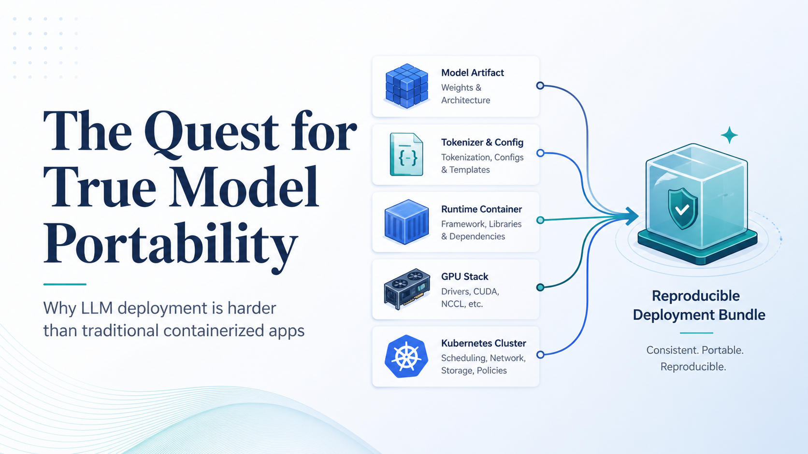

# GenAI on Kubernetes Study Notes

## Contents

1. [Purpose](#purpose)
2. [KServe](#kserve)
   - [Deployment Modes](#deployment-modes)
   - [Core APIs](#core-apis)
   - [From `InferenceService` to `LLMInferenceService`](#from-inferenceservice-to-llminferenceservice)
   - [Why Runtime and Model Separation Matters](#why-runtime-and-model-separation-matters)
3. [GPU Sharing and Sub-GPU Allocation](#gpu-sharing-and-sub-gpu-allocation)
   - [Time Slicing](#time-slicing)
   - [MIG](#mig)
4. [Current State and Gaps in Model Portability](#current-state-and-gaps-in-model-portability)
5. [Model Registry](#model-registry)
   - [Hugging Face Model Hub](#hugging-face-model-hub)
   - [MLflow Model Registry](#mlflow-model-registry)
   - [Kubeflow Model Registry](#kubeflow-model-registry)
   - [OCI](#oci)
     - [Registry](#registry)
     - [Images](#images)
6. [Accessing Model Data in Kubernetes](#accessing-model-data-in-kubernetes)
   - [KServe `storageUri` and Storage Initializers](#kserve-storageuri-and-storage-initializers)
   - [Built-in KServe Storage Initializers](#built-in-kserve-storage-initializers)
   - [Shared Storage with PersistentVolumes](#shared-storage-with-persistentvolumes)
7. [High-Value Recall Checklist](#high-value-recall-checklist)

## Purpose

These notes are structured for **elaborative encoding**, **active recall**, and **future reuse**.

Focus on:

- **What each concept is**
- **Why it exists**
- **When to use it**
- **How it connects to Kubernetes, MLOps, and production AI systems**

<u>Core rule:</u> do not just memorize definitions; **remember the operational reason behind each tool or API**.

[Back to Contents](#contents)

## KServe

**KServe** is a **CNCF project** for **model inference on Kubernetes**.

Its job is to help manage the **lifecycle**, **deployment**, and **exposure** of model-serving endpoints using Kubernetes-native patterns.

### What KServe gives you

- **Scalability**
- **Routing**
- **Canary rollout**
- **Density packing**
- **Declarative model serving**

### Historical context

- Originally created as **KfServing** in the **Kubeflow** community
- Later became an **independent project**
- Still remains part of the broader **Kubeflow ecosystem**
- First focused on **predictive AI**
- Later evolved to support **generative AI**

### Key idea to remember

**KServe extends Kubernetes with custom APIs for model serving.**

That means model serving becomes a **declarative Kubernetes problem**, not just an application container problem.

### Encode this

- **KServe = Kubernetes-native model inference platform**
- **Predictive AI first, generative AI later**
- **Uses CRDs to represent serving concepts declaratively**

### Recall prompt

*Why is KServe more than just "running a model in a container"?*

[Back to Contents](#contents)

### Deployment Modes

KServe supports **three deployment modes**:

1. **Knative**
2. **Standard**
3. **ModelMesh**

#### 1. Knative

**Knative** is the most feature-rich mode.

It uses **Knative** and **Istio** for:

- **Autoscaling**
- **Rolling updates**
- **Traffic management**
- **Composition**

In this mode, each model becomes a **KnativeService**.

**Best mental model:** KServe delegates much of the dynamic serving behavior to the Knative ecosystem.

#### 2. Standard

**Standard** is the simplest and most Kubernetes-direct mode.

It adds **no extra major dependency** beyond Kubernetes primitives. For each model, KServe creates a **Deployment**.

This is usually the most practical choice for **LLM serving**, especially when GPUs are **dedicated and statically allocated**.

**KServe 0.16 note:**

- `RawDeployment` was renamed to **Standard**
- `Serverless` was renamed to **Knative**

#### 3. ModelMesh

**ModelMesh** is optimized for **high-density serving** where **many models** must share cluster resources.

The model server can **load and unload models dynamically** based on requests.

This is useful when:

- You need to serve **many small or medium models**
- Running one deployment per model is too expensive

This is **generally not a fit for large generative AI models**, because large LLMs are too heavy to pack densely on the same nodes.

#### Best practical takeaway

For **modern LLM workloads**:

- **Standard** is often the default practical choice
- **Knative** can help for smaller models and elastic patterns
- **ModelMesh** is usually not the right match for large LLMs

#### Encode this

- **Knative = dynamic, feature-rich, extra stack**
- **Standard = simple, direct, deployment-per-model**
- **ModelMesh = many models, dense sharing**

#### Recall prompt

*Why does Standard often make more sense than Knative for production LLMs on GPUs?*

[Back to Contents](#contents)

### Core APIs

The two main APIs to remember are:

1. **`ServingRuntime`**
2. **`InferenceService`**

#### `ServingRuntime`

A **`ServingRuntime`** is basically a **model server template**.

It defines:

- The **container image**
- Startup **arguments**
- The type of **model formats** it supports
- Runtime-level defaults and behavior

This separates **runtime configuration** from **model configuration**.

There is also **`ClusterServingRuntime`**, which makes a runtime available cluster-wide.

#### What to remember

**`ServingRuntime` describes how to serve.**

Not the specific model itself, but the **runtime environment** that can serve models.

#### Example idea

For vLLM, a `ServingRuntime` can define:

- `image: vllm/vllm-openai:latest`
- exposed port
- startup arguments like `--model` and `--port`
- support for `pytorch` models

#### `InferenceService`

An **`InferenceService`** represents the **actual model deployment** the user wants to serve.

It defines:

- The **model format**
- The **runtime** to use
- The **model location**
- Per-model **resource overrides**
- The deployment behavior

When this resource is created, KServe deploys the model server and wires the model to it.

#### What to remember

**`InferenceService` describes what to serve.**

This is the object that points to the model and triggers actual serving.

#### Useful mapping

- **`ServingRuntime` = server template**
- **`InferenceService` = model serving instance**

#### Minimal mental model

Platform team:

- Owns **runtime images**, defaults, and serving stack choices

Model or application team:

- Owns **which model gets deployed**, where it lives, and model-specific resources

#### Other useful KServe concepts

KServe also supports:

- **Inference logging**
- **Preprocessing and postprocessing**
- **InferenceGraph** for model composition
- **Storage initializer** for downloading model files into the serving container
- **ClusterStorageContainer** for custom storage-loading behavior

#### Encode this

- **`ServingRuntime` = how**
- **`InferenceService` = what**
- **Storage initializer = fetches model artifacts before serving**

#### Recall prompt

*If you want to upgrade the model server image without changing the model itself, which resource concept matters most?*

[Back to Contents](#contents)

### From `InferenceService` to `LLMInferenceService`

KServe 0.16 introduced **`LLMInferenceService`**, a new CRD designed specifically for **large-scale LLM deployments**.

This exists because traditional `InferenceService` is sufficient for **basic serving**, but not ideal for **advanced LLM production topologies**.

#### Why `LLMInferenceService` exists

Large LLM systems often need:

- **Intelligent routing**
- **KV cache-aware scheduling**
- **Disaggregated serving**
- **Multinode distributed inference**
- **Parallelism across multiple GPUs**

These needs go beyond basic model serving.

#### Related config object

KServe also adds **`LLMInferenceServiceConfig`**, which acts like a **base configuration template**.

It can define shared settings such as:

- Container image
- Runtime arguments
- Resource defaults
- Router settings
- Parallelism settings

Then **`LLMInferenceService`** references that config and can override selected values.

#### Important implementation detail

`LLMInferenceService` uses **Standard deployment mode** under the hood.

That reflects an important shift:

**LLM workloads prioritize stability, predictability, and intelligent routing over fast scale-to-zero style elasticity.**

#### Key capabilities

- **Gateway / router / scheduler**
- **KV cache-aware scheduling**
- **Tensor parallelism**
- **Data parallelism**
- **Expert parallelism**
- **Horizontal replicas**

#### Simple comparison

**Traditional path**

- `ServingRuntime` + `InferenceService`
- Better for general model serving and predictive AI

**New LLM path**

- `LLMInferenceServiceConfig` + `LLMInferenceService`
- Better for advanced generative AI serving

#### Encode this

- **`InferenceService` works for basic LLM serving**
- **`LLMInferenceService` exists for complex LLM production patterns**
- **The new API is about routing, scheduling, and distributed inference**

#### Recall prompt

*What production problems does `LLMInferenceService` solve that `InferenceService` does not solve well enough?*

[Back to Contents](#contents)

### Why Runtime and Model Separation Matters

One of the most important operational ideas in these notes is the separation between:

- **Runtime lifecycle**
- **Model lifecycle**

#### Why this matters

These two things change on **different schedules** and are owned by **different teams**.

#### Runtime lifecycle examples

- Upgrading vLLM or TGI versions
- Changing container images
- Adjusting default server startup parameters
- Updating infrastructure assumptions

#### Model lifecycle examples

- Releasing a new model version
- Changing quantization
- Updating weights
- Rolling back to a previous validated model

#### Operational benefit

This separation allows:

- **Platform teams** to manage runtimes safely
- **Model teams** to iterate independently
- Fewer ownership conflicts
- Cleaner production workflows

#### Broader serving context

Model servers such as **vLLM**, **TGI**, and **SGLang** matter because they provide performance-critical optimizations like:

- **PagedAttention**
- **FlashAttention**
- **Continuous batching**

These are essential for real throughput and latency, especially on GPUs.

#### KServe versus Ray

The trade-off is philosophical as much as technical:

- **KServe** is **Kubernetes-native**
- **Ray** is more **Python-first**

KServe feels more familiar to platform operators because it maps closely to Kubernetes concepts.

Ray offers stronger built-in distributed serving ergonomics, but introduces its own orchestration layer, which can complicate operations and debugging.

#### Encode this

- **Separation of runtime and model reflects real ownership boundaries**
- **Specialized model servers are required for production efficiency**
- **KServe vs Ray = Kubernetes-native vs Python-first orchestration**

#### Recall prompt

*Why is separating runtime management from model management an operational advantage rather than just a design preference?*

[Back to Contents](#contents)

## GPU Sharing and Sub-GPU Allocation

The **NVIDIA GPU Operator** supports advanced GPU features for **partitioning** or **slicing** a single GPU across multiple workloads.

This may not always be central for operating very large LLMs, because many LLMs need most or all of a GPU's memory. Still, it is important to understand because GPU sharing can improve utilization for **inference**, **small models**, **interactive notebooks**, and **bursty workloads**.

The operator supports two main sharing modes, which can also be combined:

1. **Time slicing**
2. **MIG**

### Time Slicing

**Time slicing** allows multiple containers to share one physical GPU by allocating **time-based slices**.

By default, if a pod requests:

```yaml
resources:
  limits:
    nvidia.com/gpu: 1
```

Kubernetes grants that pod **exclusive access** to one physical GPU.

Time slicing changes the scheduling model by allowing **GPU oversubscription**. The NVIDIA device plug-in can advertise multiple virtual GPU replicas for each real GPU. For example, one physical GPU can be represented as four or eight schedulable GPU devices.

That means several pods can each request what looks like one GPU, while actually sharing the same hardware.

**Time slicing** means several workloads **take turns using the same hardware**.

Imagine one GPU as a single classroom projector.

Without time slicing:

```text
Pod A gets the projector.
Pod B must wait.
Pod C must wait.
```

With time slicing:

```text
Pod A uses the GPU for a tiny moment
then Pod B uses it
then Pod C uses it
then back to Pod A
```

It happens very fast, so it looks like they are sharing the GPU at the same time.

CPU time slicing is similar:

```text
One CPU core
-> runs browser for a moment
-> runs music app for a moment
-> runs terminal for a moment
-> repeats quickly
```

GPU time slicing:

```text
One physical GPU
-> serves model A request
-> serves model B request
-> serves model C request
-> repeats quickly
```

#### CPU comparison: cores, logical processors, and time slicing

CPU scheduling is a related concept, but **CPU logical processors** and **time slicing** are not exactly the same thing.

A CPU has **physical cores** and may also expose **logical processors** through **hyper-threading** or **Simultaneous Multithreading (SMT)**.

Example:

```text
CPU: 8 physical cores
Hyper-threading: 2 logical processors per core
OS sees: 16 logical CPUs
```

The OS scheduler can place work on those 16 logical CPUs. But two logical CPUs on the same physical core still share the same execution resources, so they are **not equal to two full physical cores**.

Time slicing is slightly different:

```text
Logical CPU / hyper-threading:
two hardware threads share one physical core at the same time

Time slicing:
many processes take turns using a CPU core over time
```

The analogy:

```text
Physical core = real hardware
Logical CPU = hardware-exposed shared execution slot
Time slicing = scheduler rapidly switches workloads on the hardware
```

For GPUs, time slicing is closer to saying:

```text
One real GPU is advertised as multiple schedulable "GPU slots,"
but those slots still share the same physical GPU.
```

Think of a **physical CPU core** like **one cashier**.

##### 1. Time slicing: one cashier, many customers taking turns

There is **one cashier** and **five customers**.

The cashier serves:

```text
Customer A for 10 seconds
Customer B for 10 seconds
Customer C for 10 seconds
Customer D for 10 seconds
Customer E for 10 seconds
then back to Customer A
```

Each customer feels like they are "being served," but actually they are **taking turns**.

That is **time slicing**.

##### 2. Multiple physical cores: many real cashiers

Now there are **four cashiers**.

```text
Cashier 1 serves Customer A
Cashier 2 serves Customer B
Cashier 3 serves Customer C
Cashier 4 serves Customer D
```

This is real parallel work. More work can happen at the same time.

That is like **four physical CPU cores**.

##### 3. Logical processors / hyper-threading: one cashier with two order windows

Now imagine **one cashier has two windows**.

```text
Window 1: Customer A
Window 2: Customer B
```

But behind both windows, it is still **one cashier**.

The cashier can stay busier because when Customer A is waiting for payment approval, the cashier can help Customer B. But the cashier did not become two full cashiers.

That is like **one physical core with two logical processors**.

##### Simple summary

```text
Physical core:
a real worker

Logical processor:
an extra lane/window into the same worker

Time slicing:
many tasks taking turns with the worker
```

For GPU time slicing, imagine:

```text
1 physical GPU = 1 big machine

Kubernetes advertises it as:
gpu-slot-1
gpu-slot-2
gpu-slot-3
gpu-slot-4
```

But underneath, all four slots still use the **same physical GPU**, taking turns.

#### What time slicing gives you

- Better GPU utilization when workloads are **small**, **bursty**, or **idle** part of the time
- Ability to run several lightweight inference workloads on one GPU
- Sharing support for older GPUs that do **not** support MIG, such as some **T4** or **V100** environments
- Higher overall throughput when individual workloads do not need full GPU capacity all the time

#### Important trade-off

Time-sliced workloads are **not getting full GPU power at the same time**.

If all pods become busy, each pod gets slower because they are sharing the same physical GPU.

<u>Key limitation:</u> time slicing provides **compute-time sharing**, not strong isolation.

Unlike MIG, time slicing does **not** provide:

- GPU memory isolation
- Fault isolation
- Dedicated memory quotas
- Guaranteed full-GPU performance

All pods sharing the same physical GPU can access the same GPU memory pool. If one pod allocates most of the GPU memory, other pods may fail to allocate memory. If one process causes a GPU reset, the other workloads sharing that GPU can also be affected.

#### Example configuration for time slicing

To enable GPU time slicing, configure the NVIDIA device plug-in through a `ConfigMap` referenced by the GPU Operator configuration.

Example configuration:

```yaml
apiVersion: v1
kind: ConfigMap
metadata:
  name: gpu-sharing-config
  namespace: gpu-operator-resources
data:
  sharing: |
    version: v1
    sharing:
      timeslicing:
        renameByDefault: true
        resources:
        - name: nvidia.com/gpu
          replicas: 8
```

Important fields:

- **`renameByDefault: true`** renames the shared resource from `nvidia.com/gpu` to `nvidia.com/gpu.shared`.
- **`replicas: 8`** exposes eight schedulable GPU units for each physical GPU.
- **`resources.name`** controls which GPU resource is oversubscribed.

For one physical GPU, `replicas: 8` exposes eight virtual GPU units. For ten physical GPUs, the node can advertise eighty virtual GPU units.

The node may also receive a label such as:

```text
gpu.replicas=8
```

This marks the oversubscription level.

#### Scheduling warning

A pod requesting multiple time-sliced GPUs does **not** get twice the performance of a single shared GPU.

For example:

```yaml
resources:
  limits:
    nvidia.com/gpu: 2
```

In shared mode, this usually gives the pod shares on two separate physical GPUs, each still shared with other workloads. That is rarely useful and can confuse users into thinking they received two full GPUs.

For this reason, the device plug-in can be configured to reject requests for more than one GPU in shared mode.

<u>Practical rule:</u> time slicing is intended for pods that request exactly **one** GPU, where that "one GPU" really means **one shared slice** of a physical GPU.

For multi-GPU workloads, keep GPUs **exclusive** or use **MIG** where appropriate.

#### Best fit

Time slicing is useful when:

- You have many small inference tasks
- You serve multiple lightweight models
- You run interactive notebooks
- Workloads are bursty and often idle
- The models collectively fit in GPU memory
- The GPU does not support MIG

Time slicing is often less useful for large LLMs because LLMs typically need most or all of a GPU's available memory.

### MIG

**MIG** stands for **Multi-Instance GPU**.

It is available on certain NVIDIA GPUs, such as **A100** and **H100**, and allows one physical GPU to be partitioned into multiple **isolated GPU instances**.

Where time slicing is mainly **temporal sharing**, MIG is **hardware partitioning**.

Simple distinction:

- **Time slicing**: workloads take turns on the same physical GPU.
- **MIG**: the GPU is split into isolated hardware-backed instances.

MIG is better when workloads need stronger guarantees around:

- **Isolation**
- **Predictable memory allocation**
- **Fault containment**
- **More stable performance**

For scenarios requiring stronger isolation guarantees and fixed memory allocations per workload, MIG is the more appropriate NVIDIA sharing mechanism.

#### Encode this

- **Sub-GPU allocation improves utilization by sharing one GPU across workloads**
- **Time slicing = oversubscription and time-based sharing**
- **MIG = hardware-backed GPU partitioning**
- **Time slicing improves utilization but does not isolate memory or faults**
- **Large LLMs often still need exclusive GPUs because memory is the real constraint**

#### Recall prompt

*Why can time slicing improve GPU utilization but still be risky for production workloads that need memory or fault isolation?*

[Back to Contents](#contents)

## Current State and Gaps in Model Portability



Model portability is still **immature** for LLMs.

### ONNX

- **ONNX** is strong for general ML portability because it provides a structured model format.
- But for LLMs, it is often **not fully self-contained** because important artifacts like **tokenizers** may remain outside the model format.

### GGUF

- **GGUF** is a more specialized format for LLMs and is relatively self-contained.
- But it is also more tightly coupled to certain runtimes, especially **`llama.cpp`**.

### Safetensors

- **Safetensors** is increasingly important for production deployments.
- It is commonly used in a **multifile layout**, which works well with **OCI artifacts** because components can be distributed as separate layers for:
  - **Caching**
  - **Parallel downloads**
  - **Flexibility**

### Core takeaway

There is still **no universal model packaging standard for LLMs** equivalent to what OCI did for containers.

The field is evolving too quickly:

- New architectures appear often
- Runtime optimizations change fast
- Serving requirements vary widely

### What is practical today

- For now, **GGUF** and **Safetensors** are often the most practical formats depending on the serving stack and deployment goal.

### Important mental model

At the end of the day, an LLM is **a collection of files**.

Those files may be:

- Self-contained
- Split across multiple artifacts
- Bound to particular runtimes

This is why discovery, indexing, and management matter so much in Kubernetes environments.

### Encode this

- **ONNX = useful, but incomplete for many LLM workflows**
- **GGUF = self-contained, but runtime-coupled**
- **Safetensors = production-friendly and OCI-compatible**
- **True portability standardization is still not finished**

### Recall prompt

- *Why is OCI-level standardization for models harder than OCI standardization for containers?*

[Back to Contents](#contents)

## Model Registry

A **model registry** is a central system for **managing models and their metadata** across the ML lifecycle.

It acts as both:

- A **discovery mechanism**
- A **collaboration platform**

### What a model registry does

It helps teams:

- Track model versions
- Store metadata
- Manage governance
- Promote models through lifecycle stages
- Support deployment readiness

### Important operational detail

Most organizations run model registries as **internal services**, often inside the cluster.

They usually **do not store the actual model weights directly**.

Instead, they typically store:

- **Metadata**
- **References**
- **Version records**
- **Governance information**

The actual model artifacts often live in:

- **S3 buckets**
- Other **object stores**

### Why this separation matters

Keeping metadata separate from large model files improves:

- **Flexibility**
- **Scalability**
- **Operational simplicity**

### Shared value across roles

For **data scientists**, the registry supports:

- Experiment tracking linkage
- Performance verification
- Reproducibility
- Release preparation

For **MLOps engineers**, the registry supports:

- Controlled deployment of approved models
- Metadata-driven automation
- Governance and auditability
- Monitoring hooks for later lifecycle steps

### Core model registry capabilities

#### Metadata management

Stores:

- Accuracy
- Lineage
- Benchmarks
- Training context

#### Model discovery and search

Allows search by:

- Architecture
- Hyperparameters
- Dataset
- Performance metrics

#### Version control

Tracks:

- Model versions
- Dataset versions

This is essential for **reproducibility** and **rollback**.

#### Lifecycle management

Supports stages such as:

- Experimentation
- Staging
- Production
- Retirement

#### Access control

Supports secure collaboration with permissions and visibility rules.

#### Auditing and compliance

Tracks approvals, changes, and usage history.

#### Data pipeline integration

Supports CI/CD workflows like:

- Validation
- Packaging
- Promotion
- Rollout

### Related ML concepts

#### Model experimentation

This is the iterative process of training many model variants with different:

- Hyperparameters
- Datasets
- configurations

The goal is to identify the best-performing version.

#### Feature stores

A **feature store** manages features consistently across training and inference to avoid **training-serving skew**.

This matters more in traditional ML than in many LLM workloads, though embeddings and retrieval systems still make it relevant in generative AI systems.

### Key bridge concept

**The model registry is the handoff point between experimentation and production.**

That is one of the highest-value ideas to remember.

### Encode this

- **Registry stores metadata, not usually the full model weights**
- **It bridges experiment workflows and production workflows**
- **It supports versioning, governance, search, and lifecycle control**

### Recall prompt

*Why is the model registry considered a handoff point between data science and MLOps?*

[Back to Contents](#contents)

### Hugging Face Model Hub

The **Hugging Face Model Hub** is the **canonical public platform** for discovering and sharing open source machine learning models, especially **LLMs**.

<u>Main idea:</u> Hugging Face plays a role for **open ML models** that is similar to what **GitHub** plays for **open source code**.

#### Why it matters

- It is the main discovery layer for open models
- It standardizes how models are documented
- It supports both manual exploration and API-driven access
- It is often the first source people use before internalizing models into production systems

#### Model Cards

Each model entry typically includes a **Model Card**.

A Model Card summarizes:

- Intended use cases
- Training datasets
- Evaluation metrics
- Limitations and risks
- Licensing information

This is important because **model adoption is not just about weights**; it is also about understanding **fitness**, **constraints**, and **governance**.

#### Inference widget

Many models also expose an **interactive inference widget** in the web UI.

This helps with:

- Quick manual validation
- Basic behavioral testing
- Fast model comparison before local deployment

#### API access

Hugging Face also provides a **REST API** for:

- Querying models
- Retrieving metadata
- Discovering versions
- Filtering models programmatically

This is useful in automation pipelines, even if the Hub itself is not the final production registry.

#### Limitation for production

The Hub is excellent for **public discovery**, but it has important limitations for enterprise production use:

- It is not ideal for **proprietary private models**
- It may be too loose for **strict internal governance**
- It is not enough by itself for **full lifecycle traceability**
- External availability and access control may not meet production requirements

#### Best operational takeaway

Use Hugging Face as:

- A **public source of truth** for open models
- A **discovery and evaluation layer**
- A **source repository** that you may later mirror, package, or import into internal systems

Do not confuse that with an **internal production-grade registry strategy**.

#### Encode this

- **Hugging Face Hub = public discovery and sharing platform**
- **Model Card = operational and governance context around a model**
- **Useful for exploration, but not sufficient by itself for private production model management**

#### Recall prompt

*Why is Hugging Face ideal for public model discovery but insufficient as the only production registry for many organizations?*

[Back to Contents](#contents)

### MLflow Model Registry

**MLflow** is a **Linux Foundation project** for managing the machine learning lifecycle, including:

- **Experiment tracking**
- **Model packaging**
- **Model registry**

It was created by **Databricks in 2018** and became widely adopted because it is relatively simple and integrates well with data science workflows.

#### Core concept: the Tracking Server

The central component in MLflow is the **Tracking Server**.

It stores and exposes:

- Experiment metadata
- Metrics
- Parameters
- Runs
- Model artifacts
- Registry entries

This makes MLflow especially strong on the **data science side** of the lifecycle.

#### Why practitioners like MLflow

- Easy to install
- Easy to use locally
- Strong experiment tracking UX
- Good for comparing runs and hyperparameters
- Supports metadata-rich model registration

#### Where model artifacts live

In simple setups, model artifacts can live on the **local filesystem**.

In production-oriented setups, MLflow can store artifacts in:

- **S3**
- Other object stores
- External artifact locations
- References to external sources such as the Hugging Face Hub

The registry stores **artifact URIs**, not just display names.

#### Programmatic logging and registration

Most data scientists use MLflow programmatically:

```python
import mlflow

mlflow.set_tracking_uri(uri="http://localhost:8000")
mlflow.set_experiment("MLflow Demo")

params = {
    "solver": "lbfgs",
    "multi_class": "auto",
    "max_iter": 2500,
}

with mlflow.start_run():
    mlflow.log_params(params)
    model_info = mlflow.sklearn.log_model(
        sk_model=model,
        artifact_path="my_model",
        input_example=X_train,
        registered_model_name="my-model",
    )
```

#### Registry access through the REST API

MLOps workflows often interact with MLflow through its HTTP API:

```bash
curl http://localhost:8000/api/2.0/mlflow/registered-models/search
```

Example response shape:

```json
{
  "registered_models": [
    {
      "name": "my-model",
      "creation_timestamp": 1736523034148,
      "last_updated_timestamp": 1736524822538,
      "latest_versions": [
        {
          "name": "my-model",
          "version": "4",
          "creation_timestamp": 1736524822538,
          "last_updated_timestamp": 1736524822538,
          "current_stage": "None",
          "description": "",
          "source": "mlflow-artifacts:/84948067/f0dd25483e/artifacts/my_model",
          "run_id": "f0dd25483e234400b7",
          "status": "READY",
          "run_link": ""
        }
      ]
    }
  ]
}
```

#### OCI image generation

MLflow can also generate a Dockerfile and package a model into a self-contained container image:

```bash
mlflow models generate-dockerfile \
  -m mlflow-artifacts:/84948067/f0dd25483e/artifacts/my_model

cd mlflow-dockerfile
podman build -t my_model .
```

This is useful for smaller or traditional ML packaging flows, but it is **not ideal for very large LLM artifacts** that require heavy downloads and more efficient caching patterns.

#### MLflow on Kubernetes

MLflow can be deployed on Kubernetes, usually as a web service backed by a database such as **PostgreSQL**.

However:

- It does **not** introduce native Kubernetes CRDs
- It is **not deeply Kubernetes-native**
- Scaling and serving automation usually require extra integration work

#### MLflow and LLMs

MLflow has improved its GenAI and LLM support significantly, especially from the **3.0** line onward, with capabilities such as:

- Memory-efficient Transformers logging
- Prompt Registry
- AI gateway
- GenAI evaluation
- Tracing for LLM applications
- Reference-based logging for Hub-backed models

Still, large-scale LLM operations often need complementary infrastructure because:

- Full weights usually still need local or nearby storage in production
- Repeated large downloads are expensive
- Artifact storage patterns may not be optimized for very large model payloads

#### Best operational takeaway

**MLflow is strongest as a data science lifecycle platform, not as the final answer to large-scale Kubernetes-native LLM operations.**

#### Encode this

- **MLflow = experiment tracking first, registry second**
- **Tracking Server is the central hub**
- **Great for DS workflows, less native to Kubernetes operations**
- **LLM support is improving, but large-model production usually needs more infrastructure**

#### Recall prompt

*Why is MLflow highly effective for experimentation but often incomplete by itself for large-scale LLM production on Kubernetes?*

[Back to Contents](#contents)

### Kubeflow Model Registry

**Kubeflow** is a **Kubernetes-native ML platform** that aims to support the full ML lifecycle.

It was initially developed by **Google** and is now part of the broader **CNCF ecosystem**.

#### Major Kubeflow components

- **Kubeflow Dashboard**  
  A central dashboard and hub that connects the authenticated web interfaces of Kubeflow and other ecosystem components.

- **Kubeflow Notebooks**  
  A component for running web-based development environments like Jupyter Notebooks inside your Kubernetes cluster by running them in pods. No local installation is needed.

- **Kubeflow Pipelines**  
  Kubeflow Pipelines (KFP) is a platform for building and deploying portable and scalable machine learning workflows using Kubernetes.

- **Kubeflow Trainer**  
  Kubeflow Trainer is a unified interface for model training and fine-tuning on Kubernetes. It runs scalable and distributed training jobs for popular frameworks like PyTorch or TensorFlow.

- **Kubeflow Katib**  
  Katib is a Kubernetes-native project for automated machine learning (AutoML) with support for hyperparameter tuning, early stopping, and neural architecture search.

- **KServe** for model serving  
  KServe, previously KFServing, solves production model serving on Kubernetes. It started in Kubeflow but later became a separate CNCF project. We cover KServe in detail in the KServe section.

- **Model Registry**  
  An index and catalog for ML models. The registry is the central hub within the Kubeflow ecosystem, and the rest of this section focuses on it.

#### Why Kubeflow is different from MLflow

Kubeflow goes deeper into **Kubernetes-native control-plane integration**.

It uses:

- **CRDs**
- **Controllers**
- **Kubernetes manifests**
- Native workflow patterns built around cluster operations

This makes Kubeflow more aligned with platform engineering on Kubernetes than tools that primarily began as standalone tracking systems.

#### What the Kubeflow Model Registry does

The **Kubeflow Model Registry** is the central catalog for:

- Models
- Versions
- Metadata
- Lineage-relevant details

Its purpose is to simplify the move from **experimentation** to **production deployment** inside a Kubernetes-centric ecosystem.

#### Metadata storage model

The registry uses a backend relational database, commonly **MySQL**, and follows a flexible **entity-relationship model** inspired by **Google ML Metadata**.

This helps with:

- Structured lineage tracking
- Parameter storage
- Metric storage
- Version reuse across Kubeflow components
- Triggering downstream workflows

#### Operational requirement

The registry depends on external stateful infrastructure such as:

- **MySQL**
- **Persistent volumes**

So while it is Kubernetes-native, it is still not "free"; it requires careful production operation.

#### Registering a model

You can interact with the registry through a Python SDK:

```python
from model_registry import ModelRegistry

registry = ModelRegistry(
    server_address="http://model-registry-service.kubeflow.svc.cluster.local",
    port=8080,
    author="your name",
    is_secure=False,
)

rm = registry.register_model(
    "iris",
    "gs://kfserving-examples/models/sklearn/1.0/model",
    model_format_name="sklearn",
    model_format_version="1",
    version="v1",
    description="Iris scikit-learn model",
    metadata={
        "accuracy": 3.14,
        "license": "BSD 3-Clause License",
    },
)
```

#### Access pattern

Because the service address is cluster-internal, this kind of code usually runs **inside the cluster**, for example:

- In a notebook pod
- In a pipeline step
- In an application pod

#### Querying the registry from inside the cluster

You can also access it from a temporary pod:

```bash
kubectl run -it --rm curl --image=curl --restart=Never -- \
  http://model-registry-service.kubeflow.svc.cluster.local/...
```

#### Integration with KServe

Kubeflow Model Registry can act as an indirection layer for KServe:

```yaml
apiVersion: serving.kserve.io/v1beta1
kind: InferenceService
metadata:
  name: iris-model
spec:
  predictor:
    model:
      storageUri: "model-registry://iris/v1"
      modelFormat:
        name: "sklearn"
        version: "1"
```

This matters because the **InferenceService** can reference the model through the registry, while the actual underlying storage location can change later without rewriting the serving manifest.

#### Best operational takeaway

**Kubeflow Model Registry is a stronger fit when you want the registry to participate as part of a Kubernetes-native ML platform rather than remain a mostly standalone tracking system.**

#### Encode this

- **Kubeflow = full Kubernetes-native ML platform**
- **Model Registry is central inside that ecosystem**
- **Uses structured metadata with deeper cluster integration**
- **Works naturally with KServe and other Kubeflow components**

#### Recall prompt

*What makes Kubeflow Model Registry more Kubernetes-native than MLflow Model Registry?*

[Back to Contents](#contents)

### OCI

#### Registry

An **OCI Registry** is a standard system for **storing and distributing OCI-compliant artifacts**, most famously container images.

Examples include:

- **Docker Hub**
- **Quay.io**
- Built-in registries in some Kubernetes distributions such as **OpenShift**

##### Why OCI registries matter for GenAI

OCI registries are increasingly useful for **model distribution**, not just application containers.

That is possible because OCI evolved beyond classic container images into a broader artifact model.

##### What OCI means here

The **Open Container Initiative (OCI)** standardizes how containerized applications and related artifacts are packaged, stored, and exchanged.

OCI began with images but now also supports **OCI artifacts**, which allows registries to store more than runnable applications.

##### Why this is important for LLMs

Unlike many model registries that store mostly **metadata and references**, an OCI Registry can store the **full model data itself**.

That makes it attractive for:

- Versioning
- Immutability
- Caching
- Distribution
- Kubernetes-native delivery workflows

##### Passive data images

LLM model images are often **passive data images**.

That means:

- They are **not executed** like applications
- They are used as **immutable packages** of model files
- Inference runtimes consume the files they contain

##### Building a model image from Hugging Face

Example Dockerfile:

```dockerfile
FROM alpine/git

RUN git lfs install \
 && git clone --depth 1 https://huggingface.co/Qwen/Qwen2.5-0.5B-Instruct /models

ENTRYPOINT sh
```

##### Building and pushing with Podman

```bash
podman build -f Dockerfile.model -t quay.io/rhuss/qwen2.5-0.5b-instruct .
podman push quay.io/rhuss/qwen2.5-0.5b-instruct:latest
```

##### Important production note

For simplicity, a model might be added as a **single layer**, but in production it is often better to structure large artifacts into multiple layers so runtimes can:

- Cache efficiently
- Reuse unchanged chunks
- Download pieces independently

##### Relationship to KServe

OCI-backed model artifacts can integrate well with Kubernetes-native serving workflows.

They are especially relevant when combined with patterns such as:

- **Modelcars**
- **OCI image volume mounts**
- KServe loading model data from OCI-managed artifacts

##### Prominent OCI-compliant registries

The following are prominent **OCI-compliant registries**, grouped by deployment model and primary use case.

###### Major cloud-managed registries

- **Amazon Elastic Container Registry (ECR)**  
  A highly scalable managed registry that integrates with AWS IAM and provides built-in vulnerability scanning.

- **Azure Container Registry (ACR)**  
  Provides geo-replication for high availability and supports OCI artifacts such as Helm charts.

- **Google Artifact Registry (GAR)**  
  Google’s successor to GCR, supporting both container images and language-specific packages such as `npm` and `Maven`.

- **Oracle Cloud Infrastructure Registry (OCIR)**  
  Tailored for Oracle Cloud services and integrated with Oracle Container Engine for Kubernetes (OKE).

- **DigitalOcean Container Registry (DOCR)**  
  A simplified managed registry designed for easy integration with DigitalOcean Kubernetes.

###### Popular public and SaaS registries

- **Docker Hub**  
  The default registry for Docker and the largest public marketplace for container images.

- **GitHub Container Registry (GHCR)**  
  Integrated with GitHub Actions and repositories, with fine-grained permissions tied to GitHub identities.

- **Quay.io**  
  A Red Hat-hosted registry known for strong security scanning and repository mirroring features.

- **GitLab Container Registry**  
  A built-in registry for GitLab users, supporting seamless image management inside GitLab CI/CD workflows.

###### Open source and self-hosted solutions

- **Harbor**  
  A CNCF-graduated registry project with RBAC, image signing through Notary, and vulnerability scanning.

- **Zot**  
  A vendor-neutral, OCI-native registry distributed as a single statically linked binary, designed for simplicity and performance.

- **Distribution**  
  The reference implementation of the OCI Distribution Specification, previously known as Docker Distribution.

- **Sonatype Nexus Repository OSS**  
  A universal repository manager that supports OCI-compliant Docker registries alongside `Maven`, `npm`, and other package formats.

- **JFrog Artifactory**  
  An enterprise-grade universal repository manager with OCI artifact support and extended security capabilities through JFrog Xray.

##### Best operational takeaway

**OCI Registry is not just another metadata registry. It can be the actual distribution system for the full model artifact.**

That is a fundamental distinction from many classic model registry designs.

##### Encode this

- **OCI Registry can store the full model artifact, not just metadata**
- **Useful for immutable, versioned model delivery**
- **Strong fit for Kubernetes-native distribution of large model files**

##### Recall prompt

*Why is an OCI Registry conceptually different from MLflow or Kubeflow registries when handling model data?*

[Back to Contents](#contents)

#### Images

An **OCI image** is a **standardized container image format** defined by the **Open Container Initiative**.

Its purpose is **interoperability**:

**build with one tool, run with another, without changing the artifact**.

##### Why OCI matters

OCI makes container artifacts portable across:

- Build tools
- Registries
- Runtimes
- Kubernetes environments

##### Core components of an OCI image

###### 1. Filesystem layers

Ordered, content-addressed blobs representing filesystem changes.

###### 2. Image configuration

A JSON document describing runtime details such as:

- Environment variables
- Entrypoint
- Default command

###### 3. Image manifest

A JSON document that pins:

- Specific layers
- Specific config
- Cryptographic digests

This acts like a **bill of materials** for the image.

###### 4. Image index

An optional higher-level manifest that points to platform-specific variants, such as:

- `amd64`
- `arm64`

##### Standard pull workflow

When a runtime pulls an OCI image, it generally:

1. **Downloads** the manifest
2. **Verifies** layer digests
3. **Unpacks** the filesystem layers
4. **Executes** the image through the runtime stack

##### OCI versus Docker

They are closely related, but not identical:

- **OCI image** = open standard
- **Docker image** = Docker-oriented conventions, now largely OCI-compatible

##### Why this matters in AI systems

OCI ideas influence how people think about **packaging and distributing model artifacts**, especially when models are broken into multiple files or layers.

This is one reason **Safetensors + OCI artifacts** is a practical pattern for production delivery.

##### Encode this

- **OCI = standard for interoperable container packaging**
- **Manifest = cryptographic description of the image**
- **Image index = multi-architecture selector**
- **OCI thinking influences model artifact packaging too**

##### Recall prompt

*Why is OCI a strong analogy for where model packaging standards may eventually go?*

[Back to Contents](#contents)

## Accessing Model Data in Kubernetes

Now that the notes have covered **model formats**, **registries**, and **artifact distribution**, the next operational question is:

**How does a model-serving workload actually access model data from inside a Kubernetes cluster?**

For GenAI serving on Kubernetes, this is not a secondary detail. It directly affects:

- **startup time**
- **storage efficiency**
- **replica scaling**
- **network usage**
- **inference latency**

### KServe `storageUri` and Storage Initializers

KServe provides a clean reference model for understanding how Kubernetes-based serving systems access model data.

In the simplest case, the storage location is declared directly in an `InferenceService` using `storageUri`.

Example using S3-backed model storage:

```yaml
apiVersion: "serving.kserve.io/v1beta1"
kind: "InferenceService"
metadata:
  name: "mnist"
spec:
  predictor:
    serviceAccountName: sa
    tensorflow:
      storageUri: "s3://kserve-examples/mnist"
```

What to notice:

- `serviceAccountName` identifies the Kubernetes `ServiceAccount`
- that service account is typically associated with a `Secret` or cloud-native identity
- the runtime here is **TensorFlow**
- `storageUri` points to the model’s storage location

#### Why the URI scheme matters

The **scheme** in `storageUri` determines which storage backend KServe will use and how the model data is prepared.

Examples:

- `s3://`
- `gs://`
- `https://`
- `pvc://`
- `oci://`
- `hf://`

This scheme triggers a **storage initializer**, which KServe runs as an **init container** before the main serving runtime starts.

Its purpose is simple:

**make model data available to the runtime container before inference begins**

#### Custom storage initializers

KServe lets you add custom URI schemes through `ClusterStorageContainer`.

Example:

```yaml
apiVersion: serving.kserve.io/v1alpha1
kind: ClusterStorageContainer
metadata:
  name: model-registry-storage
spec:
  container:
    name: storage-initializer
    image: kubeflow/model-registry-storage-initializer
  supportedUriFormats:
    - prefix: model-registry://
```

What this does:

- declares a custom initializer image
- registers `model-registry://` as a supported URI prefix
- allows `InferenceService` resources to refer to models through that scheme

#### Init containers and sidecars

These are important Kubernetes patterns to remember.

**Init containers**:

- run **before** the application container
- perform **one-time setup work**
- commonly prepare files in a shared volume

**Sidecars**:

- run **alongside** the main container
- provide supporting behavior such as logging, transformation, or coordination

For model serving, the storage initializer is usually an **init-container pattern**, not a sidecar pattern.

#### Node-local sharing with `emptyDir`

A common KServe pattern is:

1. the storage initializer downloads or copies the model data
2. the data is written into an `emptyDir` volume
3. the main serving container mounts that same volume

This works because `emptyDir` is shared among containers in the same pod, including:

- init containers
- application containers

This gives the runtime a node-local copy of the model data for that pod.

### Built-in KServe Storage Initializers

KServe supports several storage schemes out of the box:

| Scheme | Description | Example |
| --- | --- | --- |
| `gs` | Download from Google Cloud Storage | `gs://kfserving-examples/models/sklearn/1.0/model` |
| `s3` | Download from an S3 bucket | `s3://kserve-examples/mnist` |
| `https` | Download model data with HTTP | `https://huggingface.co/meta-llama/Llama-3.2-3B` |
| `hdfs`, `webhdfs` | Access files from Hadoop Distributed File System | `hdfs://path/to/model` |
| `pvc` | Copy or mount model data from a PersistentVolumeClaim | `pvc://${PVC_NAME}/export` |
| `oci` | Pull an OCI image with model data and access it directly via a modelcar | `oci://quay.io/rhuss/kserving-example-sklearn:1.0` |
| `model-registry` | Access a model registered in the Kubeflow Model Registry | `model-registry://iris/v1` |
| `hf` | Download directly from the Hugging Face Hub | `hf://meta-llama/Llama-2-7b-chat-hf` |

#### Important operational distinction

Most of these schemes involve **preparing a node-local copy** of model data for each pod.

That is convenient for runtime access speed, but it can mean:

- repeated downloads
- repeated copies
- duplicated storage across replicas or nodes

This is one reason storage strategy matters so much for larger models.

### Shared Storage with PersistentVolumes

When an `InferenceService` runs with multiple replicas, each replica needs access to the same model files.

There are three broad approaches:

- download copies from remote object storage
- package models into OCI artifacts
- mount shared storage through **PersistentVolumes**

PersistentVolumes provide a third model:

**store the model once, mount it from many pods**

#### Why PersistentVolumes matter

PVs are useful when you want:

- **storage efficiency** across replicas
- **centralized model management**
- **fast startup without redownloading model data**
- clearer separation between infrastructure and model ownership

Typical backends include:

- **NFS**
- **Ceph**
- **AWS EFS**
- **Azure Files**
- **Google Cloud Filestore**

#### Example PV and PVC for model storage

```yaml
apiVersion: v1
kind: PersistentVolume
metadata:
  name: llama-3-8b-pv
spec:
  capacity:
    storage: 20Gi
  accessModes:
    - ReadOnlyMany
  persistentVolumeReclaimPolicy: Retain
  nfs:
    server: nfs-server.example.com
    path: /exports/models/llama-3-8b
---
apiVersion: v1
kind: PersistentVolumeClaim
metadata:
  name: llama-3-8b-pvc
  namespace: default
spec:
  accessModes:
    - ReadOnlyMany
  resources:
    requests:
      storage: 20Gi
```

Key points:

- `storage: 20Gi` defines the total PV capacity
- `ReadOnlyMany` allows multiple pods to mount the volume read-only at the same time
- `Retain` preserves the underlying model data if the PVC is deleted
- the PVC must request an access mode compatible with the PV

#### Why `ReadOnlyMany` is a strong fit

Serving workloads usually need to **read** model weights, not modify them.

That makes **read-only shared mounts** a natural fit.

This also helps with:

- safer sharing across replicas
- less coordination overhead
- more aggressive filesystem caching

#### Using a PVC with KServe

KServe supports PVC-backed access through the `pvc://` storage scheme:

```yaml
apiVersion: serving.kserve.io/v1beta1
kind: InferenceService
metadata:
  name: llama-pvc
spec:
  predictor:
    model:
      modelFormat:
        name: pytorch
      storageUri: pvc://llama-3-8b-pvc/
```

The PVC name is referenced directly in the URI.

KServe then mounts the PVC into the model container, typically under `/mnt/models`.

#### How PVC access differs from remote-download schemes

This is a crucial distinction.

For schemes like:

- `s3://`
- `gs://`
- `https://`
- `hf://`

the storage initializer usually **downloads and copies** data into pod-local storage.

For `pvc://`, KServe generally **mounts the volume directly**.

That means:

- no large data copy step is needed
- startup can be faster
- the runtime reads directly from the mounted shared filesystem

The storage initializer may still exist in the flow, but for PVC-backed access it effectively becomes a **near no-op** compared with remote download schemes.

#### Trade-off: local speed versus shared efficiency

This is the core operational trade-off:

**Node-local access**

- faster runtime I/O
- avoids repeated network reads during inference
- but may require one copy per pod or per node

**Network-backed shared PV access**

- more storage-efficient
- simpler central updates
- but introduces network latency on reads

#### Scaling considerations

PersistentVolumes work well for many common serving deployments, especially when:

- replica counts are moderate
- model files are large
- startup efficiency matters
- centralized storage management is preferred

But performance depends on:

- backend storage throughput
- storage server load
- available network bandwidth
- number of concurrent readers

Warning signs include:

- increasing I/O wait
- higher latency variance
- storage backend pressure
- network saturation

High-performance distributed storage systems usually scale better than simple NFS setups.

#### Practical takeaway

There is no universal best method for model data access.

The right choice depends on whether you optimize for:

- **startup speed**
- **runtime latency**
- **storage efficiency**
- **replica scale**
- **operational simplicity**

PVs are often a strong choice for shared model serving, but for very high-throughput or high-scale inference, node-local approaches such as OCI-backed delivery can be better.

### Encode this

- **`storageUri` is the control point for how KServe locates model data**
- **storage initializers are usually init containers that prepare model files before serving**
- **`emptyDir` gives pod-local shared storage between init containers and runtimes**
- **`pvc://` differs from remote-download schemes because it mounts shared storage directly**
- **model access design is a trade-off between local performance and shared efficiency**

### Recall prompt

*Why might a team choose `pvc://` over `s3://`, and what performance trade-off does that decision introduce?*

[Back to Contents](#contents)

## High-Value Recall Checklist

Use these prompts for fast review:

- **KServe**: What problem does it solve on Kubernetes?
- **Deployment modes**: When do you choose **Knative**, **Standard**, or **ModelMesh**?
- **Core APIs**: What is the difference between **`ServingRuntime`** and **`InferenceService`**?
- **LLM APIs**: Why was **`LLMInferenceService`** introduced?
- **Operations**: Why should runtime lifecycle and model lifecycle be separated?
- **GPU sharing**: What is the difference between **time slicing** and **MIG**?
- **Portability**: Why are ONNX, GGUF, and Safetensors each useful but incomplete?
- **Registry**: Why does a model registry store metadata more often than weights?
- **Hugging Face**: Why is it the default public discovery platform but not the full production answer?
- **MLflow**: Why is it strong for experimentation but weaker as a Kubernetes-native serving control plane?
- **Kubeflow**: What makes its registry more deeply integrated with Kubernetes workflows?
- **OCI Registry**: Why is storing full model artifacts there different from storing metadata in a model registry?
- **OCI**: What are the four main OCI image components?
- **Model access**: What is the difference between download-based storage initialization and direct PVC-backed mounting?

### One-sentence compression

**KServe operationalizes model serving on Kubernetes, registries operationalize model discovery and governance, OCI-style artifacts improve model distribution, and storage access strategy determines how efficiently those models actually reach serving pods.**

[Back to Contents](#contents)
