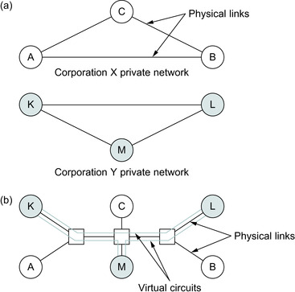

# VPN and IP Tunneling Study Notes

## Contents

1. [Big Picture](#big-picture)
2. [VPN: Virtual Private Network](#vpn-virtual-private-network)
3. [Virtual Circuits](#virtual-circuits)
4. [Sharing Hardware Safely](#sharing-hardware-safely)
5. [Capacity and Network Quality](#capacity-and-network-quality)
6. [IP Tunnels](#ip-tunnels)
7. [Commercial VPN Services](#commercial-vpn-services)
8. [Pritunl: VPN Server Platform](#pritunl-vpn-server-platform)
9. [VPN Server Location](#vpn-server-location)
10. [Quick Summary](#quick-summary)

---

## Big Picture

A **VPN (Virtual Private Network)** creates a <u>private network experience</u> over a **shared public or common network**.

> A VPN is like a private tunnel inside a busy public road system. Many people use the roads, but your tunnel keeps your path separate and protected.

Companies often need to connect offices in different places. They could rent private physical lines, but that is expensive. A VPN lets them connect offices over shared infrastructure while still behaving like a private network.



In the diagram:

- **(a)** Corporation X and Corporation Y each have separate private networks.
- **(b)** Both corporations use the same physical network equipment, but their traffic is separated using **virtual circuits**.

Even though the physical links and switches are shared, **Corporation X's traffic stays inside Corporation X's VPN**, and **Corporation Y's traffic stays inside Corporation Y's VPN**.

---

## VPN: Virtual Private Network

A **VPN** gives **private, controlled communication over a shared network**.

The important idea is:

```text
Shared physical network + logical separation = private network behavior
```

The VPN may use different mechanisms depending on the technology:

- **Virtual circuits**
- **Routing separation**
- **Access control**
- **Encryption**
- **Provider-side configuration rules**

In simple terms, a VPN makes a shared network feel like it belongs only to one organization or user.

---

## Virtual Circuits

A **virtual circuit** is a **logical connection** between two points across a shared network.

It is called *virtual* because there may not be one dedicated physical cable between the two points. Instead, the network creates a planned path through shared switches and links, and packets follow that path.

### Simple Example

Corporation X wants to connect office **A** to office **B**.

Instead of renting a private cable only for **A** and **B**, the provider creates a **virtual circuit** between them.

To Corporation X, it feels like a private line, even though the same hardware may also be used by others.

### Physical Circuit vs. Virtual Circuit

| Type | Meaning |
| --- | --- |
| **Physical circuit** | A real dedicated wire or physical link |
| **Virtual circuit** | A private-looking path created over shared hardware |

> A virtual circuit is like a private lane created inside a shared road system.

---

## Sharing Hardware Safely

### Can One Corporation Interfere With Another?

In a **properly designed VPN**, one corporation should **not** be able to access or interfere with another corporation's VPN traffic.

The network separates traffic using mechanisms such as:

- **Virtual circuit identifiers**
- **Routing separation**
- **Access control**
- **Encryption** in many VPN systems
- **Provider-side configuration rules**

So Corporation Y should not be able to send packets into Corporation X's private network unless the network is:

- Misconfigured
- Compromised
- Intentionally connected

> Different companies may use the same highway system, but each has its own sealed delivery route. Sharing the road does not mean they can open each other's packages.

---

## Capacity and Network Quality

### Does the Hardware Capacity Need To Be High Enough?

**Yes. Absolutely.**

Since many VPNs may share the same physical links and switches, the underlying network must have enough capacity for the total traffic.

Example:

```text
Corporation X: 200 Mbps
Corporation Y: 300 Mbps
Corporation Z: 400 Mbps
------------------------
Total traffic: 900 Mbps
```

The shared network should handle around **900 Mbps**, plus extra capacity for:

- Protocol overhead
- Traffic bursts
- Redundancy
- Failures
- Future growth

If the hardware or links are underpowered, **congestion** can happen.

### Can Shared Load Increase Latency, Jitter, and Reduce Quality?

**Yes.**

When many users share the same physical network, heavy load can affect performance.

| Network quality parameter | What happens under heavy load |
| --- | --- |
| **Latency** | Packets may take longer to arrive |
| **Jitter** | Delay may become less stable |
| **Packet loss** | Some packets may be dropped during congestion |
| **Throughput** | Users may get lower speeds |
| **Availability** | Failures can affect many VPNs sharing the same infrastructure |

This is why providers use:

- **QoS (Quality of Service)**
- **Traffic engineering**
- **Capacity planning**
- **Bandwidth guarantees**
- **Redundant links and devices**

---

## IP Tunnels

An **IP tunnel** is like a **virtual cable through the Internet**.

Even if two routers are separated by many networks, a tunnel can make them behave as if they have a direct point-to-point link between them.

### Simple Idea

Suppose we have:

- **R1** near network 1
- **R2** near network 2
- A large internetwork or Internet between them

Normally, packets from network 1 to network 2 travel using normal IP routing. But sometimes we do not want the middle network to understand or control the original packet.

So **R1 creates a tunnel to R2**.

### What Happens When R1 Sends a Packet Through the Tunnel?

1. **R1** receives the original packet.
2. **R1** sees: "To reach network 2, use the tunnel."
3. **R1** takes the whole original packet and puts it inside a new IP packet.
4. The new **outer IP packet** is addressed to **R2**.
5. The big internetwork only sees: "This packet is going to R2."
6. When the packet reaches **R2**, R2 removes the outer IP header.
7. **R2** finds the original packet inside.
8. **R2** forwards the original packet to network 2.

This process is called **encapsulation**.

### Encapsulation

```text
Original packet
      |
      v
Put inside a new outer IP packet
      |
      v
Outer packet is sent to tunnel endpoint R2
      |
      v
R2 removes outer header and forwards original packet
```

### Envelope Analogy

Think of the original packet as a letter:

> "Deliver this to network 2."

R1 puts that letter inside a bigger envelope:

> "Deliver this envelope to R2."

The public network only reads the outside envelope and sends it to **R2**. When **R2** receives it, it opens the envelope and continues delivering the original letter.

### Why Use Tunnels?

| Reason | Simple explanation |
| --- | --- |
| **Security** | With encryption, the tunnel can protect private traffic across a public network |
| **VPNs** | Company offices can communicate as if they are on the same private network |
| **Special routing features** | Two routers can use features that the middle network does not support |
| **Carrying other protocols** | Non-IP traffic can be carried inside IP packets |
| **Forcing a path** | A packet can be sent to a specific tunnel endpoint first |

### Important Point

The routers in the middle do **not** need to understand the original packet inside the tunnel.

They only care about the **outer IP header**, which says:

> "Send this packet to R2."

Only **R1** and **R2** need to understand the tunnel.

### Downsides of Tunneling

| Downside | Simple meaning |
| --- | --- |
| **Bigger packets** | Extra IP headers are added, so packets become larger |
| **Possible fragmentation** | If packets become too large, they may need to be split |
| **More router work** | R1 must add the tunnel header, and R2 must remove it |
| **Management cost** | Someone must configure and maintain the tunnel correctly |

---

## Commercial VPN Services

Paid VPN services can bypass some government or ISP website restrictions because they **send your traffic through a server in another country**.

Normally:

```text
You -> your ISP/government-controlled network -> blocked website
```

With a VPN:

```text
You -> encrypted tunnel -> VPN server in another country -> website
```

The local network may only see that you are connected to a VPN server, not the final website.

The website also sees the **VPN server's location and IP address** instead of yours, so it may look like you are visiting from another country.

### Important Limitation

This is **not guaranteed**.

Governments or networks can sometimes:

- Block known VPN servers
- Detect VPN traffic patterns
- Restrict or criminalize VPN use
- Require local providers to filter traffic

Depending on the country, VPN use may be technically difficult, legally risky, or both.

---

## Pritunl: VPN Server Platform

**Pritunl** is software for creating and managing your own VPN server.

It is not mainly a *consumer VPN service* where you open an app and choose a country from a list. Instead, it is more like a **VPN server platform** that a company, school, or technical user can install on their own server to give users secure remote access to private networks.

Simply:

```text
Pritunl = a tool to build and manage VPNs
```

Pritunl supports common VPN technologies such as **OpenVPN**, **WireGuard**, and **IPsec**. Its website describes it as an **enterprise distributed VPN server**.

### Example Use

- A company has private servers in **AWS**.
- Employees are outside the office.
- The company installs **Pritunl** on a server.
- Employees connect using a **Pritunl**, **OpenVPN**, or **WireGuard** client.
- After connecting, employees can securely access the company's private network.

In terms of the tunnel model:

```text
Your device -> encrypted tunnel -> Pritunl VPN server -> private/company network or internet
```

Pritunl also provides a client app for **macOS**, **Windows**, and **Linux**, and the client can import **OpenVPN** and **WireGuard** profiles.

### Consumer VPN vs. Pritunl

| Type | Main purpose |
| --- | --- |
| **Consumer VPN service** | Use someone else's VPN servers, often to change apparent location or add privacy on public networks |
| **Pritunl** | Build and manage your own VPN server for controlled access to private networks |

Useful links:

- [Pritunl - Enterprise VPN Server](https://pritunl.com/)
- [Pritunl Client](https://client.pritunl.com/)

---

## VPN Server Location

### Is a Commercial VPN the Same General Tunneling Idea?

Yes. It is the **same general tunneling idea**, but usually with **encryption added**.

In a textbook IP tunnel:

```text
Original packet -> put inside outer IP packet -> sent to tunnel endpoint
```

In a commercial VPN:

```text
Original traffic -> encrypted -> put inside outer packet -> sent to VPN server
```

The outer packet usually looks like:

```text
source:      your device/public IP
destination: VPN server IP
```

Your ISP or local network mainly sees:

> "This user is sending encrypted packets to a VPN server."

They usually cannot easily see the original destination website inside the encrypted tunnel.

### VPN Server in Another Country

A VPN server can be physically located in another country.

Example:

1. You connect to a VPN server in **Germany**.
2. Your request for a blocked website is encrypted and tunneled to that German VPN server.
3. The VPN server decrypts the tunnel traffic.
4. The VPN server sends your request to the website.
5. The website replies to the VPN server.
6. The VPN server sends the response back to you through the encrypted tunnel.

To the website, it looks like the request came from the **VPN server in Germany**, not directly from you.

> Small correction: the VPN server does not usually "redirect" your request like a web redirect. It acts more like a **middle router or proxy**: it receives your traffic, unwraps it, forwards it to the destination, then wraps the response back to you.

### VPN Server Inside the Same Restricted Country

A VPN server **can** be located inside the same restricted country.

But then it usually does **not** help much for bypassing that country's restrictions, because after traffic leaves the VPN server, it is still inside the same national or ISP-controlled network environment.

Example:

```text
You -> encrypted tunnel -> VPN server inside restricted country -> blocked website
```

The local ISP or government may not see the website requested between you and the VPN server. However, the VPN server's outgoing request to the blocked website may still be blocked.

For bypassing country-level blocking, users usually choose a VPN server **outside** the restricted country:

```text
You -> encrypted tunnel -> VPN server in another country -> website
```

Comparison:

| VPN server location | Result |
| --- | --- |
| **Inside the same restricted country** | May hide traffic from the first local network, but may not bypass national blocks |
| **Outside the restricted country** | More likely to bypass location-based or country-level restrictions |
| **Inside the same country for normal privacy** | Still useful for public Wi-Fi, company access, or hiding traffic from the first local network |

---

## Quick Summary

- A **VPN** creates private, controlled communication over a shared network.
- A **virtual circuit** is a logical private-looking path across shared hardware.
- Shared VPN infrastructure needs enough capacity, or users may experience **latency**, **jitter**, **packet loss**, and lower **throughput**.
- An **IP tunnel** puts the original packet inside another IP packet.
- A commercial VPN usually combines tunneling with **encryption**.
- **Pritunl** is a platform for building and managing your own VPN server.
- A VPN server outside a restricted country is more useful for bypassing country-level blocking than one inside the same restricted country.

```text
VPN = private network behavior over shared infrastructure
IP tunnel = original packet carried inside an outer packet
Commercial VPN = encrypted tunnel through a VPN server
Pritunl = software platform for self-managed VPN servers
```
