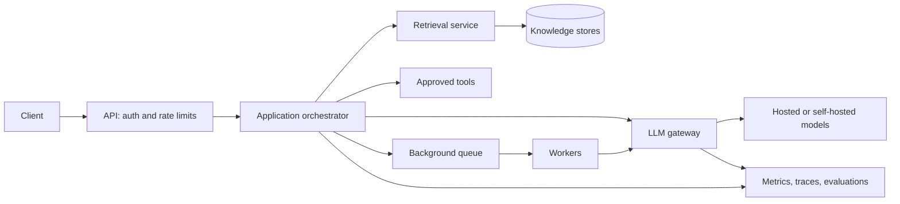

# AI Systems Design

## Table of Contents

- [Overview](#overview)
- [Core Building Blocks](#core-building-blocks)
  - [LLM Requests and Context](#llm-requests-and-context)
  - [Embeddings and Modalities](#embeddings-and-modalities)
  - [Model Failure Modes](#model-failure-modes)
- [Reference Architecture](#reference-architecture)
- [Reliability and Resilience](#reliability-and-resilience)
  - [LLM Gateway](#llm-gateway)
  - [Timeouts, Circuit Breakers, and Fallbacks](#timeouts-circuit-breakers-and-fallbacks)
- [Latency and Throughput](#latency-and-throughput)
  - [Synchronous, Asynchronous, and Streaming Work](#synchronous-asynchronous-and-streaming-work)
  - [Caching and Request Coalescing](#caching-and-request-coalescing)
- [Cost and Model Routing](#cost-and-model-routing)
- [Grounding and Retrieval](#grounding-and-retrieval)
  - [RAG Request Flow](#rag-request-flow)
  - [Knowledge Ingestion and Retrieval](#knowledge-ingestion-and-retrieval)
  - [Context Engineering](#context-engineering)
- [Tools and Agentic Workflows](#tools-and-agentic-workflows)
- [Evaluation and Observability](#evaluation-and-observability)
  - [Evaluating Quality](#evaluating-quality)
  - [Measuring Production Behavior](#measuring-production-behavior)
- [Security, Privacy, and Data Residency](#security-privacy-and-data-residency)
  - [Threats and Controls](#threats-and-controls)
  - [Data Handling and Deployment Choices](#data-handling-and-deployment-choices)
- [Design Checklist](#design-checklist)
- [Key Takeaways](#key-takeaways)
- [Further Reading](#further-reading)

## Overview

**AI systems design** is the design of complete applications that use models as components: clients, APIs, orchestration, retrieval, tools, storage, monitoring, and operations. It assumes the usual distributed systems foundations, then addresses the behavior and cost of model inference.

> The model is one dependency in the application. The system around it determines whether the result is useful, safe, fast, affordable, and reliable.

Unlike ordinary deterministic code, an LLM can produce different responses to the same request. Even when output is constrained, quality depends on the prompt, available context, model, and external data. Design therefore combines **deterministic controls** (validation, permissions, budgets, tests) with **probabilistic evaluation** (task success, groundedness, human review).

| Design concern | Question to answer |
| --- | --- |
| **Quality** | Does the output solve the user's task and use trustworthy evidence? |
| **Latency** | How quickly does the user see a useful result? |
| **Cost** | How many tokens, model calls, and retrieval operations does each task consume? |
| **Reliability** | What happens when a model or provider slows down, fails, or returns unusable output? |
| **Security and privacy** | Which data and tools can the model access, and where does data go? |
| **Scale** | Can the architecture handle concurrent requests and background work? |

## Core Building Blocks

### LLM Requests and Context

An LLM processes **tokens** (pieces of text or other encoded input) and predicts an output from the supplied context. An application request commonly contains:

- **Instructions:** The task, format, and behavior expected of the model.
- **User input:** The current question or action request.
- **Context:** Relevant conversation history, retrieved records, and tool results.
- **Output constraints:** A schema, length limit, or allowed tool list.

The **context window** limits what can be supplied in one request. Long histories and retrieved documents compete for that space. More context can increase cost and latency, and irrelevant context can reduce quality.

> <u>Prompting is an interface design task.</u> Specify the job clearly, keep trusted instructions separate from untrusted content, and validate the result in application code. A prompt alone is not an access-control boundary.

### Embeddings and Modalities

An **embedding** is a vector representation used to compare the meaning or similarity of items. It is useful for search and retrieval; it is not a secure substitute for the underlying data or for access control.

| Modality | Typical input or output | Example use |
| --- | --- | --- |
| Text | Documents, messages, code | Summarization, chat, code assistance |
| Image | Pictures, screenshots | Visual question answering |
| Audio | Speech and sound | Transcription, spoken assistants |
| Video | Frames, often with audio | Clip analysis |
| Spatial or structured signals | Coordinates, sensor data, 3D features | Navigation and scene understanding |

Different modalities change storage, bandwidth, latency, privacy, and evaluation requirements. A text-only system and a real-time voice assistant need different architectures.

### Model Failure Modes

| Failure mode | What it looks like | Design response |
| --- | --- | --- |
| **Hallucination** | A plausible but unsupported claim | Ground in evidence, require citations where useful, and verify critical facts. |
| **Stale knowledge** | An answer based on outdated information | Retrieve from an authoritative current source. |
| **Bias or harmful output** | Unequal, unsafe, or inappropriate treatment | Test across affected groups and scenarios; review high-impact decisions. |
| **Invalid format or instruction drift** | Missing fields, broken JSON, or ignored constraints | Use structured output, schema validation, and bounded repair or retry. |
| **Dependency failure** | Timeout, rate limit, or provider outage | Apply deadlines, backoff, circuit breakers, and tested fallbacks. |

RAG can help with missing or stale facts, but it does not solve every failure mode. Bias, unsupported reasoning, and unsafe actions need their own controls and evaluations.

## Reference Architecture



- The **client** handles interaction and may receive a streamed answer or track a background job.
- The **API** authenticates users, enforces quotas, and establishes tenant identity.
- The **orchestrator** builds context, applies business rules, calls tools, and validates outputs.
- The **retrieval layer** supplies authorized, current information.
- The **LLM gateway** chooses models and centralizes provider calls, telemetry, and limits.
- **Workers** handle tasks that need more time than an interactive request allows.

This is a reference layout, not a rule that every application needs separate services. A small system can combine components while retaining clear responsibilities.

## Reliability and Resilience

### LLM Gateway

An **LLM gateway** gives application services a shared interface for model calls. It can manage credentials, model selection, request limits, retries, logging, and provider-specific formats.

| Without a shared gateway | With a shared gateway |
| --- | --- |
| Each service integrates with providers independently. | Services use one internal contract. |
| Limits, retries, and telemetry differ by service. | Common policies are applied in one place. |
| Credentials are spread across services. | Credentials can be managed centrally. |

Centralization also creates a critical dependency: scale the gateway, isolate failures, and keep its API small enough to evolve. A gateway can make provider changes easier, but model behavior and features may still require application changes.

### Timeouts, Circuit Breakers, and Fallbacks

- **Deadlines:** Set an end-to-end time budget, then allocate smaller budgets to retrieval, tools, and model calls.
- **Bounded retries:** Retry only transient failures when safe; add jitter and respect rate-limit responses.
- **Circuit breaker:** Stop sending traffic to an unhealthy dependency, then probe it after a cooldown.
- **Fallback:** Use another model, a narrower feature, a cached *safe* result, or a clear error.
- **Bulkhead:** Keep one expensive or failing workload from exhausting capacity for all users.

> A fallback model must be tested against the task and data policy. A faster model that produces an incorrect reservation, leaks data, or violates a required format is not a useful fallback.

For interactive requests, fail or degrade within the user's deadline. Background jobs can retry for longer, provided duplicate execution is handled through idempotency.

## Latency and Throughput

### Synchronous, Asynchronous, and Streaming Work

| Pattern | Use when | User experience |
| --- | --- | --- |
| **Synchronous** | The task can finish within the interaction deadline | Client waits for the complete result |
| **Streaming** | Partial output is useful, such as chat or drafting | Client sees output as it arrives |
| **Asynchronous** | The task is long running, batchable, or multi-step | Client receives a job ID and later polls or gets a notification |

Streaming reduces *perceived* waiting time; it does not necessarily reduce total completion time. For HTTP streaming, server-sent events (SSE) are one option. Long-running jobs should be queued, persisted, retried safely, and given a status that the client can query.

Useful latency measures are:

- **TTFT (time to first token):** Time until the first visible output.
- **TPOT (time per output token):** Average interval between generated tokens.
- **End-to-end latency:** Time from request to complete, validated result.
- **Throughput:** Requests or generated tokens completed per unit time.

Measure p50, p95, and p99, because averages can hide slow user experiences.

### Caching and Request Coalescing

| Technique | Idea | Main caution |
| --- | --- | --- |
| **Exact cache** | Reuse a result for identical normalized inputs | Include model, prompt version, tenant, permissions, and data version in the cache key. |
| **Semantic cache** | Reuse an answer for sufficiently similar requests | Similar wording may still require different answers; validate equivalence and freshness. |
| **Precomputation** | Generate predictable results before users ask | Regenerate when source data changes. |
| **Request coalescing** | Let concurrent identical misses share one in-flight call | Share only across requests with equivalent authorization and context. |

Caching saves model calls only when reuse is correct. Personalized, time-sensitive, or sensitive outputs require especially careful scope and expiry rules.

## Cost and Model Routing

Model cost is variable because requests have different input lengths, output lengths, tool calls, and retries. For a token-priced model, an approximate request cost is:

$$
C_{request} \approx \frac{T_{in}P_{in} + T_{out}P_{out}}{10^6}
              + C_{retrieval} + C_{tools} + C_{infrastructure}
$$

where $T$ is token count and $P$ is price per million tokens. Actual billing depends on the provider and deployment model.

**Cost controls:**

- Route simple tasks to a model that meets the required quality at lower cost.
- Set input, output, tool-call, time, and per-user budget limits.
- Retrieve only relevant context; summarize history when it is safe to do so.
- Cache reusable work and batch work that need not run immediately.
- Track cost per successful task, not only cost per model call.

> Model routing is a quality decision as well as a cost decision. Test each route with representative tasks and watch for regressions when models or prompts change.

## Grounding and Retrieval

LLMs may produce unsupported statements and may lack recent or private facts. **Grounding** supplies relevant external information at request time. Retrieval-augmented generation (**RAG**) is a common grounding pattern.

### RAG Request Flow

1. **Authorize** the user and determine which records they may access.
2. **Retrieve** relevant records using keywords, vectors, filters, or structured queries.
3. **Rank and select** the best evidence within a context budget.
4. **Augment** the model request with that evidence and its provenance.
5. **Generate** an answer, then check citations, format, and any domain rules.

> RAG can improve factual grounding and freshness, but retrieval can miss evidence and the model can still misread or invent claims. High-stakes answers need explicit validation or human review.

For a live order status, query the authoritative order database. A vector search over old documents is a poor substitute for current transactional state.

### Knowledge Ingestion and Retrieval

An ingestion pipeline usually **collects → cleans → chunks → embeds/indexes → stores → refreshes** documents. Each stored chunk should retain a link to its source, version, timestamp, and access policy.

| Retrieval method | Strength | Useful for |
| --- | --- | --- |
| **Keyword search** | Exact terms and identifiers | Error codes, product IDs, names |
| **Vector search** | Semantic similarity | Paraphrased questions and concept matches |
| **Structured query** | Exact current fields and relations | Account balances, order state, permissions |
| **Graph traversal** | Explicit relationships | Connected entities and dependency paths |
| **Hybrid retrieval** | Combines methods and reranks results | Mixed search workloads |

Enforce tenant and user permissions **during retrieval**, before results enter the prompt. Recheck permissions when accessing the source and when serving cached results.

### Context Engineering

**Context engineering** selects and organizes what the model sees: instructions, conversation, retrieved evidence, tool results, and output schema.

- Put the task and expected output format in clear terms.
- Distinguish trusted instructions from documents and user-provided text.
- Prefer relevant, current, attributable evidence over large undifferentiated dumps.
- Reserve space for the model's answer and possible tool responses.
- Define what to do when evidence is missing or conflicting.
- Version prompts and retrieval settings so evaluations are reproducible.

## Tools and Agentic Workflows

A **tool call** lets the model request an operation through a defined schema; the application validates and executes it. An **agentic workflow** uses repeated model decisions and tool results to pursue a goal whose exact path is not fixed in advance.

```text
Goal → choose next step → request tool → validate and execute → observe result
  ↑                                                     │
  └──────────── continue, revise, or finish ────────────┘
```

Agentic workflows can search, read files, query databases, or run code. They also add cost, latency, and more opportunities for mistakes. Use a fixed workflow when the steps are known; use an agent when the system must choose steps dynamically.

**Agent controls:**

- Give each tool the minimum permissions needed for the current task.
- Validate tool arguments and results outside the model.
- Limit steps, time, tokens, and spending per run.
- Record tool calls and outcomes for debugging.
- Require approval before consequential actions such as sending messages, modifying records, or deleting data.
- Make retries and writes idempotent where possible.

## Evaluation and Observability

### Evaluating Quality

Exact string comparisons are useful for strict formats but too brittle for most open-ended answers. Build a **golden set** of representative tasks, edge cases, and expected behavior, then evaluate the full system after model, prompt, retrieval, or tool changes.

| Evaluation method | Best use | Limitation |
| --- | --- | --- |
| **Programmatic checks** | Schema, citations, tool permissions, factual fields | Cannot judge all nuanced quality |
| **Human review** | High-impact or subjective tasks | Slower and more expensive |
| **LLM as judge** | Scoring many responses for groundedness, relevance, or tone | Can be biased or inconsistent; calibrate against human ratings |
| **Task outcome checks** | Whether an agent actually completed the objective | Requires a reliable external success signal |

For a multi-criterion task, define weights that sum to $1$:

$$
S_{task} = \sum_{i=1}^{k} w_i s_i, \qquad \sum_{i=1}^{k} w_i = 1
$$

Here $s_i$ is the score for criterion $i$ and $w_i$ is its importance. Report the distribution of task scores and the percentage above an agreed threshold; a single average hides failures on critical cases.

Example tests include incomplete code for code completion, source-backed repository questions for coding assistants, multi-step tasks for agents, and adversarial or ambiguous requests for safety controls. Review results after each material change and block releases when critical checks fail.

### Measuring Production Behavior

| Area | Metrics to track |
| --- | --- |
| **Quality** | Task success, groundedness, user corrections, human escalation |
| **Latency** | p95/p99 TTFT, total latency, TPOT, queue wait |
| **Cost** | Tokens and cost per request, user, tenant, and successful task |
| **Reliability** | Timeouts, invalid outputs, retries, fallback use, provider errors and rate limits |
| **Retrieval** | Search hit rate, evidence relevance, stale content, permission-filter failures |
| **Agents** | Tool failures, steps per run, budget exhaustion, approval rate |

Trace a request across API, retrieval, tools, gateway, and model calls. Log enough to diagnose problems while avoiding unnecessary storage of prompts, outputs, and personal data.

## Security, Privacy, and Data Residency

### Threats and Controls

Treat user input, retrieved pages, tool results, and model output as **untrusted data**. The model may help interpret them, but the application must enforce permissions and validate actions.

| Risk | Control |
| --- | --- |
| **Prompt injection** in a document or tool result | Keep instruction and data roles distinct; restrict tools; verify actions in code. Filters may help but are not a complete defense. |
| **Unsafe output** such as HTML, code, or SQL | Validate schemas; encode or sanitize for the destination; use parameterized queries; never execute raw model output blindly. |
| **Excessive agency** | Scope credentials and tool access; cap steps; require human approval for high-impact actions. |
| **Sensitive-data disclosure** | Minimize data sent to models, enforce retrieval permissions, redact where appropriate, and control logs and retention. |
| **Resource abuse** | Rate-limit users, cap tokens and concurrency, apply budgets and backpressure. |
| **Poisoned data or dependencies** | Track source provenance, review ingestion, and assess models, libraries, and tools before use. |

### Data Handling and Deployment Choices

Data residency concerns **where data is processed and stored**, including prompts, outputs, embeddings, logs, caches, and backups. Retention and provider access are separate questions.

| Deployment choice | Main benefit | Main responsibility |
| --- | --- | --- |
| **Hosted model API** | Fast adoption and less infrastructure work | Verify processing locations, retention, contracts, and permitted data use. |
| **Managed model service in a chosen cloud environment** | Closer integration with existing cloud controls | Check actual region routing, network path, logging, and provider terms. |
| **Self-hosted model** | More control over deployment and data path | Operate GPUs, scaling, patching, model updates, and security. |

Minimize transferred context, encrypt data in transit and at rest, apply tenant-level access controls, and set retention rules for every data store. **Embeddings can leak information** and should be protected like other derived sensitive data; they are not guaranteed to be irreversible or anonymous.

> No deployment option is automatically compliant. Verify the concrete service configuration and legal requirements for the application and data involved.

## Design Checklist

1. **Task:** What outcome must the user achieve, and what does a correct answer look like?
2. **Model:** Which model meets the quality target at an acceptable cost and latency?
3. **Context:** Which information is necessary, current, and authorized?
4. **Flow:** Is the task synchronous, streamed, or a background job?
5. **Failure:** What are the deadlines, retry rules, fallbacks, and user-visible errors?
6. **Tools:** Which operations are allowed, and which require approval?
7. **Data:** Where do prompts, outputs, embeddings, logs, and backups live?
8. **Evaluation:** Which representative and adversarial tasks run before release?
9. **Operations:** Which metrics reveal quality, cost, latency, and provider incidents?
10. **Scale:** What happens under concurrent requests, cache misses, and queue growth?

## Key Takeaways

- Build the application around a model with explicit contracts for data, tools, output, latency, and cost.
- Use retrieval for relevant external facts, but verify evidence and permissions before generation.
- Keep interactive work within a deadline; stream useful partial output and queue long tasks.
- Centralize shared model policies where useful, and design the gateway for failure and scale.
- Evaluate the complete task with representative data; model scores alone do not prove application quality.
- Treat agents as bounded workflows with validated tools and approvals for consequential actions.
- Protect prompts, outputs, embeddings, and telemetry according to the same data policy.

## Further Reading

- [Retrieval-Augmented Generation for Knowledge-Intensive NLP Tasks](https://arxiv.org/abs/2005.11401)
- [OWASP Top 10 for LLM and Generative AI Applications](https://genai.owasp.org/llm-top-10/)
- [NIST Generative AI Profile](https://nvlpubs.nist.gov/nistpubs/ai/NIST.AI.600-1.pdf)
