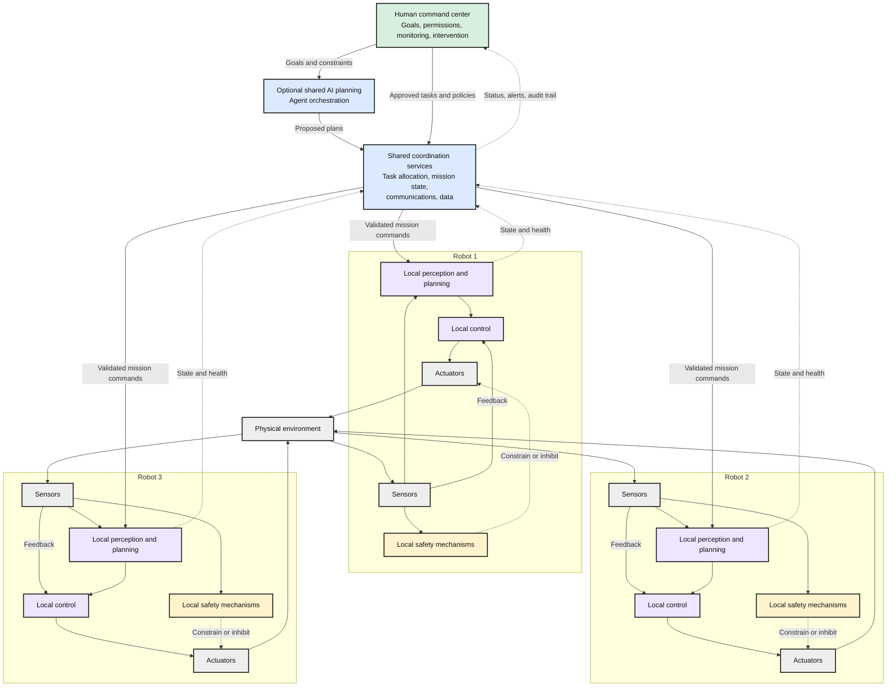

# Distributed Intelligence and Robotics System Design

## Table of Contents

- [Overview](#overview)
  - [Related Concepts](#related-concepts)
  - [Core Mental Model](#core-mental-model)
- [Human-Supervised Reference Architecture](#human-supervised-reference-architecture)
  - [Where Decisions Belong](#where-decisions-belong)
- [What Transfers from Distributed System Design](#what-transfers-from-distributed-system-design)
  - [Basics of System Design](#basics-of-system-design)
  - [Distributed System Attributes](#distributed-system-attributes)
  - [Distributed Systems Theorems and Data Structures](#distributed-systems-theorems-and-data-structures)
  - [Distributed Systems Building Blocks: DNS, Load Balancers, and Application Gateways](#distributed-systems-building-blocks-dns-load-balancers-and-application-gateways)
  - [Design and Implementation of System Components: Databases and Storage](#design-and-implementation-of-system-components-databases-and-storage)
  - [Distributed Cache](#distributed-cache)
  - [Pub/Sub, Distributed Queues, and Event-Driven Architectures](#pubsub-distributed-queues-and-event-driven-architectures)
  - [Design and Implementation of System Components: API, Security, and Metrics](#design-and-implementation-of-system-components-api-security-and-metrics)
- [Complementary Engineering Disciplines](#complementary-engineering-disciplines)
- [What Physical Systems Change](#what-physical-systems-change)
  - [Planning, Control, and Safety](#planning-control-and-safety)
  - [Commands Are Not Ordinary Messages](#commands-are-not-ordinary-messages)
  - [ROS 2, DDS, and Communication QoS](#ros-2-dds-and-communication-qos)
- [Failure Example: A Warehouse Robot Loses Communication](#failure-example-a-warehouse-robot-loses-communication)
- [Failure Example: A Military Support Robot Loses Communication](#failure-example-a-military-support-robot-loses-communication)
- [Failure Example: A Space Robot Loses Communication](#failure-example-a-space-robot-loses-communication)
- [Compact Study Map](#compact-study-map)
- [Key Takeaways](#key-takeaways)
- [References](#references)

## Overview

**Distributed intelligence** means that multiple computing agents contribute to sensing, reasoning, planning, or decision-making and coordinate their work. Some agents may be software services; others may operate through physical robots.

**Distributed system design is a foundation for building these systems.** It explains how components communicate, share information, coordinate tasks, handle failures, and operate at scale. Robotics adds requirements involving motion, timing, hardware, and physical safety.

**Example:** A human supervisor asks a warehouse fleet to move packages. Shared services allocate tasks; robots detect obstacles, navigate, and control their motors locally. The fleet must coordinate without making each robot depend on a continuous connection for every movement.

### Related Concepts

| Concept | Main focus | Example |
| --- | --- | --- |
| **Distributed AI** | AI capabilities spread across cooperating agents or machines. | Several agents analyze observations and coordinate a plan. |
| **Multi-robot system** | Multiple physical robots work in a shared environment. | Robots share delivery tasks and coordinate access to an aisle. |
| **Cyber-physical system** | Computation, communications, people, and physical processes interact. | Software decisions affect motors, while sensors report physical changes. |

These concepts overlap, but are not synonyms. Distributed AI does not require robots, and a multi-robot system does not require LLMs. NIST's cyber-physical systems framework treats physical, computational, human, and timing concerns together. [NIST CPS overview](https://www.nist.gov/publications/framework-cyber-physical-systems-volume-1-overview)

### Core Mental Model

> **System design connects the components; specialist engineering makes each component work.** The integrated system must then be tested against its real operating conditions.

- **Human supervision:** What should the system achieve, and what is it allowed to do?
- **Fleet coordination:** Which robot should do which task, using what shared information?
- **Local autonomy:** How should this robot carry out its task in its current surroundings?
- **Control and safety:** How should actuators respond, and which actions must be limited or prevented?

## Human-Supervised Reference Architecture

This is an **illustrative architecture**, not a mandatory topology. Shared services may run at a command center, on an edge server, or across multiple machines. Some coordination can be decentralized.

**Diagram:** Mission commands flow from supervision and coordination toward robots; telemetry flows back. Sensors provide local control feedback, and actuators change the environment. Control feedback and the safety path do not depend on the shared AI planner; the actual safety implementation must be designed and validated for the hazards.

### Where Decisions Belong

| Layer | Typical responsibility | Warehouse example |
| --- | --- | --- |
| **Human command center** | Set objectives, authorize operations, review exceptions, and intervene. | Approve a delivery mission and restrict access to an area. |
| **Shared coordination** | Allocate tasks and maintain shared mission state. | Assign one package to one robot and manage shared resources. |
| **AI planning and agents** | Interpret goals and propose task sequences within allowed capabilities. | Turn a delivery request into a proposed sequence of tasks. |
| **Local perception and planning** | Estimate nearby conditions and adapt the robot's behavior. | Detect an obstacle and choose an allowed route around it. |
| **Local control and safety** | Execute motion with bounded timing and enforce physical limits. | Regulate speed and prevent an unsafe actuator command. |

> **Human-controlled does not mean every motor command is sent remotely.** Humans can retain mission authority while robots execute bounded local autonomy. Central AI, onboard AI, and LLMs are choices, not requirements at every layer.

## What Transfers from Distributed System Design

| System-design concept | How it applies | Concrete example |
| --- | --- | --- |
| **Networking** | Manage delay, disconnections, bandwidth, and partial failures. | A robot continues following its approved loss-of-link policy when wireless coverage drops. |
| **APIs and interfaces** | Define commands, results, errors, versions, and responsibilities. | A delivery command identifies the task, destination, and allowed operating conditions. |
| **Messaging** | Separate commands, events, and telemetry; handle ordering and retries. | A retried delivery message must not create a second delivery task. |
| **Consistency** | Decide which shared data must be current and which may lag. | Task ownership needs stronger coordination than a dashboard's battery display. |
| **Consensus** | Agree on shared decisions or an ordered history. | Coordinators agree on a task assignment or which coordinator has authority. |
| **Fault tolerance** | Continue or degrade safely when components fail. | Another coordinator takes over without issuing conflicting assignments. |
| **Scalability** | Handle more robots and more sensor and status traffic. | Keep local sensing local instead of uploading every raw observation to one server. |
| **Security** | Authenticate participants and restrict command authority. | A monitoring account can view robot status but cannot command motion. |
| **Observability** | Connect mission events with node and physical behavior. | Trace a delayed delivery to a blocked route, low battery, or lost connection. |

> **Consensus is not physical truth.** Nodes can agree that an aisle is clear while their sensor data is wrong. Physical decisions also need appropriate sensing, uncertainty handling, and safety checks.

Robots are not automatically interchangeable replicas: one may carry a package, occupy a narrow aisle, or have different hardware. Reassigning a task requires checking the physical situation, not just selecting another healthy server.

The table above is a quick summary. The following **eight study areas** map the broader system-design discipline to shared AI services, fleet coordination, and onboard software. Their use depends on requirements; not every robot needs every database, broker, or consensus protocol.

### Basics of System Design

System design turns the mission into **requirements, components, interfaces, data flows, and explicit trade-offs**.

- **Functional requirements:** Define what humans, AI services, and robots must do, such as assign a delivery and report its outcome.
- **Non-functional requirements:** Define latency, capacity, reliability, security, resource budgets, and required operating limits.
- **High-level design:** Decide which work belongs at the command center, shared services, edge infrastructure, or onboard each robot.
- **Low-level design:** Define command states, interfaces, validation, concurrency, and recovery behavior inside each component.

**Example:** Before choosing tools, specify who may assign tasks, which decisions can be local, and what a robot must do when its connection fails. Cost and performance trade-offs must not silently remove required safety constraints.

### Distributed System Attributes

| Attribute | Applicability to distributed intelligence and robotics |
| --- | --- |
| **Consistency** | Prevent conflicting task ownership; allow less critical dashboard telemetry to lag when appropriate. |
| **Availability** | Keep mission services usable during supported failures, while showing which operations are unavailable. |
| **Partition tolerance** | Define what each disconnected robot or group is allowed to do without shared coordination. |
| **Latency** | Separate human-facing response targets from onboard control deadlines; consider tail delays, not only averages. |
| **Durability** | Preserve accepted tasks, execution records, configuration, and observations across supported crashes. |
| **Reliability** | Deliver the intended mission behavior correctly over time, rather than merely keep processes running. |
| **Fault tolerance** | Use redundancy, recovery, and validated degraded behavior for supported component failures. |
| **Scalability** | Handle additional robots, concurrent missions, inference requests, and telemetry without missing required targets. |

**Example:** A dashboard may temporarily display an old battery reading, but final task assignment may require an authoritative state check. A disconnected robot cannot assume another robot's last reported position is still current.

> **Different data needs different guarantees.** Shared digital state, live physical observations, and control feedback cannot all be treated as ordinary replicated database values.

### Distributed Systems Theorems and Data Structures

These topics explain **coordination limits** and how to distribute or summarize large amounts of information.

| Topic | Matching application | Important boundary |
| --- | --- | --- |
| **CAP** | Decide whether affected shared-state operations wait or proceed with weaker consistency during a partition. | Continuing physical work still requires the robot's approved local policy. |
| **PACELC** | Evaluate the latency cost of coordinating task state across distant services even when the network works. | The theorem does not determine physical safety limits. |
| **FLP impossibility** | Understand why deterministic consensus cannot guarantee termination under fully asynchronous communication with even one possible crash. | Practical progress requires additional assumptions or techniques; safety need not be abandoned. |
| **Paxos, Raft, and Zab** | Agree on coordinator authority, configuration, or ordered mission-state updates within a replica group. | They do not directly regulate motors or verify sensor truth. |
| **BGP and BFT protocols such as PBFT** | Reason about arbitrary or dishonest behavior in shared-service participants. | Ordinary replication is not sufficient; the protocol's fault budget and assumptions matter. |
| **Consistent hashing** | Distribute cache keys or stored observations while limiting remapping when nodes change. | It is not a physical task-allocation or robot navigation algorithm. |
| **Bloom filters** | Quickly check whether an observation identifier may already exist before an exact lookup. | False positives are possible; do not use this alone to discard required work or authorize actions. |
| **Count-Min Sketch** | Estimate how often fault codes or event types appear in large telemetry streams. | Estimates are not authoritative incident counts. |
| **HyperLogLog** | Estimate how many distinct robots reported during a time window. | It does not provide the exact participant list or establish which robots are online now. |

**Example:** Use an agreed log to preserve task assignments, consistent hashing to spread cache entries, and compact summaries for fleet analytics. These solve different problems and should not be substituted for one another.

[Bloom filter behavior](https://redis.io/docs/latest/develop/data-types/probabilistic/bloom-filter/), [Count-Min Sketch](https://redis.io/docs/latest/develop/data-types/probabilistic/count-min-sketch/), [HyperLogLog](https://redis.io/docs/latest/develop/data-types/probabilistic/hyperloglogs/)

### Distributed Systems Building Blocks: DNS, Load Balancers, and Application Gateways

| Building block | Applicability | Concrete example |
| --- | --- | --- |
| **DNS** | Resolve service names to addresses instead of hard-coding every infrastructure address. | A robot connects to a named mission API; the design also handles resolution failure and cached addresses. |
| **Load balancers** | Distribute requests across eligible, equivalent service instances. | Spread inference or telemetry-ingestion requests across backend servers. |
| **Reverse proxies** | Receive requests and route them to the appropriate backend service. | Route `/missions` to coordination and `/observations` to data ingestion. |
| **Application/API gateways** | Provide an entry point for application routing, authentication, request validation, quotas, and audit integration. | Check an operator's permission before forwarding a mission request. |

**Example:** DNS locates the fleet API endpoint; a gateway routes and checks the request; load balancing chooses a healthy backend instance. The task allocator separately chooses a capable robot using mission and physical state.

> **Balancing backend requests is not the same as assigning physical robot tasks.** Nor do DNS, gateways, or load balancers belong automatically in a time-critical onboard control loop.

[DNS concepts and caching](https://www.rfc-editor.org/rfc/rfc1034)

### Design and Implementation of System Components: Databases and Storage

Choose storage according to **what must be stored, how it is queried, and what failures it must survive**.

| Storage topic | Matching application |
| --- | --- |
| **Relational databases, transactions, and constraints** | Store robots, missions, permissions, and task ownership; enforce allowed mission-state changes. |
| **Document/key-value databases** | Store suitable configuration documents, capability records, or lookup-oriented state. |
| **Time-series storage** | Query battery readings, temperatures, latency, and other timestamped telemetry. |
| **Object storage** | Retain images, sensor recordings, maps, model artifacts, and other large files. |
| **Vector indexes and retrieval** | Retrieve relevant manuals or prior observations for AI-assisted planning, with provenance and access checks. |
| **Onboard persistent journals** | Record accepted commands and execution progress while disconnected, then reconcile with shared services. |
| **Indexes, partitioning, and sharding** | Keep queries efficient and distribute growing histories by suitable keys such as robot ID and time. |
| **Replication, backups, and recovery** | Preserve data across failures and restore independent history after deletion or corruption; define and test RPO/RTO. |

**Example:** The coordinator records an assignment transactionally; the robot journals acceptance locally; telemetry goes to time-series storage; camera recordings go to object storage. Reconnection must reconcile these records with the physical outcome.

> A committed database transaction does not prove that a robot completed its action. Storage consistency and physical execution are separate responsibilities; replication is also not a replacement for backups.

### Distributed Cache

Caching avoids repeatedly loading or computing information. A **shared distributed cache** can support fleet services; **local caches** can reduce onboard dependence on remote access.

- **Cached data:** Frequently read configuration, versioned map data, model metadata, or non-authoritative dashboard views.
- **Access patterns:** Understand cache-aside or read-through fetching, and how writes update or invalidate cached entries.
- **Freshness and capacity:** Define TTLs, version checks, invalidation, eviction, and recovery from cache loss.
- **Scale and latency:** Consider hot keys, cache stampedes, distribution, and what happens when the cache is unavailable.

**Example:** Many operators can view a cached fleet summary without repeatedly querying the mission database. A robot can retain an approved version of local mission data, but must still obey its validity conditions when disconnected.

> **Cached does not mean current.** A cached robot position is not sufficient evidence that an aisle is clear; expiry alone also does not guarantee that a value was accurate when stored.

[Caching and invalidation example](https://redis.io/docs/latest/develop/reference/client-side-caching/)

### Pub/Sub, Distributed Queues, and Event-Driven Architectures

Messaging separates producers from consumers and lets different services react without one large synchronous call chain.

| Pattern or tool | Matching application |
| --- | --- |
| **Publish/subscribe** | Let dashboards, monitoring, and analytics independently receive robot-status events. |
| **Work queues** | Distribute eligible background jobs such as processing uploaded observations across workers. |
| **Event-driven architecture** | React to `TaskAccepted`, `TaskCompleted`, or a reported fault by updating state, notifying operators, or scheduling follow-up work. |
| **Kafka** | Retain and replay partitioned event streams for fleet telemetry, analytics, and data-processing pipelines. |
| **RabbitMQ** | Route messages through exchanges and queues for suitable worker jobs and acknowledged application messaging. |

**Example:** A robot reports task completion. A mission service updates the task, a dashboard displays it, and an analytics service records performance. Each consumer handles its own processing without blocking the robot's local control loop.

Design for **duplicate delivery, acknowledgements, retry limits, ordering scope, backpressure, retention, and failed-message handling**. Kafka ordering is per partition, not a universal order across all fleet events. Broker capabilities and configurations differ. [Kafka concepts](https://kafka.apache.org/43/getting-started/introduction/), [RabbitMQ queues](https://www.rabbitmq.com/docs/queues)

> **Broker acknowledgement is not proof of physical completion.** Transport delivery, application processing, and robot execution are separate outcomes. Replaying historical telemetry for analysis must not replay physical commands. [RabbitMQ acknowledgement scopes](https://www.rabbitmq.com/docs/confirms)

Kafka and RabbitMQ can support shared or edge services; ROS 2/DDS addresses robot communication needs at another layer. None should be assumed to provide a safe real-time actuation path merely because it can carry messages.

### Design and Implementation of System Components: API, Security, and Metrics

| Area | What to design | Concrete example |
| --- | --- | --- |
| **API** | Command and event schemas, task IDs, versioning, idempotency, validation, expiry, cancellation, and explicit execution states. | A task API distinguishes accepted from completed and lets a retried request recover the original task's status. |
| **Security** | Robot and operator identity, authentication, least-privilege authorization, encryption, credential lifecycle, isolation, and audit trails. | An AI agent may propose a task but cannot override protected operating limits; the command gateway and robot enforce their respective permissions. |
| **Metrics and observability** | Service indicators, logs, traces, alerts, and physical-operation measurements, linked by mission and robot IDs. | Track request latency and queue lag alongside task failures, stale telemetry, battery state, and control-deadline misses. |

**Example:** A mission API responds quickly, but the robot repeatedly rejects its commands because their permissions or versions are wrong. API uptime alone hides the problem; end-to-end mission outcomes and rejection reasons reveal it.

> **Measure the complete operation, not just the server.** Useful signals include successful authorized tasks, freshness of observations, recovery outcomes, and required timing behavior. A broker queue being empty does not mean the robot's work is complete or safe.

## Complementary Engineering Disciplines

| Discipline | Responsibility | Simple example |
| --- | --- | --- |
| **Robotics and mechatronics** | Integrate sensing, localization, motion planning, mechanisms, and actuation. | Estimate a mobile robot's position and navigate toward a destination. |
| **Control theory and control engineering** | Model dynamics and design stable feedback behavior. | Adjust motor output to maintain speed as the load changes. |
| **Embedded and real-time software** | Work within hardware limits and meet execution deadlines. | Read an encoder and update motor control on schedule. |
| **Mechanical engineering** | Design structures, movement, load capacity, and physical robustness. | Ensure a lifting mechanism supports its intended load. |
| **Electronics and hardware engineering** | Design power, sensing, computing, interfaces, and protective circuitry. | Integrate motor drivers, batteries, sensors, and onboard processors. |
| **AI architecture and engineering** | Integrate perception and planning models with data, evaluation, deployment, and monitoring. | Evaluate whether object detection remains useful under changing lighting. |
| **Agentic AI and multi-agent coordination** | Design bounded goal-driven workflows, tool use, task delegation, and shared state. | An agent proposes a delivery plan using approved fleet tools. |
| **Systems engineering, integration, and safety assurance** | Turn requirements and hazards into interfaces, operating limits, evidence, and lifecycle tests. | Verify that loss of communication does not bypass a local safety mechanism. |

> These are **cooperating specialisms**, not a checklist one person must master completely. A system designer needs enough cross-disciplinary understanding to define interfaces, identify risks, and collaborate with specialists.

## What Physical Systems Change

| Concern | Why it changes the design | Example |
| --- | --- | --- |
| **Deadlines and timing variation** | A result can arrive too late to be useful, even if logically correct. | A delayed control update can destabilize motion. |
| **Unreliable wireless communication** | Remote services and human operators may become unreachable. | A robot moves into a coverage gap. |
| **Limited power and compute** | Battery, memory, thermal, and processing budgets constrain local work. | Heavy inference competes with other onboard computation. |
| **Uncertain sensing** | Observations may be noisy, incomplete, or outdated. | Glare hides an obstacle from a camera. |
| **Irreversible actions** | A physical effect may not be undone by rolling back a database. | Repeating a release command drops an object twice or at the wrong time. |

### Planning, Control, and Safety

- **Planning:** Decide what to do. AI models may help interpret goals, estimate conditions, or propose routes and tasks.
- **Control:** Decide how to execute movement through feedback and application-specific timing requirements.
- **Safety:** Enforce validated limits and protective behavior, including when planning, control, communications, or sensing fail in anticipated ways.

**Design guideline:** Keep unpredictable remote inference out of time-critical control paths. Treat AI-generated actions as proposals subject to local validation; prompts alone are not a safety boundary.

> **Real-time means meeting required deadlines, not merely being fast on average.** Predictable software is useful, but deterministic code alone does not prove that physical behavior is safe. [ROS 2 real-time programming guidance](https://github.com/ros2/ros2_documentation/blob/rolling/source/Capabilities/Motion-planning/Real-Time-Programming.rst)

### Commands Are Not Ordinary Messages

Before executing a command, check:

- **Authorization:** Is this sender allowed to request this action on this robot?
- **Validation:** Is the command well formed and permitted by current state, capabilities, and operating limits?
- **Expiry and freshness:** Is it still relevant, or was it delayed or superseded?
- **Duplicate handling:** Has this command ID already been accepted or executed? Persist and reconcile execution state where required.
- **Outcome:** Distinguish received, accepted, started, completed, rejected, and unknown outcomes.

**Example:** The connection drops after a robot receives a delivery task but before the acknowledgement reaches the coordinator. Retrying with the same task ID should recover the existing task's status, not create another delivery.

> A missing acknowledgement does **not** prove an action never occurred. Command deduplication helps, but it does not by itself guarantee exactly-once physical effects after a crash; recovery may need observation of the actual environment.

### ROS 2, DDS, and Communication QoS

**ROS 2** provides robotics software interfaces and tools. **DDS (Data Distribution Service)** is a common underlying communication technology; **QoS (Quality of Service)** policies specify how messages are delivered, retained, and monitored.

- **Reliability:** Request reliable delivery or best-effort delivery according to the data's purpose.
- **History and lifespan:** Control retained samples and prevent expired data from remaining useful indefinitely.
- **Deadline and liveliness:** Detect missed expected updates or loss of publisher liveliness; neither proves the robot is physically safe.

**Example:** A live sensor stream may favor recent samples over a backlog of old ones. Mission commands need acknowledgement and application-level execution tracking, not just middleware delivery.

QoS compatibility matters: incompatible publisher and subscriber policies can prevent communication. **Using ROS 2 or DDS does not automatically guarantee end-to-end deadlines or safety**; scheduling, hardware, application behavior, and failure responses still need validation. [ROS 2 QoS documentation](https://github.com/ros2/ros2_documentation/blob/rolling/source/ROS-Framework/interfaces/topics/About-Quality-of-Service-Settings.rst)

## Failure Example: A Warehouse Robot Loses Communication

**Situation:** Robot 2 is carrying a package when it loses its connection to the coordination service.

| Stage | Intended behavior |
| --- | --- |
| **Detect** | Local monitoring detects the missing expected communication. The command center marks the last known state as stale. |
| **Respond locally** | The robot follows a predefined, validated loss-of-link policy: continue a permitted bounded action, stop safely, or enter a recovery mode, depending on the hazards and available capabilities. |
| **Coordinate conservatively** | The coordinator does not assume the robot has stopped or completed its task. It avoids conflicting assignments or access permissions until uncertainty is resolved. |
| **Reconnect and reconcile** | Compare task IDs, recorded progress, and observed physical state. Reject stale commands and resume only when the relevant conditions and permissions are satisfied. |

**Illustration:** If the robot is already completing a locally approved maneuver, its policy might allow that maneuver before entering a designated waiting state. If continuing would violate its operating limits, a different protective response is required. These choices come from the system's hazard analysis, not a universal rule.

> **Stopping is not always the safest action, and remote intervention is not always available.** Define and validate failure behavior before deployment rather than asking a central LLM to improvise during a loss of communication.

## Failure Example: A Military Support Robot Loses Communication

**Illustrative system:** A distant bunker command center supervises a fleet of advanced, **non-weaponized military support robots** delivering medical supplies and inspecting facility equipment. Shared services coordinate tasks; each robot has onboard perception, planning, control, and safety mechanisms.

**Situation:** Robot B is transporting medical supplies when its connection to the bunker fails. The human operators can no longer see its live status or send immediate instructions.

| Stage | Intended behavior |
| --- | --- |
| **Detect** | The robot detects loss of expected communication; the bunker displays its last reported state as stale, not current. |
| **Respond locally** | The robot follows its approved loss-of-link policy. It may finish a permitted bounded action, enter a safe waiting state, or perform predefined recovery, according to local conditions and operating limits. |
| **Coordinate conservatively** | The bunker treats the delivery outcome as unknown. It does not blindly assign another robot the same physical action or assume Robot B has vacated a shared area. |
| **Reconnect and reconcile** | Compare task IDs, execution records, and observed position and cargo state. Reject expired or superseded commands before authorizing further work. |

**Illustration:** The bunker last saw Robot B approaching a delivery point. After the link fails, the dashboard must not report that the supplies were delivered merely because the command was sent. The robot records what actually happened locally; the command center resolves the outcome when communication returns.

> **Distant supervision sets mission authority, not every movement.** Even an advanced AI-enabled robot needs validated local control and protective behavior when its operators are unreachable. This example concerns support operations, not weapon control or combat decisions.

## Failure Example: A Space Robot Loses Communication

**Illustrative system:** An Earth-based mission control center supervises several robotic explorers on Mars through relay communications. Shared planning allocates observations; each robot performs approved tasks using onboard sensing, navigation, control, and protective mechanisms.

**Situation:** Rover 2 is carrying out a terrain-observation task when a scheduled communication opportunity is missed. Its latest telemetry has not reached Earth, and new instructions cannot reach it promptly.

| Stage | Intended behavior |
| --- | --- |
| **Detect** | Assess the missed contact against the mission's expected delays and communication windows. Ordinary signal delay is not automatically a failure. |
| **Respond locally** | Execute only the remaining preapproved activities permitted by local conditions. If operating limits are reached, enter the predefined protective mode while maintaining required power and thermal management. |
| **Coordinate conservatively** | Mission control treats the rover's progress as uncertain. Other robots cannot assume it has completed an observation or released a shared resource. |
| **Reconnect and reconcile** | Send recorded observations and execution status during a later contact. Mission control reconciles the actual outcome and issues a fresh plan rather than blindly replaying old commands. |

**Illustration:** Rover 2 may finish an already approved observation while disconnected, but it cannot infer permission to begin an unrelated mission. If local conditions no longer allow the observation, its validated recovery policy takes precedence over the earlier plan.

**Real-world connection:** NASA's Perseverance combines human-approved plans with onboard navigation. Earth–Mars signal delay prevents joystick-style real-time driving; the rover handles local navigation within the planned operation. [NASA/JPL's explanation](https://www.jpl.nasa.gov/news/nasas-self-driving-perseverance-mars-rover-takes-the-wheel/)

> **Space systems must account for communication delay even when nothing has failed.** Human oversight remains important, but timely local decisions cannot depend on an immediate reply from Earth. A protective state may still require active control; it does not necessarily mean switching everything off.

## Compact Study Map

The progression is **distributed systems foundations → AI systems integration → robotics, control, and embedded foundations → simulated fleet integration → supervised physical validation**. Study the disciplines in parallel where useful; this is an integration path, not a rigid prerequisite chain.

| Stage | Main focus | Understanding to demonstrate |
| --- | --- | --- |
| **1. Distributed systems foundations** | Requirements and architecture; attributes and theorems; networking and gateways; storage, caching, messaging, APIs, security, and metrics. | Explain where each component belongs and what happens when a task message is delayed, repeated, or lost. |
| **2. AI systems integration** | Models, agents, tools, evaluation, permissions, and fallbacks. | Explain how an AI proposal becomes an authorized, validated task. |
| **3. Robotics, control, and embedded foundations** | Sensing, localization, dynamics, feedback, timing, hardware, and operating limits. | Explain what must remain local and what information control needs. |
| **4. Simulated fleet integration** | Connect supervision, coordination, and simulated robots; inject failures. | Examine disconnections, duplicate commands, stale state, and conflicting assignments. |
| **5. Supervised physical validation** | Validate the integrated design in controlled conditions with qualified specialists. | Compare simulated assumptions with real timing, sensing, actuation, and recovery behavior. |

Related notes:

- [Understanding System Design](Understanding-System-Design.md) — requirements, architecture, interfaces, and trade-offs.
- [Distributed System Attributes](Distributed-System-Attributes.md) — consistency, availability, latency, durability, and fault tolerance.
- [AI Systems Design](AI-Systems-Design.md) — model integration, agentic workflows, evaluation, and operations.
- [Consensus and Replication Protocols](Distributed-Systems-Theorems-and-Data-Structures.md#consensus-and-replication-protocols) — Paxos, Raft, and Zab for shared digital decisions.
- [Load Balancing and Traffic Distribution](Load-Balancing-and-Traffic-Distribution.md) — backend request distribution, reverse proxies, and gateway-related boundaries.

## Key Takeaways

- **Distributed system design is directly applicable:** It provides the architecture for coordinating intelligent components.
- **Robotics adds physical constraints:** Timing, sensing, mechanics, power, and hazards must shape the design.
- **Human supervision and local autonomy can coexist:** Mission authority does not require remote control of every movement.
- **AI is a component, not the whole system:** Agentic plans require permissions, validation, and bounded execution.
- **Agreement is not truth, and uptime is not safety:** Shared state must be checked against the physical situation.
- **Integrate disciplines and validate the whole system:** Simulation helps, but does not replace physical testing and safety assurance.

> **Recall:** Humans set goals and authority; shared services coordinate; robots perceive and act locally; control and safety mechanisms enforce the operating limits.

## References

- [NIST — Framework for Cyber-Physical Systems: Volume 1, Overview](https://www.nist.gov/publications/framework-cyber-physical-systems-volume-1-overview)
- [ROS 2 — Quality of Service Settings](https://github.com/ros2/ros2_documentation/blob/rolling/source/ROS-Framework/interfaces/topics/About-Quality-of-Service-Settings.rst)
- [ROS 2 — Real-Time Programming](https://github.com/ros2/ros2_documentation/blob/rolling/source/Capabilities/Motion-planning/Real-Time-Programming.rst)
- [NASA/JPL — Human Planning and Autonomous Navigation on Perseverance](https://www.jpl.nasa.gov/news/nasas-self-driving-perseverance-mars-rover-takes-the-wheel/)
- [RFC 1034 — DNS Concepts and Facilities](https://www.rfc-editor.org/rfc/rfc1034)
- [Apache Kafka — Event Streaming and Core Concepts](https://kafka.apache.org/43/getting-started/introduction/)
- [RabbitMQ — Queues](https://www.rabbitmq.com/docs/queues)
- [RabbitMQ — Consumer Acknowledgements and Publisher Confirms](https://www.rabbitmq.com/docs/confirms)
- [Redis — Caching and Invalidation](https://redis.io/docs/latest/develop/reference/client-side-caching/)
- [Redis — Bloom Filters](https://redis.io/docs/latest/develop/data-types/probabilistic/bloom-filter/)
- [Redis — Count-Min Sketch](https://redis.io/docs/latest/develop/data-types/probabilistic/count-min-sketch/)
- [Redis — HyperLogLog](https://redis.io/docs/latest/develop/data-types/probabilistic/hyperloglogs/)

*These are conceptual study notes, not a validated deployment design or a substitute for application-specific hazard analysis and qualified engineering review.*
