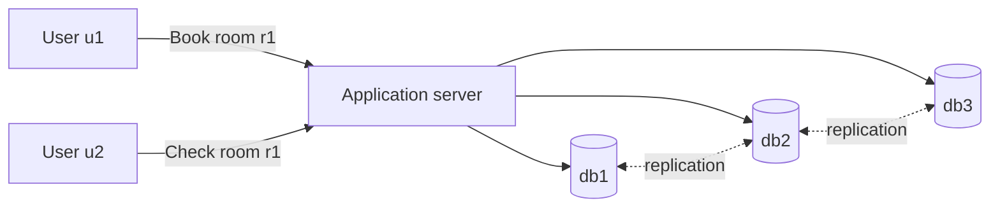
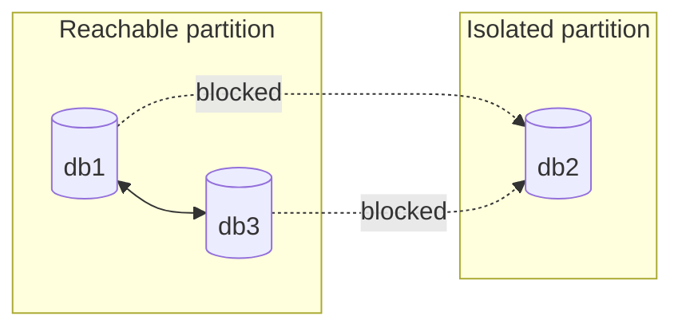

# Distributed System Attributes

## Table of Contents

- [Overview](#overview)
- [Running Example: Hotel Room Booking](#running-example-hotel-room-booking)
  - [Request Flow](#request-flow)
  - [Write Strategies](#write-strategies)
  - [Read Strategies](#read-strategies)
- [Consistency](#consistency)
  - [Strong Consistency](#strong-consistency)
  - [Eventual Consistency](#eventual-consistency)
  - [Quorum Reads and Writes](#quorum-reads-and-writes)
- [Availability](#availability)
  - [Techniques for High Availability](#techniques-for-high-availability)
- [Partition Tolerance](#partition-tolerance)
  - [Network Partitions](#network-partitions)
  - [Behavior During a Partition](#behavior-during-a-partition)
- [Latency](#latency)
  - [Sources of Latency](#sources-of-latency)
  - [Latency-Reduction Techniques](#latency-reduction-techniques)
- [Durability](#durability)
- [Reliability](#reliability)
- [Fault Tolerance](#fault-tolerance)
- [Scalability](#scalability)
  - [Vertical Scaling](#vertical-scaling)
  - [Horizontal Scaling](#horizontal-scaling)
  - [Designing for Scale](#designing-for-scale)
- [How the Attributes Relate](#how-the-attributes-relate)
- [Design Checklist](#design-checklist)
- [Key Takeaways](#key-takeaways)

## Overview

A **distributed system** is a collection of independent nodes that communicate over a network and work together as one logical system. Distribution enables greater capacity, geographic reach, and resilience, but introduces partial failures, network delays, concurrency, and data-replication challenges.

The main design attributes are:

| Attribute | Core question |
| --- | --- |
| **Consistency** | Do clients observe a correct and predictable view of data? |
| **Availability** | Can the system respond to requests when components fail? |
| **Partition tolerance** | Can the system operate when groups of nodes cannot communicate? |
| **Latency** | How long does a request take to complete? |
| **Durability** | Does acknowledged data survive failures? |
| **Reliability** | Does the system behave correctly over time? |
| **Fault tolerance** | Can the system continue working despite faults? |
| **Scalability** | Can the system handle growth without unacceptable degradation? |

> **Design principle:** These attributes cannot always be maximized simultaneously. Good system design chooses explicit trade-offs based on business requirements.

Useful terms:

- A **node** is an independently running machine, process, or service instance.
- A **replica** is a copy of data or a service maintained on another node.
- A **failure** means a component stops performing as required.
- A **fault** is the underlying cause of a failure.
- A **network partition** divides nodes into groups that cannot communicate reliably.
- A **quorum** is the minimum number of replicas whose responses are required to complete an operation.

## Running Example: Hotel Room Booking

Assume two users interact with the same room record:

- User `u1` books room `r1`.
- User `u2` checks whether `r1` is still available.
- Reservation data is stored on three replicas: `db1`, `db2`, and `db3`.

The application may write to the replicas itself, or the database may replicate updates internally.

### Request Flow

**Write flow**

1. `u1` sends `BookRoom(u1, r1)`.
2. The server writes the reservation to one or more replicas.
3. The server acknowledges success according to its write policy.

**Read flow**

1. `u2` sends `RoomAvailable(r1)`.
2. The server reads from one or more replicas.
3. It reconciles the responses, if necessary, and returns the result.

> The number of replicas consulted—and the number of acknowledgements required—directly affects correctness, latency, and availability.

### Write Strategies

| Strategy | How it works | Main benefit | Main cost or risk |
| --- | --- | --- | --- |
| **Serial synchronous** | Write to each replica in sequence and wait for every acknowledgement | Simple completion semantics | Highest latency; one slow replica delays the request |
| **Serial asynchronous** | Wait for one write, acknowledge the client, then update other replicas | Low client latency | Other replicas may temporarily be stale |
| **Parallel quorum** | Write to replicas concurrently and return after `W` acknowledgements | Tunable balance of speed and consistency | Uses more concurrent resources; unfinished replicas lag |
| **Durable message first** | Append the command to a durable log or queue; consumers update storage | High write throughput and decoupling | Adds asynchronous processing, lag, and operational complexity |

> A queue acknowledgement is meaningful only if the message itself is durably stored and the downstream operation is retryable and **idempotent**.

### Read Strategies

| Strategy | Latency | Consistency risk | Availability |
| --- | --- | --- | --- |
| Read from **one** replica | Low | May return stale data | High |
| Read from a **quorum** | Moderate | Lower when versions are reconciled correctly | Moderate to high |
| Read from **all** replicas | Determined by the slowest replica | Lowest stale-read risk | Low if every replica is required |

Reading more replicas is not automatically sufficient: the system still needs a way to identify the newest valid version, such as version numbers, timestamps with safe clock assumptions, or logical clocks.

## Consistency

**Consistency** defines what values a read is allowed to return when data is replicated or concurrently updated.

> <u>Consistency is a contract about observations</u>: it describes how completed and concurrent operations appear to clients.

### Strong Consistency

Under **strong consistency**—commonly implemented as *linearizability*—a completed write appears to take effect at one instant, and every later read returns that value or a newer one.

If write `W(x = v₂)` completes before read `R(x)` begins, then:

$$
W(x = v_2) \prec R(x) \implies R(x) = v_2 \text{ or a newer value}
$$

Typical mechanisms include:

- Consensus protocols such as **Raft** or **Paxos**
- Leader-based replication with confirmed writes
- Distributed transactions
- Distributed locking or fencing tokens
- Synchronous quorum reads and writes with version reconciliation

**Benefits**

- Predictable behavior and simpler application reasoning
- Prevents stale decisions in correctness-critical workflows
- Suitable for balances, inventory, reservations, and uniqueness constraints

**Costs**

- Coordination adds network round trips and latency.
- Unreachable or slow nodes may reduce availability.
- Cross-region consensus can be especially expensive.

For the hotel example, strong consistency prevents two users from successfully booking the final available room.

### Eventual Consistency

**Eventual consistency** permits replicas to temporarily disagree. If no new updates occur, all replicas are expected to converge to the same state.

Informally, for replicas $i$ and $j$:

$$
\lim_{t \to \infty} value_i(t) = value_j(t)
$$

Common mechanisms include:

- Asynchronous replication
- Gossip protocols
- Version vectors or logical clocks
- Conflict-resolution rules
- Read repair and anti-entropy synchronization

**Benefits**

- Lower write latency
- Greater availability during failures or partitions
- Easier geographic distribution and horizontal scaling

**Costs**

- Reads may be stale.
- Concurrent writes may conflict.
- Applications must tolerate, expose, or reconcile temporary disagreement.

Eventual consistency is often appropriate for feeds, analytics, view counts, recommendations, and other data where short-lived staleness is acceptable. For room availability, it may be acceptable for search results, but the final booking operation usually needs stronger protection.

| Concern | Strong consistency | Eventual consistency |
| --- | --- | --- |
| Latest write visible immediately | Yes, after successful completion | Not guaranteed |
| Coordination | High | Lower |
| Typical latency | Higher | Lower |
| Availability during partitions | May be reduced | Often higher |
| Application complexity | Simpler reads; complex infrastructure | Conflict and stale-data handling moves to the application |
| Good fit | Payments, reservations, permissions | Feeds, counters, caches, analytics |

### Quorum Reads and Writes

Let:

- $N$ = total number of replicas
- $W$ = replicas that must acknowledge a write
- $R$ = replicas consulted for a read

Read and write quorums overlap when:

$$
R + W > N
$$

| Configuration for $N=3$ | Characteristics |
| --- | --- |
| $W=1, R=3$ | Fast writes, slow reads; read set overlaps the write set |
| $W=3, R=1$ | Slow writes, fast reads; every replica receives the write first |
| $W=2, R=2$ | Balanced read/write cost; overlapping majorities |
| $W=1, R=1$ | Fast operations, but a read can miss the latest write |

> **Important nuance:** $R + W > N$ guarantees an overlap between read and write sets. It does **not**, by itself, guarantee strong consistency. The system must also select the latest valid version, handle concurrent writes, and enforce appropriate operation ordering.

Higher quorums also reduce operation availability. A write can succeed only when at least $W$ replicas are reachable, and a read can succeed only when at least $R$ replicas are reachable.

## Availability

**Availability** is the system's ability to accept a request and return a non-error response within an acceptable time.

A common operational measure is:

$$
Availability = \frac{MTBF}{MTBF + MTTR} \times 100\%
$$

where:

- **MTBF** = mean time between failures
- **MTTR** = mean time to repair or restore service

| Target | Approximate maximum downtime per year |
| --- | ---: |
| 99% | 3.65 days |
| 99.9% | 8.76 hours |
| 99.99% | 52.6 minutes |
| 99.999% | 5.26 minutes |

> Availability must be defined through a user-visible **service-level indicator**: for example, “successful booking requests completed within 500 ms.” A running process is not useful if it cannot serve correct responses in time.

### Techniques for High Availability

- **Redundancy:** Duplicate critical hardware, processes, zones, and network paths.
- **Replication:** Maintain data or service copies across multiple failure domains.
- **Load balancing:** Route requests only to healthy instances and distribute load.
- **Health checks:** Detect failed or degraded components quickly.
- **Failover:** Redirect work to a healthy standby or peer.
- **Failback:** Safely restore traffic to the recovered component.
- **Graceful degradation:** Preserve essential features when dependencies fail.
- **Timeouts, retries, and circuit breakers:** Bound failures and prevent cascades.

Retries should use exponential backoff, jitter, and idempotency controls; otherwise, they can amplify an outage into a *retry storm*.

## Partition Tolerance

### Network Partitions

A **network partition** occurs when some nodes can communicate within their group but cannot reliably communicate with nodes in another group.

Possible causes include:

- Link, router, switch, or DNS failures
- Misconfigured firewalls or routing rules
- Cloud-zone or regional outages
- Packet loss, extreme delay, or network congestion
- Software defects or network attacks

During a partition, an isolated replica may continue serving stale data or accept conflicting writes.

### Behavior During a Partition

**Partition tolerance** means the system has defined behavior and continues operating as far as its guarantees allow when communication is disrupted.

During a partition, a distributed system must decide which guarantee to preserve for each operation:

- Prefer **consistency**: reject or delay operations that cannot be safely coordinated.
- Prefer **availability**: accept operations in multiple partitions and reconcile conflicts later.

> This is the practical core of the **CAP theorem**: when a network partition exists, a system cannot guarantee both linearizable consistency and total availability for every request.

Partition tolerance is not usually optional in a real distributed system—networks can fail. The meaningful design question is *how each feature behaves when a partition occurs*.

## Latency

**Latency** is the elapsed time between initiating an operation and receiving its response. It is usually measured as a distribution, not only as an average.

Report percentiles such as:

- **p50:** median experience
- **p95:** slower 5% of requests
- **p99:** tail latency experienced by the slowest 1%

An approximate request-latency budget is:

$$
L_{total} \approx L_{network} + L_{queue} + L_{processing} + L_{storage} + L_{coordination}
$$

### Sources of Latency

- Physical distance and network hops
- Congestion, packet loss, and retransmission
- Queueing under high utilization
- Application processing and serialization
- Database queries and disk I/O
- Cross-node replication or consensus
- Slow downstream dependencies
- Large request or response payloads

### Latency-Reduction Techniques

- Cache frequently read data in memory or at the edge.
- Place services and data closer to users.
- Reduce network hops and payload sizes.
- Optimize indexes, queries, algorithms, and serialization.
- Process independent work concurrently.
- Move non-critical work to asynchronous queues.
- Use connection pooling and persistent connections.
- Apply deadlines and cancel work that is no longer useful.

> Optimize tail latency as well as the average. A request that fans out to many services is often limited by its slowest dependency.

Lower latency may conflict with consistency and durability. For example, acknowledging a write before remote replicas persist it is faster but increases stale-read and data-loss risk.

## Durability

**Durability** means that once a write is acknowledged as committed, it survives the failures covered by the system's stated guarantee.

Durability techniques include:

- Write-ahead logs and durable storage
- Replication across independent failure domains
- Checksums and corruption detection
- Point-in-time recovery and immutable backups
- Cross-zone or cross-region copies
- Regular restore tests

| Mechanism | Protects against | Does not necessarily protect against |
| --- | --- | --- |
| Local disk persistence | Process restart | Disk or host loss |
| Multi-node replication | Single-node failure | Shared-zone failure or accidental deletion |
| Cross-region replication | Regional outage | Bad writes replicated everywhere |
| Versioned backups | Deletion, corruption, ransomware | Data created after the latest recovery point |

> **Replication is not backup.** Replication can quickly copy corruption or accidental deletion; backups provide an independent recovery history.

Two useful objectives are:

- **RPO (Recovery Point Objective):** maximum acceptable data loss measured in time.
- **RTO (Recovery Time Objective):** maximum acceptable time to restore service.

## Reliability

**Reliability** is the probability that a system performs its intended function correctly for a specified period under stated conditions.

Under a simplified constant failure-rate model:

$$
Reliability(t) = e^{-\lambda t}
$$

where $\lambda$ is the failure rate. Real systems often require richer models because failures are correlated and rates change over time.

Reliability depends on more than uptime. A service that responds but returns incorrect reservations is *available* in a narrow sense, yet unreliable.

Ways to improve reliability include:

- Eliminate single points of failure.
- Validate data and enforce invariants.
- Use idempotent operations and deduplication.
- Isolate faults with bulkheads and bounded queues.
- Monitor symptoms, causes, and correctness signals.
- Test recovery through fault injection and disaster-recovery exercises.
- Deploy gradually with rollback capability.

## Fault Tolerance

**Fault tolerance** is the ability to continue providing correct or acceptably degraded service when components fail.

A fault-tolerant design typically follows this loop:

1. **Detect** the fault using timeouts, health checks, or monitoring.
2. **Contain** it so that the failure does not cascade.
3. **Recover** through retry, failover, restart, or reconstruction.
4. **Repair** lost redundancy and return to normal capacity.

Common mechanisms include:

- Redundant service instances
- Replicated data
- Leader election and automatic failover
- Circuit breakers and bulkheads
- Checkpointing and replay
- Dead-letter queues and poison-message handling
- Graceful degradation

| Concept | Meaning |
| --- | --- |
| **Availability** | The service can respond now |
| **Reliability** | The service behaves correctly over time |
| **Fault tolerance** | The service continues despite specific faults |
| **Durability** | Committed data survives specified failures |

These properties reinforce each other, but are not interchangeable.

## Scalability

**Scalability** is the ability to handle growth in traffic, users, data, or computation while maintaining required performance and reliability.

Scalability should be measured against a workload and an objective, for example:

- Requests per second at p99 latency below 300 ms
- Concurrent users per service instance
- Events processed per second
- Data volume stored or scanned
- Cost per request or per customer

For arrival rate $\lambda$, average service rate $\mu$ per worker, and $m$ workers, approximate utilization is:

$$
\rho = \frac{\lambda}{m\mu}
$$

As $\rho$ approaches $1$, queues and tail latency can grow sharply. Systems therefore need headroom for bursts, failures, and uneven traffic.

### Vertical Scaling

**Vertical scaling** (*scaling up*) increases the capacity of one node—for example, by adding CPU, memory, storage, or faster networking.

**Advantages**

- Simple architecture and operations
- Few or no application changes
- Often cost-effective at modest scale

**Limitations**

- Hardware has a finite ceiling.
- Large machines can be disproportionately expensive.
- A single node can remain a single point of failure.
- Upgrades may require downtime.

### Horizontal Scaling

**Horizontal scaling** (*scaling out*) adds more nodes and distributes work among them.

**Advantages**

- Higher aggregate capacity
- Parallel processing
- Better fault isolation and redundancy
- Incremental growth using commodity instances

**Challenges**

- Coordination and synchronization
- Data partitioning and rebalancing
- Cross-node consistency
- Load balancing and service discovery
- More complex deployment, monitoring, and debugging

| Aspect | Vertical scaling | Horizontal scaling |
| --- | --- | --- |
| Method | Make one node larger | Add more nodes |
| Architectural change | Usually small | Often significant |
| Capacity ceiling | Lower | Potentially much higher |
| Fault tolerance | Limited by the node | Improved through redundancy |
| Operational complexity | Lower | Higher |
| Typical use | Databases or early-stage workloads | Large, distributed, or elastic workloads |

The two approaches are complementary. A system can use appropriately sized nodes and add more of them as demand grows.

### Designing for Scale

- Keep services **stateless** where practical.
- Partition data and work using stable keys.
- Use caches for read-heavy workloads.
- Decouple producers and consumers with queues or logs.
- Apply backpressure and admission control.
- Avoid globally shared locks and coordination hot spots.
- Autoscale using workload signals, with safe minimum capacity.
- Design for rebalancing, hot keys, and uneven traffic.
- Measure cost efficiency as well as raw throughput.

> Scaling a bottleneck only moves the bottleneck. Measure the entire request path before adding capacity.

## How the Attributes Relate

| Design choice | Improves | May weaken or increase |
| --- | --- | --- |
| Synchronous replication | Consistency, durability | Latency, write availability |
| Asynchronous replication | Latency, availability | Immediate consistency, zero-loss durability |
| More replicas | Availability, read capacity, durability | Cost, coordination, write complexity |
| Larger quorums | Fresh-read probability, consistency | Latency, availability during failures |
| Caching | Read latency, scalability | Freshness, invalidation complexity |
| Geographic distribution | User latency, disaster tolerance | Coordination latency, conflict handling |
| Horizontal scaling | Capacity, fault isolation | Operational and data-consistency complexity |

For the hotel booking system, a practical split is:

- Serve hotel search and general availability from caches or eventually consistent replicas.
- Revalidate availability during checkout.
- Protect the final reservation with a strongly consistent conditional write or transaction.
- Publish downstream events asynchronously after the reservation is committed.
- Make payment and booking requests idempotent so retries do not create duplicates.

This applies strong guarantees only where business correctness requires them.

## Design Checklist

When evaluating a distributed system, ask:

1. **Correctness:** Which invariants must never be violated?
2. **Consistency:** How stale may each read be, and for how long?
3. **Availability:** Which operations must remain available during failures?
4. **Partitions:** Should each operation reject, wait, or reconcile later?
5. **Latency:** What are the p50, p95, and p99 targets?
6. **Durability:** When is a write acknowledged, and which failures may lose it?
7. **Recovery:** What are the RPO and RTO? Have restores been tested?
8. **Fault tolerance:** Which faults are detected, contained, and recovered automatically?
9. **Scalability:** What grows—traffic, data, tenants, or geography—and where is the first bottleneck?
10. **Operations:** How will the system be observed, deployed, degraded, and repaired?

## Key Takeaways

- Distributed design is primarily about handling **partial failure, concurrency, replication, and uncertainty**.
- Strong consistency simplifies correctness but usually requires more coordination.
- Eventual consistency improves responsiveness and availability when temporary staleness is acceptable.
- Quorum overlap is useful, but versioning and coordination determine the actual consistency guarantee.
- Availability, reliability, durability, and fault tolerance describe different qualities.
- Network partitions are unavoidable; define feature-level behavior for when they occur.
- Latency should be budgeted end to end and measured with percentiles.
- Scale vertically for simplicity and horizontally for greater capacity and resilience; many systems use both.
- Apply the strongest guarantees to the smallest correctness-critical path.
