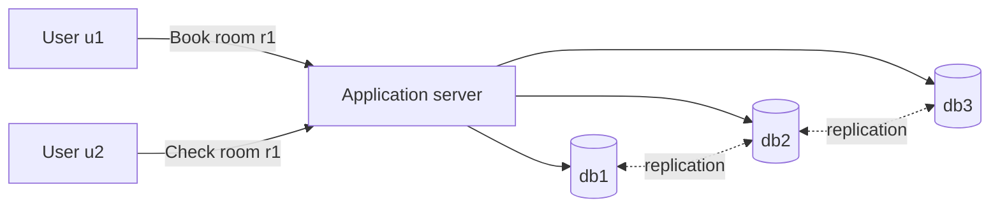
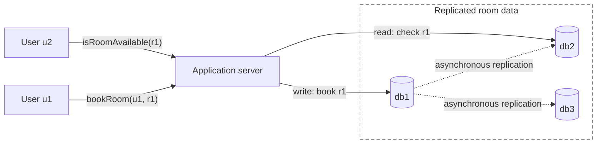
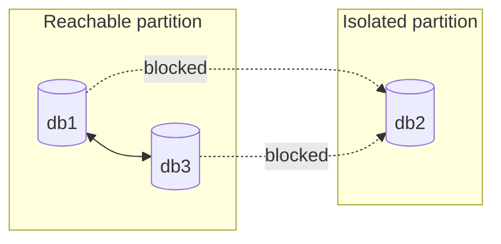

# Distributed System Attributes

## Table of Contents

- [Overview](#overview)
- [Running Example: Hotel Room Booking](#running-example-hotel-room-booking)
  - [Request Flow](#request-flow)
  - [Write Strategies](#write-strategies)
  - [Read Strategies](#read-strategies)
- [Consistency](#consistency)
  - [Strong Consistency](#strong-consistency)
  - [Eventual Consistency](#eventual-consistency)
  - [Quorum Reads and Writes](#quorum-reads-and-writes)
- [Availability](#availability)
  - [Measuring Availability](#measuring-availability)
  - [Techniques for High Availability](#techniques-for-high-availability)
- [Partition Tolerance](#partition-tolerance)
  - [Network Partitions](#network-partitions)
  - [Behavior During a Partition](#behavior-during-a-partition)
- [Latency](#latency)
  - [Sources of Latency](#sources-of-latency)
  - [Latency-Reduction Techniques](#latency-reduction-techniques)
- [Durability](#durability)
- [Reliability](#reliability)
- [Fault Tolerance](#fault-tolerance)
- [Scalability](#scalability)
  - [Vertical Scaling](#vertical-scaling)
  - [Horizontal Scaling](#horizontal-scaling)
  - [Designing for Scale](#designing-for-scale)
- [How the Attributes Relate](#how-the-attributes-relate)
- [Design Checklist](#design-checklist)
- [Key Takeaways](#key-takeaways)

## Overview

A **distributed system** is a collection of independent nodes that communicate over a network and work together as one logical system. Distribution enables greater capacity, geographic reach, and resilience, but introduces partial failures, network delays, concurrency, and data-replication challenges.

The main design attributes are:

| Attribute | Core question |
| --- | --- |
| **Consistency** | Do clients observe a correct and predictable view of data? |
| **Availability** | Can the system respond to requests when components fail? |
| **Partition tolerance** | Can the system operate when groups of nodes cannot communicate? |
| **Latency** | How long does a request take to complete? |
| **Durability** | Does acknowledged data survive failures? |
| **Reliability** | Does the system behave correctly over time? |
| **Fault tolerance** | Can the system continue working despite faults? |
| **Scalability** | Can the system handle growth without unacceptable degradation? |

> **Design principle:** These attributes cannot always be maximized simultaneously. Good system design chooses explicit trade-offs based on business requirements.

Useful terms:

- A **node** is an independently running machine, process, or service instance.
- A **replica** is a copy of data or a service maintained on another node.
- A **failure** means a component stops performing as required.
- A **fault** is the underlying cause of a failure.
- A **network partition** divides nodes into groups that cannot communicate reliably.
- A **quorum** is the minimum number of replicas whose responses are required to complete an operation.

## Running Example: Hotel Room Booking

Assume two users interact with the same room record:

- User `u1` books room `r1`.
- User `u2` checks whether `r1` is still available.
- Reservation data is stored on three replicas: `db1`, `db2`, and `db3`.

The application may write to the replicas itself, or the database may replicate updates internally.

### Request Flow

```mermaid
flowchart LR
    U1[User u1] -->|Book room r1| APP[Application server]
    U2[User u2] -->|Check room r1| APP
    APP --> DB1[(db1)]
    APP --> DB2[(db2)]
    APP --> DB3[(db3)]
    DB1 <-. replication .-> DB2
    DB2 <-. replication .-> DB3
```

**Write flow**

1. `u1` sends request via the client by making an API call to `BookRoom(u1, r1)`.
2. The server writes the reservation to one or more replicas.
3. The server acknowledges success according to its write policy.

**Read flow**

1. `u2` sends request via the client by making an API call to `RoomAvailable(r1)`.
2. The server reads from one or more replicas.
3. It reconciles the responses, if necessary, and returns the result.

> The number of replicas consulted—and the number of acknowledgements required—directly affects correctness, latency, and availability.

### Write Strategies

| Strategy | How it works | Main benefit | Main cost or risk |
| --- | --- | --- | --- |
| **Serial synchronous** | Write to each replica in sequence and wait for every acknowledgement | Simple completion semantics | Highest latency; one slow replica delays the request |
| **Serial asynchronous** | Wait for one write, acknowledge the client, then update other replicas | Low client latency | Other replicas may temporarily be stale |
| **Parallel asynchronous** | Write to replicas concurrently and return after `W` acknowledgements | Tunable balance of speed and consistency | Uses more concurrent resources; unfinished replicas lag |
| **Durable message first** | Append the command to a durable log or queue such as Kafka and return an ack to the client; consumers update storage | High write throughput and decoupling; latency is the lowest | Adds asynchronous processing, lag, and operational complexity |

> A queue acknowledgement is meaningful only if the message itself is durably stored and the downstream operation is retryable and **idempotent**.

### Read Strategies

| Strategy | Latency | Consistency risk | Availability |
| --- | --- | --- | --- |
| Read from **one** replica | Low | May return stale data | High |
| Read from a **quorum** | Moderate | Lower when versions are reconciled correctly | Moderate to high |
| Read from **all** replicas | Determined by the slowest replica | Lowest stale-read risk | Low if every replica is required |

> Each of these read options comes with consistency trade-offs. For example, if we read from only one replica, the read may be stale in some situations, posing a *correctness problem*. On the other hand, reading from all replicas and comparing all the values to determine which one is the latest value addresses the correctness problem, but this would be *slower*. Reading from a ***quorum number*** of replicas may be a more *balanced approach*. This is the design trade-offs we should consider.

Reading more replicas is not automatically sufficient: the system still needs a way to identify the newest valid version, such as version numbers, timestamps with safe clock assumptions, or logical clocks.

## Consistency

**Consistency** describes how and when different copies of the same data agree, and what a user may see while an update spreads between replicas.

For example, after you change your profile name, one replica might show the new name while another still shows the old one. The **consistency model** determines when a later read must show the new name:

- **Strong consistency:** Once the update succeeds, any read started afterward sees the new name (or a newer update).
- **Eventual consistency:** Some reads may briefly show the old name, but the replicas converge if no further updates occur.

> Strong consistency does not require every replica to update at the same instant. The system can delay or route reads so users do not observe a stale value after a successful write.

### Strong Consistency

Under **strong consistency**—commonly implemented as *linearizability*—a completed write appears to take effect at one instant, and every later read returns that value or a newer one.

If write `W(x = v₂)` completes before read `R(x)` begins, then:

$$
W(x = v_2) \prec R(x) \implies R(x) = v_2 \text{ or a newer value}
$$

Typical mechanisms include:

- Consensus protocols such as **Raft** or **Paxos**
- Leader-based replication with confirmed writes
- Distributed transactions
- Distributed locking or fencing tokens
- Synchronous quorum reads and writes with version reconciliation

**Benefits**

- Predictable behavior and simpler application reasoning
- Prevents stale decisions in correctness-critical workflows
- Suitable for balances, inventory, reservations, and uniqueness constraints

**Costs**

- Coordination adds network round trips and latency.
- Unreachable or slow nodes may reduce availability.
- Cross-region consensus can be especially expensive.

For the hotel example, strong consistency prevents two users from successfully booking the final available room.

### Eventual Consistency

**Eventual consistency** permits replicas to temporarily disagree. If no new updates occur, all replicas are expected to converge to the same state.

```mermaid
flowchart LR
    U1["User u1"] -->|"bookRoom(u1, r1)"| APP[Application server]
    U2["User u2"] -->|"isRoomAvailable(r1)"| APP

    subgraph REPLICAS[Replicated room data]
        direction TB
        DB1[(db1)]
        DB2[(db2)]
        DB3[(db3)]
        DB1 -.->|asynchronous replication| DB2
        DB1 -.->|asynchronous replication| DB3
    end

    APP -->|write: book r1| DB1
    APP -->|read: check r1| DB2

    style REPLICAS fill:#fff,stroke:#777,stroke-width:1px,stroke-dasharray:6 4
```

**Hotel-room example:** `u1`'s booking is written to `db1` and replicated asynchronously to `db2` and `db3`. If `u2` reads from `db2` before it applies the update, the API may incorrectly report that room `r1` is available (`true`); after the update, it reports `false`.

Informally, for replicas $i$ and $j$:

$$
\lim_{t \to \infty} value_i(t) = value_j(t)
$$

Common mechanisms include:

- Asynchronous replication
- Gossip protocols
- Version vectors or logical clocks
- Conflict-resolution rules
- Read repair and anti-entropy synchronization

**Benefits**

- Lower write latency
- Greater availability during failures or partitions
- Easier geographic distribution and horizontal scaling

**Costs**

- Reads may be stale.
- Concurrent writes may conflict.
- Applications must tolerate, expose, or reconcile temporary disagreement.

Eventual consistency is often appropriate for feeds, analytics, view counts, recommendations, and other data where short-lived staleness is acceptable. For room availability, it may be acceptable for search results, but the final booking operation usually needs stronger protection.

| Concern | Strong consistency | Eventual consistency |
| --- | --- | --- |
| Latest write visible immediately | Yes, after successful completion | Not guaranteed |
| Coordination | High | Lower |
| Typical latency | Higher | Lower |
| Availability during partitions | May be reduced | Often higher |
| Application complexity | Simpler reads; complex infrastructure | Conflict and stale-data handling moves to the application |
| Good fit | Payments, reservations, permissions | Feeds, counters, caches, analytics |

### Quorum Reads and Writes

Let:

- $N$ = total number of replicas
- $W$ = number of replicas we consider *writing to*
- $R$ = number of replicas we consider *reading from*

Read and write quorums overlap (we have strong consistency) when:

$$
R + W > N
$$

| Configuration for $N=3$ | Characteristics |
| --- | --- |
| $W=1, R=3$ | **Strong consistency**; Fast writes, slow reads; read set overlaps the write set |
| $W=3, R=1$ | **Strong consistency**; Slow writes, fast reads; every replica receives the write first |
| $W=2, R=2$ | **Strong consistency**; Balanced read/write cost; overlapping majorities |
| $W=1, R=1$ | **Eventual consistency**; Fast operations, but a read can miss the latest write |

> **Important nuance:** $R + W > N$ guarantees an overlap between read and write sets. It does **not**, by itself, guarantee strong consistency. The system must also select the latest valid version, handle concurrent writes, and enforce appropriate operation ordering.

> As system designers/architects, we have the option to design strong consistency **or** eventual consistency. The answer may seem obvious at first glance - we want strong consistency. However, that may not be the case if we consider **availability** in the context! Higher quorums also reduce operation availability. A write can succeed only when at least $W$ replicas are reachable, and a read can succeed only when at least $R$ replicas are reachable. So, when designing the system, we should consider eventual consistency as a **trade-off** to have higher availability.

## Availability

**Availability** means users can get a usable response from a service when they need it, within an acceptable time. A component may fail without making the whole service unavailable, provided enough other components can handle the request.

> **Hotel-room example:** Booking data is stored on `db1`, `db2`, and `db3`. Suppose each read needs **two replica responses** (`R = 2`) and each write needs **two acknowledgements** (`W = 2`). If `db3` fails, `db1` and `db2` can still serve those operations. If two replicas fail, neither operation can meet its requirement, so the booking feature must wait or return an error.

Requiring fewer replicas can keep operations available through more failures, but may expose stale data. **Availability alone does not prevent double-booking:** if two users both see the last room as available, the final booking must *atomically* check that it is still free and mark it booked. Only one user should succeed.

### Measuring Availability

For a service that repeatedly runs and recovers from failures, a common estimate is: [AWS availability guide](https://docs.aws.amazon.com/whitepapers/latest/availability-and-beyond-improving-resilience/understanding-availability.html)

$$
Availability = \frac{MTBF}{MTBF + MTTR} \times 100\%
$$

- **MTBF** (*mean time between failures*) is the average time the service works before its next failure.
- **MTTR** (*mean time to repair or recover*) is the average time needed to restore it.

or simply as the concept:

$$
Availability = \frac{Uptime}{Uptime + Downtime} \times 100\%
$$

For example, if the service works for an average of **999 hours** and takes **1 hour** to recover:

$$
Availability = \frac{999}{999 + 1} \times 100\% = 99.9\%
$$

This estimates the **percentage of time the service is up**. The table translates availability targets into approximate *total downtime* in a 365-day year:

| Target | Approximate maximum downtime per year |
| --- | ---: |
| 99% | 3.65 days |
| 99.9% | 8.76 hours |
| 99.99% | 52.6 minutes |
| 99.999% | 5.26 minutes |

For **99.9% annual availability**, the calculation is:

$$
365 \times 24 \times (1 - 0.999)
= 8.76\text{ hours}
$$

That is **8 hours, 45 minutes, and 36 seconds (46 min / 60 min *(1 hour)* ~ 0.76) of total downtime across the year**—not an allowance for each outage.

> Define availability from the **user’s perspective**: for example, the percentage of booking requests that return a *valid result* within 500 ms. “Room already booked” can be a valid result; a timeout or a successful double-booking is not. A running database alone does not prove the booking feature is available or correct.

Achieving high availability in distributed systems can be challenging because distributed systems are composed of multiple components, each of which may be subject to failures such as crashes, network failures, or communication failures.

### Techniques for High Availability

- **Redundancy:** Keep alternative components available so some component(s) failure(s) does not stop the service—for example, spare network links, power supplies, processes, service instances, or availability zones.
- **Replication:** Maintain copies of *stateful data* across nodes. In **active-passive** setups, a primary serves requests while a standby can take over; in **active-active** setups, multiple nodes serve requests simultaneously. Replication lag and conflicts may affect consistency.
- **Load balancing:** Route work across healthy instances to avoid overloading one node. Distribution may be weighted rather than equal.
- **Fault detection and recovery:** Use heartbeats, health checks, and monitoring to detect failures; restart, replace, or repair failed components.
- **Failover and failback:** Redirect work to a healthy alternative after failure, then safely restore traffic to the recovered component.
- **Graceful degradation:** Preserve essential features when a dependency is unavailable.
- **Timeouts, retries, and circuit breakers:** Limit the impact of slow or failing dependencies and prevent failures from spreading.

> **Trade-off:** Redundancy and replication improve availability but add cost and operational complexity. Replicated data can also be temporarily inconsistent, so choose these techniques according to each feature’s requirements.

Retries should use exponential backoff, jitter, and idempotency controls; otherwise, they can amplify an outage into a *retry storm*.

## Partition Tolerance

### Network Partitions

A **network partition** occurs when some nodes can communicate within their group but cannot reliably communicate with nodes in another group.

Possible causes include:

- Link, router, switch, or DNS failures
- Misconfigured firewalls or routing rules
- Cloud-zone or regional outages
- Packet loss, extreme delay, or network congestion
- Software bugs or network attacks

During a partition, an isolated replica may continue serving stale data or accept conflicting writes.

```mermaid
flowchart LR
    subgraph A[Reachable partition]
        DB1[(db1)] <--> DB3[(db3)]
    end
    subgraph B[Isolated partition]
        DB2[(db2)]
    end
    DB1 -. blocked .-> DB2
    DB3 -. blocked .-> DB2
```

> **Impact**: Nodes within each partition may keep operating, but cannot coordinate with nodes in other partitions. This challenges consistency (copies may diverge or conflict), availability (requests needing cross-partition agreement may fail or wait), and fault tolerance (the system must decide what useful service it can still provide and how to recover when communication returns).

> **Duration matters**: A partition may be brief and heal automatically when connectivity returns, or persist until the underlying fault is repaired. A longer partition can prolong stale reads, conflicting writes, or unavailable operations. If connectivity cannot be restored, recovery may require manual intervention.

### Behavior During a Partition

**Partition tolerance** means the distributed system is able to continue to operate despite network disruptions or partitions.

During a partition, a distributed system must decide which guarantee to preserve for each operation:

- Prefer **consistency**: reject or delay operations that cannot be safely coordinated.
- Prefer **availability**: accept operations in multiple partitions and reconcile conflicts later.

> This is the practical core of the **CAP theorem**: when a network partition exists, a system cannot guarantee both linearizable consistency and total availability for every request.

Partition tolerance is not usually optional in a real distributed system—networks can fail. The meaningful design question is *how each feature behaves when a partition occurs - what ***trade-off*** we need to make between consistency and availability*.

## Latency

**Latency** is the time taken between initiating a request and receiving its response, typically measured in **milliseconds (ms)**. It includes network delay, processing time, and any backend dependencies. It is usually measured as a distribution (percentiles), not only as an average.

Report percentiles such as:

- **p50:** median experienced latency - half the requests are faster than this
- **p95:** slower 5% of requests
- **p99:** tail/worst-case latency experienced by the slowest 1% of users

> **Analogy**: Think of waiting in a queue at Starbucks. While most people are served in 2 minutes (p50), occasionally, someone waits 8 minutes (p99).

An approximate request-latency budget is:

$$
L_{total} \approx L_{network} + L_{queue} + L_{processing} + L_{storage} + L_{coordination}
$$

### Sources of Latency

- Physical distance between nodes in a DS and network hops
- Congestion, packet loss, and retransmission
- Queueing under high utilization
- Application processing and serialization
- Database queries and disk I/O
- Cross-node replication or consensus
- Slow downstream dependencies
- Large request or response payloads

### Latency-Reduction Techniques

- **Caching**: Cache frequently read data in memory or at the edge (CDNs).
- **Data localization**: Place services and data closer to users via data replication, edge computing, or content distribution strategies.
- **Network optimization**: Optimizing network infrastructure, such as using high-speed connections, reduce network hops and payload sizes, minimizing network congestion.
- **Performance tuning**: Optimize system configs, indexes, db queries, algorithms, code execution, and serialization.
- **Asynchronous communication**: Move non-critical work to asynchronous message queues or event-driven architectures and process independent work concurrently..
- **Connection reuse**: Use connection pools and persistent connections to avoid repeated connection setup.
- **Deadlines and cancellation**: Set request deadlines and stop work that is no longer useful, limiting long waits and freeing capacity.

> Optimize tail latency as well as the average. A request that fans out to many services is often limited by its slowest dependency.

> **Latency trade-off**: Network delays cannot be eliminated, and faster responses may require weaker guarantees. For example, acknowledging a write before other replicas receive and persist it reduces latency, but another replica may briefly return stale data (consistency), and the acknowledged write may be lost if its only durable copy fails (durability). Choose the trade-off according to the operation—for a room booking, correctness matters more than saving on a single network request (round trip).

**Fault Tolerance and Durability are different**. Fault tolerance is whether the system can keep providing service when a component fails. Durability is whether acknowledged data survives that failure. A system might fail over and remain usable while losing its most recent booking—fault-tolerant in service continuity, but not durable for that write.

**Illustrative example:** Suppose `db1` saves a room booking and immediately tells the user **“confirmed.”** It has not yet copied the booking to `db2` or `db3`. If `db1` then suffers a permanent disk failure, the other replicas have no record of that booking. The system may still run using `db2`, but the **confirmed booking has disappeared**. That is a durability failure.

## Durability

**Durability** means that once a write is acknowledged as committed, it survives even in the event of a crash or power failure.

> **Hotel-room example**: The API confirms `u1`’s booking, but `db1` fails permanently before another copy receives it. The booking disappears despite the confirmation—a durability failure. If the system waits until both `db1` and `db2` have safely stored the booking, losing `db1` alone will not erase it.

Durability techniques include:

- **Write-ahead log and durable storage**: Record a change before confirming it, so the database can recover it after a process crash.
- **Replication**: Keep another copy on an independent node; `db2` can retain the booking if `db1` fails.
- **Checksums and corruption detection**: Detect a damaged record so the system can seek a healthy copy; detection alone does not repair it.
- **Versioned, immutable backups**: Restore data from an earlier point if it is deleted or corrupted.
- **Cross-zone or cross-region copies**: Place copies beyond one failure location, so a zone or region outage does not destroy every copy.
- **Regular restore/backup recovery tests**: Confirm that backups can actually be used to recover the booking data.

| Mechanism | Protects against/helps with | Does not necessarily protect against/help with |
| --- | --- | --- |
| Local durable storage | Restarting `db1` without losing its booking | Permanent loss of `db1`’s disk |
| Multi-node replication (replication to `db2`) | Single-node failure - failure of `db1`, **if `db2` received the write** | Shared-zone failure or accidental deletion - a failure affecting both copies |
| Cross-region replication | Loss of one region | Recent writes not yet copied; bad writes replicated everywhere |
| Versioned backups | Recovering a deleted or corrupted booking | Writes made after the latest recoverable backup |

> **Replication is not backup.** If a booking is accidentally deleted, replicas may quickly copy the accidental deletion or corruption. A versioned backup can provide a copy from *before* the mistake - *independent recovery history*.

Two useful objectives are:

- **RPO (Recovery Point Objective):** maximum acceptable data loss measured in time - *"how much recent data loss is acceptable"*. An RPO of 5 minutes means recovery must not lose more than 5 minutes of confirmed writes.
- **RTO (Recovery Time Objective):** maximum acceptable time to restore service - *"how long service restoration may take"*. An RTO of 30 minutes means the booking service should be usable again within 30 minutes.

> **Durability Trade-off**: Waiting for other replicas to persist a write improves durability, but increases write latency and may prevent writes when too few replicas are reachable. For example, waiting for another node to store a booking before confirming it improves protection against node loss, but increases write latency and can block writes when too few nodes are reachable.

## Reliability

**Reliability** is the probability that a system performs its intended function correctly for a specified period under stated conditions.

> **Hotel-room example**: A reliable booking system records reservations correctly, prevents double-booking, and avoids creating duplicate bookings when a request is retried. Redundancy, replication, fault tolerance, load balancing, and error handling help it continue providing its intended service when failures occur.

Under a simplified constant failure-rate model:

$$
Reliability(t) = e^{-\lambda t}
$$

where $\lambda$ is the failure rate. Real systems often require richer models because failures are correlated and rates change over time.

Reliability depends on more than uptime. A service that responds but returns incorrect reservations is *available* in a narrow sense, yet unreliable.

Ways to improve reliability include:

- Eliminate single points of failure.
- Validate data and enforce invariants.
- Use idempotent operations and deduplication.
- Isolate faults with bulkheads and bounded queues.
- Monitor symptoms, causes, and correctness signals.
- Test recovery through fault injection and disaster-recovery exercises.
- Deploy gradually with rollback capability.

## Fault Tolerance

**Fault tolerance** is the ability to continue providing correct or acceptably degraded service when components fail.

A fault-tolerant design typically follows this loop:

1. **Detect** the fault using timeouts, health checks, or monitoring.
2. **Contain** it so that the failure does not cascade.
3. **Recover** through retry, failover, restart, or reconstruction.
4. **Repair** lost redundancy and return to normal capacity.

Common mechanisms include:

- Redundant service instances
- Replicated data
- Leader election and automatic failover
- Circuit breakers and bulkheads
- Checkpointing and replay
- Dead-letter queues and poison-message handling
- Graceful degradation

| Concept | Meaning |
| --- | --- |
| **Availability** | The service can respond now |
| **Reliability** | The service behaves correctly over time |
| **Fault tolerance** | The service continues despite specific faults |
| **Durability** | Committed data survives specified failures |

These properties reinforce each other, but are not interchangeable.

## Scalability

**Scalability** is the ability to handle growth in traffic, users, data, or computation while maintaining required performance and reliability.

Scalability should be measured against a workload and an objective, for example:

- Requests per second at p99 latency below 300 ms
- Concurrent users per service instance
- Events processed per second
- Data volume stored or scanned
- Cost per request or per customer

For arrival rate $\lambda$, average service rate $\mu$ per worker, and $m$ workers, approximate utilization is:

$$
\rho = \frac{\lambda}{m\mu}
$$

As $\rho$ approaches $1$, queues and tail latency can grow sharply. Systems therefore need headroom for bursts, failures, and uneven traffic.

### Vertical Scaling

**Vertical scaling** (*scaling up*) increases the capacity of one node—for example, by adding CPU, memory, storage, or faster networking.

**Advantages**

- Simple architecture and operations
- Few or no application changes
- Often cost-effective at modest scale

**Limitations**

- Hardware has a finite ceiling.
- Large machines can be disproportionately expensive.
- A single node can remain a single point of failure.
- Upgrades may require downtime.

### Horizontal Scaling

**Horizontal scaling** (*scaling out*) adds more nodes and distributes work among them.

**Advantages**

- Higher aggregate capacity
- Parallel processing
- Better fault isolation and redundancy
- Incremental growth using commodity instances

**Challenges**

- Coordination and synchronization
- Data partitioning and rebalancing
- Cross-node consistency
- Load balancing and service discovery
- More complex deployment, monitoring, and debugging

| Aspect | Vertical scaling | Horizontal scaling |
| --- | --- | --- |
| Method | Make one node larger | Add more nodes |
| Architectural change | Usually small | Often significant |
| Capacity ceiling | Lower | Potentially much higher |
| Fault tolerance | Limited by the node | Improved through redundancy |
| Operational complexity | Lower | Higher |
| Typical use | Databases or early-stage workloads | Large, distributed, or elastic workloads |

The two approaches are complementary. A system can use appropriately sized nodes and add more of them as demand grows.

### Designing for Scale

- Keep services **stateless** where practical.
- Partition data and work using stable keys.
- Use caches for read-heavy workloads.
- Decouple producers and consumers with queues or logs.
- Apply backpressure and admission control.
- Avoid globally shared locks and coordination hot spots.
- Autoscale using workload signals, with safe minimum capacity.
- Design for rebalancing, hot keys, and uneven traffic.
- Measure cost efficiency as well as raw throughput.

> Scaling a bottleneck only moves the bottleneck. Measure the entire request path before adding capacity.

## How the Attributes Relate

| Design choice | Improves | May weaken or increase |
| --- | --- | --- |
| Synchronous replication | Consistency, durability | Latency, write availability |
| Asynchronous replication | Latency, availability | Immediate consistency, zero-loss durability |
| More replicas | Availability, read capacity, durability | Cost, coordination, write complexity |
| Larger quorums | Fresh-read probability, consistency | Latency, availability during failures |
| Caching | Read latency, scalability | Freshness, invalidation complexity |
| Geographic distribution | User latency, disaster tolerance | Coordination latency, conflict handling |
| Horizontal scaling | Capacity, fault isolation | Operational and data-consistency complexity |

For the hotel booking system, a practical split is:

- Serve hotel search and general availability from caches or eventually consistent replicas.
- Revalidate availability during checkout.
- Protect the final reservation with a strongly consistent conditional write or transaction.
- Publish downstream events asynchronously after the reservation is committed.
- Make payment and booking requests idempotent so retries do not create duplicates.

This applies strong guarantees only where business correctness requires them.

## Design Checklist

When evaluating a distributed system, ask:

1. **Correctness:** Which invariants must never be violated?
2. **Consistency:** How stale may each read be, and for how long?
3. **Availability:** Which operations must remain available during failures?
4. **Partitions:** Should each operation reject, wait, or reconcile later?
5. **Latency:** What are the p50, p95, and p99 targets?
6. **Durability:** When is a write acknowledged, and which failures may lose it?
7. **Recovery:** What are the RPO and RTO? Have restores been tested?
8. **Fault tolerance:** Which faults are detected, contained, and recovered automatically?
9. **Scalability:** What grows—traffic, data, tenants, or geography—and where is the first bottleneck?
10. **Operations:** How will the system be observed, deployed, degraded, and repaired?

## Key Takeaways

- Distributed design is primarily about handling **partial failure, concurrency, replication, and uncertainty**.
- Strong consistency simplifies correctness but usually requires more coordination.
- Eventual consistency improves responsiveness and availability when temporary staleness is acceptable.
- Quorum overlap is useful, but versioning and coordination determine the actual consistency guarantee.
- Availability, reliability, durability, and fault tolerance describe different qualities.
- Network partitions are unavoidable; define feature-level behavior for when they occur.
- Latency should be budgeted end to end and measured with percentiles.
- Scale vertically for simplicity and horizontally for greater capacity and resilience; many systems use both.
- Apply the strongest guarantees to the smallest correctness-critical path.
