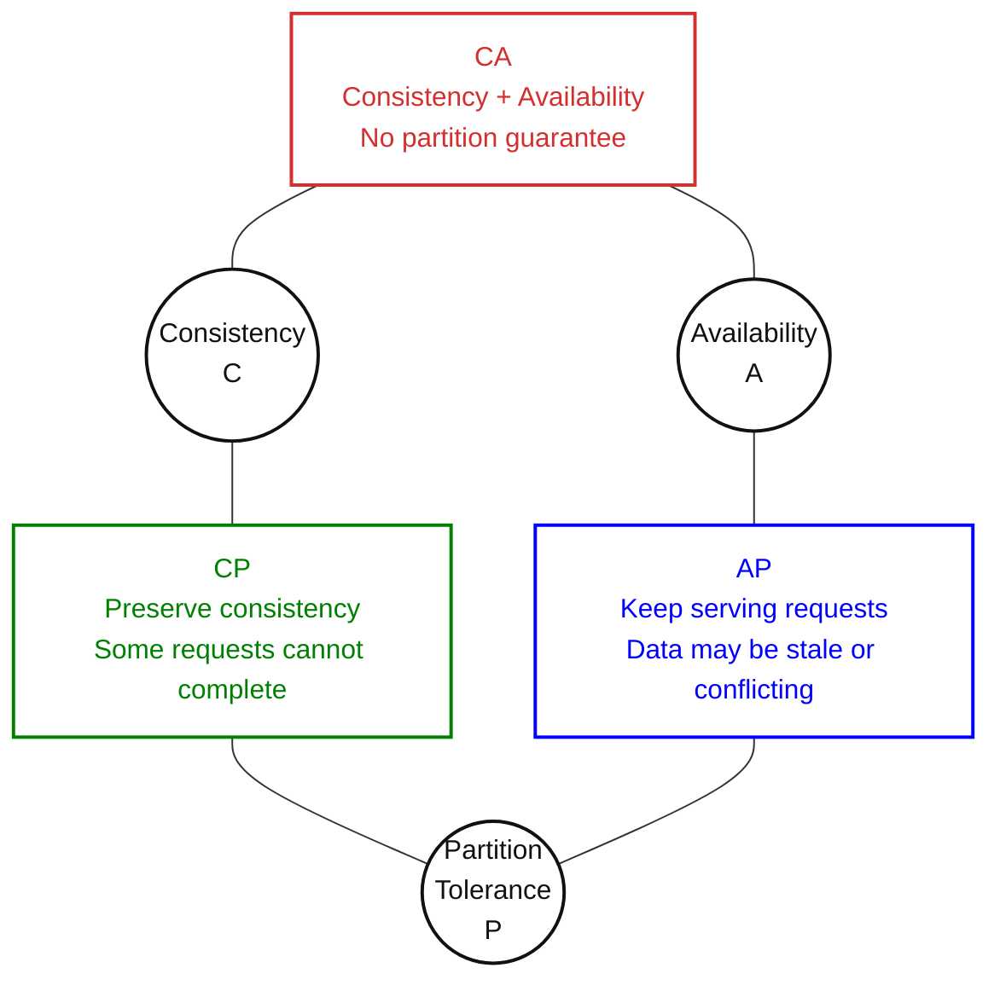

# Distributed Systems Theorems and Data Structures

## Table of Contents

- [Overview](#overview)
- [CAP Theorem](#cap-theorem)
  - [The Three Properties](#the-three-properties)
  - [CAP Diagram](#cap-diagram)
  - [Why a Partition Forces a Choice](#why-a-partition-forces-a-choice)
  - [CP, AP, and CA](#cp-ap-and-ca)
  - [Practical Design Notes](#practical-design-notes)
- [PACELC Theorem](#pacelc-theorem)
- [Paxos and Raft Algorithms](#paxos-and-raft-algorithms)
  - [Paxos](#paxos)
  - [Raft](#raft)
- [Byzantine Generals Problem (BGP)](#byzantine-generals-problem-bgp)
- [FLP Impossibility Theorem](#flp-impossibility-theorem)
- [Consistent Hashing](#consistent-hashing)
- [Bloom Filters](#bloom-filters)
- [Count-Min Sketch](#count-min-sketch)
- [HyperLogLog](#hyperloglog)
- [References](#references)

## Overview

Distributed systems need more than additional servers. Nodes must communicate, coordinate updates, handle failures, and manage large datasets.

These topics explain what distributed systems can guarantee and how to build within those limits:

| Category | Topics | Main question |
| --- | --- | --- |
| Theorems and trade-off models | CAP, PACELC, FLP | Which guarantees are possible under the stated conditions? |
| Consensus algorithms | Paxos, Raft | How can nodes agree on decisions or an ordered sequence of updates? |
| Fault models and agreement problems | Byzantine generals problem | How can nodes agree when some participants behave incorrectly? |
| Data distribution and compact summaries | Consistent hashing, Bloom filters, Count-Min Sketch, HyperLogLog | How can we distribute data or answer questions with limited memory? |

See [Distributed System Attributes](Distributed-System-Attributes.md) for the underlying concepts of consistency, availability, partition tolerance, and fault tolerance.

## CAP Theorem

The **CAP theorem**, also called *Brewer's theorem*, states that a distributed read/write system cannot guarantee both **strong consistency** and **availability** during a **network partition**.

> **Remember:** When nodes cannot communicate, the system cannot always provide both an up-to-date answer and an answer to every request.

### The Three Properties

| Property | Plain meaning | Hotel-room example |
| --- | --- | --- |
| **C — Consistency** | Operations behave as if there were one up-to-date copy of the data. A read after a completed write sees that write or a newer one. | After a booking completes, a later availability read cannot report the room as still free. |
| **A — Availability** | Every request reaching a non-failing node eventually completes its requested operation, even if other nodes cannot be reached. | A reachable replica continues answering availability checks rather than refusing them because it cannot contact another replica. |
| **P — Partition tolerance** | The design handles network splits that prevent groups of nodes from communicating. | `db1` and `db2` remain running, but their network connection is broken. |

Here, **consistency means linearizability**. CAP availability is a formal guarantee about completing requests; it does not specify a response deadline or an uptime percentage. Production systems also need latency and availability targets. [Gilbert and Lynch's explanation](https://groups.csail.mit.edu/tds/papers/Gilbert/Brewer2.pdf)

### CAP Diagram

**Diagram:** The circles represent the three properties; the connecting boxes show the familiar CA, CP, and AP combinations. During a partition, the relevant choice is **CP or AP**. CA assumes partitions are excluded; it cannot preserve both guarantees if a partition occurs.

### Why a Partition Forces a Choice

**Hotel-room example:**

1. `u1` books room `r1` on `db1`, and the booking is confirmed.
2. A network partition prevents the update from reaching `db2`.
3. `u2` asks `db2` whether `r1` is available. `db2` still has the old value and cannot check `db1`.
4. If `db2` answers from its local copy, it may return **“available”** despite the completed booking. If it waits for communication to return, the request cannot complete while the partition persists.

> The isolated replica cannot know whether its data is current. Answering risks breaking consistency; waiting sacrifices availability.

### CP, AP, and CA

| Choice | Behavior during a partition | Example |
| --- | --- | --- |
| **CP — Consistency + partition tolerance** | Preserve strong consistency, even if some reads or writes must wait or fail. | An isolated replica refuses to confirm a booking it cannot safely coordinate. |
| **AP — Availability + partition tolerance** | Continue serving requests, accepting weaker consistency and possible conflicting updates. | Hotel search returns locally stored availability that may be outdated. |
| **CA — Consistency + availability** | Can provide both when partitions are excluded from the assumed failure conditions. | Normal operation with reliable communication; a partition would still force a C/A decision. |

### Practical Design Notes

- **Plan for partitions:** Hardware faults, network outages, routing problems, and maintenance can break communication, even within one region.
- **CP does not mean every replica is always identical:** Some replicas can lag; the system must prevent those copies from serving inconsistent operations.
- **CP does not mean the whole service stops:** A group with enough reachable replicas may continue while an isolated group cannot.
- **AP does not automatically mean eventual consistency:** Convergence also requires replication and conflict-resolution rules.
- **Choose per operation:** Search can tolerate stale room availability, while final booking confirmation needs stronger coordination and an atomic check-and-write.

> CAP describes a limit during partitions, rather than a rule to permanently abandon one property. Define which operations can continue, which must wait, and how conflicting updates will be handled when communication returns. [Eric Brewer's clarification](https://www.infoq.com/articles/cap-twelve-years-later-how-the-rules-have-changed/)

## PACELC Theorem

> Study notes to be added.

## Paxos and Raft Algorithms

### Paxos

> Study notes to be added.

### Raft

> Study notes to be added.

## Byzantine Generals Problem (BGP)

> Study notes to be added.

## FLP Impossibility Theorem

> Study notes to be added.

## Consistent Hashing

> Study notes to be added.

## Bloom Filters

> Study notes to be added.

## Count-Min Sketch

> Study notes to be added.

## HyperLogLog

> Study notes to be added.

## References

- [Seth Gilbert and Nancy Lynch — Perspectives on the CAP Theorem](https://groups.csail.mit.edu/tds/papers/Gilbert/Brewer2.pdf)
- [Eric Brewer — CAP Twelve Years Later: How the "Rules" Have Changed](https://www.infoq.com/articles/cap-twelve-years-later-how-the-rules-have-changed/)
