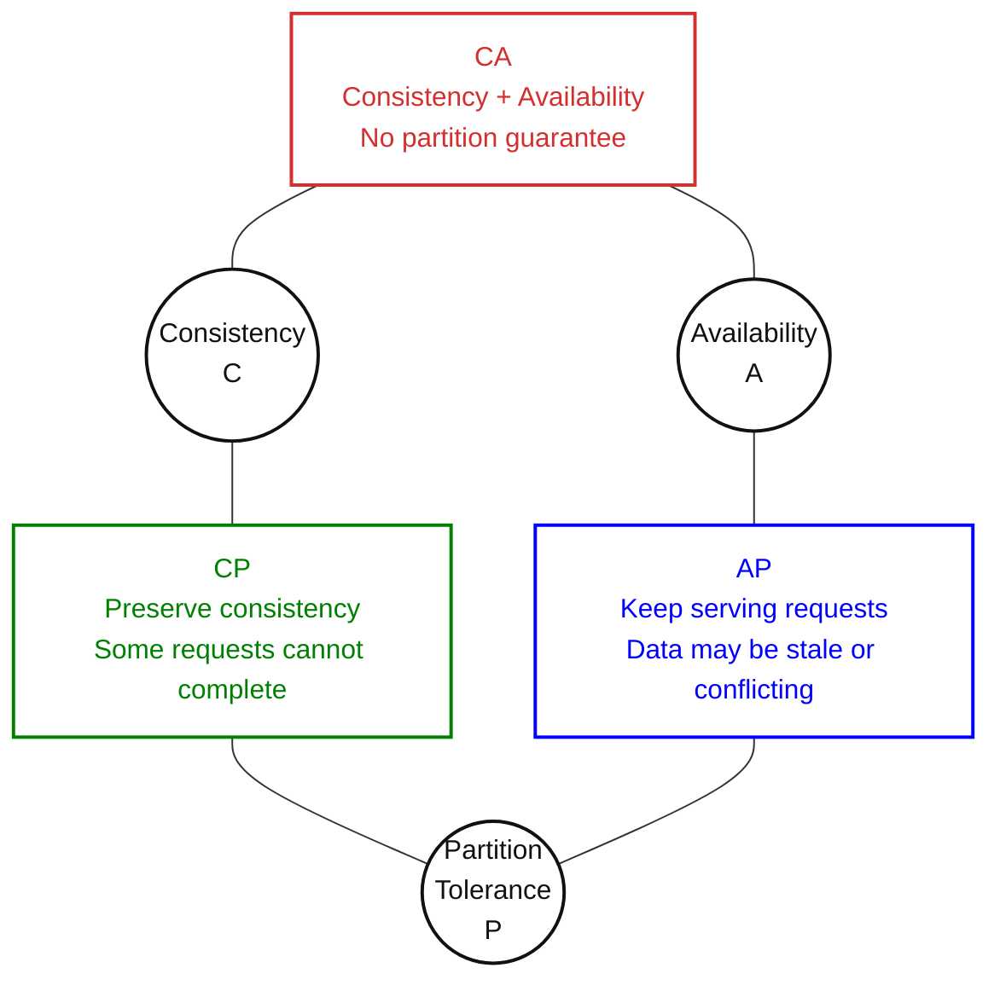
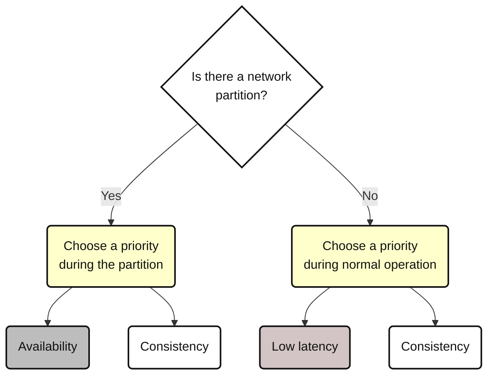
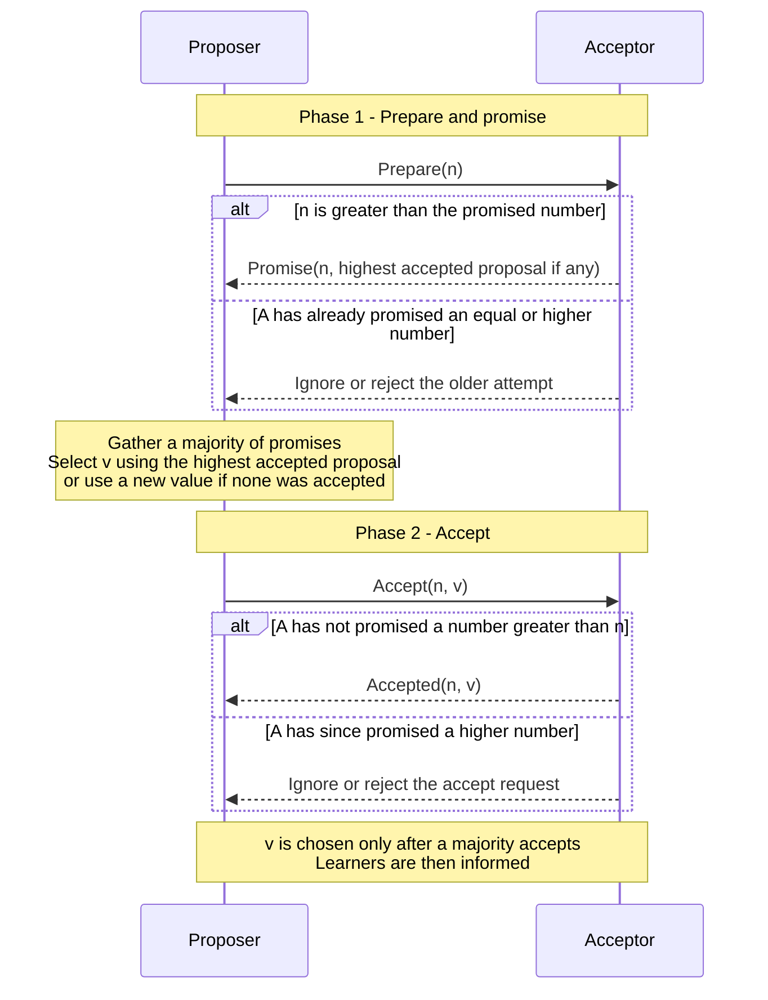
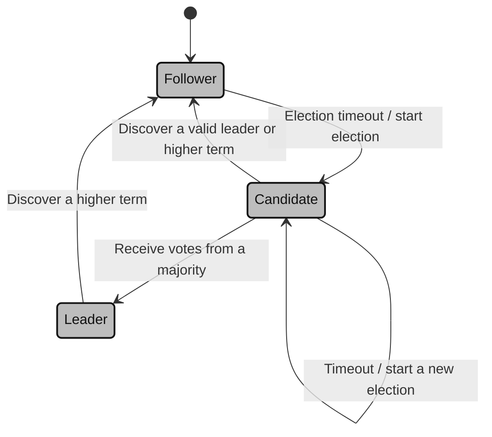
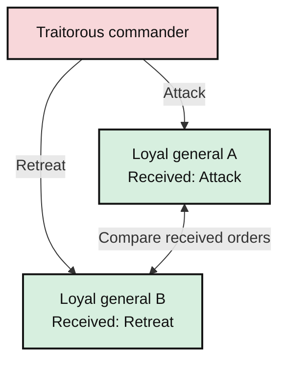

# Distributed Systems Theorems and Data Structures

## Table of Contents

- [Overview](#overview)
- [CAP Theorem](#cap-theorem)
  - [The Three Properties](#the-three-properties)
  - [CAP Diagram](#cap-diagram)
  - [Why a Partition Forces a Choice](#why-a-partition-forces-a-choice)
  - [CP, AP, and CA](#cp-ap-and-ca)
  - [Practical Design Notes](#practical-design-notes)
- [PACELC Theorem](#pacelc-theorem)
  - [What PACELC Stands For](#what-pacelc-stands-for)
  - [PACELC Diagram](#pacelc-diagram)
  - [The Two Trade-Offs](#the-two-trade-offs)
- [Consensus and Replication Protocols](#consensus-and-replication-protocols)
  - [Consensus and Majority Quorums](#consensus-and-majority-quorums)
  - [Paxos](#paxos)
    - [Paxos Roles](#paxos-roles)
    - [Paxos Protocol Steps](#paxos-protocol-steps)
    - [Paxos Protocol Diagram](#paxos-protocol-diagram)
    - [Paxos Walkthrough: Two Competing Values](#paxos-walkthrough-two-competing-values)
    - [Paxos Challenges](#paxos-challenges)
    - [Paxos Variants and Optimizations](#paxos-variants-and-optimizations)
    - [Paxos Applications](#paxos-applications)
  - [Raft](#raft)
    - [Raft Roles and Terms](#raft-roles-and-terms)
    - [Raft State Diagram](#raft-state-diagram)
    - [Raft Protocol Steps](#raft-protocol-steps)
    - [Raft Safety Rules](#raft-safety-rules)
    - [Raft Challenges](#raft-challenges)
    - [Raft Applications](#raft-applications)
    - [Named Systems and Algorithm Boundaries](#named-systems-and-algorithm-boundaries)
  - [Zab and ZooKeeper](#zab-and-zookeeper)
  - [Other Protocols to Study Later](#other-protocols-to-study-later)
  - [Paxos vs. Raft vs. Zab](#paxos-vs-raft-vs-zab)
- [Byzantine Generals Problem (BGP)](#byzantine-generals-problem-bgp)
  - [The Generals Example](#the-generals-example)
  - [Requirements for Byzantine Agreement](#requirements-for-byzantine-agreement)
  - [Byzantine Faults vs. Crash Faults](#byzantine-faults-vs-crash-faults)
  - [Byzantine Fault Tolerance and Quorums](#byzantine-fault-tolerance-and-quorums)
  - [Common BFT Techniques](#common-bft-techniques)
  - [Classical Solutions and PBFT](#classical-solutions-and-pbft)
  - [When Is BFT Needed?](#when-is-bft-needed)
  - [BFT Applications and Trade-Offs](#bft-applications-and-trade-offs)
  - [BFT and AI/LLM-Based Systems](#bft-and-aillm-based-systems)
- [FLP Impossibility Theorem](#flp-impossibility-theorem)
- [Consistent Hashing](#consistent-hashing)
- [Bloom Filters](#bloom-filters)
- [Count-Min Sketch](#count-min-sketch)
- [HyperLogLog](#hyperloglog)
- [References](#references)

## Overview

Distributed systems need more than additional servers. Nodes must communicate, coordinate updates, handle failures, and manage large datasets.

These topics explain what distributed systems can guarantee and how to build within those limits:

| Category | Topics | Main question |
| --- | --- | --- |
| Theorems and trade-off models | CAP, PACELC, FLP | Which guarantees are possible under the stated conditions? |
| Consensus and replication protocols | Paxos, Raft, Zab | How can nodes agree on decisions or an ordered sequence of updates? |
| Fault models and agreement problems | Byzantine generals problem | How can nodes agree when some participants behave incorrectly? |
| Data distribution and compact summaries | Consistent hashing, Bloom filters, Count-Min Sketch, HyperLogLog | How can we distribute data or answer questions with limited memory? |

See [Distributed System Attributes](Distributed-System-Attributes.md) for the underlying concepts of consistency, availability, partition tolerance, and fault tolerance.

## CAP Theorem

The **CAP theorem**, also called *Brewer's theorem*, states that a distributed read/write system cannot guarantee both **strong consistency** and **availability** during a **network partition**.

> **Remember:** When nodes cannot communicate, the system cannot always provide both an up-to-date answer and an answer to every request.

### The Three Properties

| Property | Plain meaning | Hotel-room example |
| --- | --- | --- |
| **C — Consistency** | Operations behave as if there were one up-to-date copy of the data. A read after a completed write sees that write or a newer one. | After a booking completes, a later availability read cannot report the room as still free. |
| **A — Availability** | Every request reaching a non-failing node eventually completes its requested operation, even if other nodes cannot be reached. | A reachable replica continues answering availability checks rather than refusing them because it cannot contact another replica. |
| **P — Partition tolerance** | The design handles network splits that prevent groups of nodes from communicating. | `db1` and `db2` remain running, but their network connection is broken. |

Here, **consistency means linearizability**. CAP availability is a formal guarantee about completing requests; it does not specify a response deadline or an uptime percentage. Production systems also need latency and availability targets. [Gilbert and Lynch's explanation](https://groups.csail.mit.edu/tds/papers/Gilbert/Brewer2.pdf)

### CAP Diagram

> **During a network partition, a system cannot guarantee both strong consistency and availability. CA is possible when there is no partition; if one occurs, the system must give up at least one of those guarantees.**



> **Diagram:** The circles represent the three properties; the connecting boxes show the familiar CA, CP, and AP combinations. During a partition, the relevant choice is **CP or AP**. CA assumes partitions are excluded; it cannot preserve both guarantees if a partition occurs.

### Why a Partition Forces a Choice

**Hotel-room example:**

1. `u1` books room `r1` on `db1`, and the booking is confirmed.
2. A network partition prevents the update from reaching `db2`.
3. `u2` asks `db2` whether `r1` is available. `db2` still has the old value and cannot check `db1`.
4. If `db2` answers from its local copy, it may return **“available”** despite the completed booking. If it waits for communication to return, the request cannot complete while the partition persists.

> The isolated replica cannot know whether its data is current. Answering risks breaking consistency; waiting sacrifices availability.

### CP, AP, and CA

| Choice | Behavior during a partition | Example |
| --- | --- | --- |
| **CP — Consistency + partition tolerance** | Preserve strong consistency, even if some reads or writes must wait or fail. | An isolated replica refuses to confirm a booking it cannot safely coordinate. |
| **AP — Availability + partition tolerance** | Continue serving requests, accepting weaker consistency and possible conflicting updates. | Hotel search returns locally stored availability that may be outdated. |
| **CA — Consistency + availability** | Can provide both when partitions are excluded from the assumed failure conditions. | Normal operation with reliable communication; a partition would still force a C/A decision. |

### Practical Design Notes

- **Plan for partitions:** Hardware faults, network outages, routing problems, and maintenance can break communication, even within one region.
- **CP does not mean every replica is always identical:** Some replicas can lag; the system must prevent those copies from serving inconsistent operations.
- **CP does not mean the whole service stops:** A group with enough reachable replicas may continue while an isolated group cannot.
- **AP does not automatically mean eventual consistency:** Convergence also requires replication and conflict-resolution rules.
- **Choose per operation:** Search can tolerate stale room availability, while final booking confirmation needs stronger coordination and an atomic check-and-write.

> **CAP describes a limit during partitions, rather than a rule to permanently abandon one property.** Define which operations can continue, which must wait, and how conflicting updates will be handled when communication returns. *CAP prohibits only a tiny part of the design space: ***perfect availability and consistency*** in the presence of partitions, which are ***rare***.* [Eric Brewer's clarification](https://www.infoq.com/articles/cap-twelve-years-later-how-the-rules-have-changed/)

> **CAP does not mean sacrificing consistency or availability in every situation.** When communication works normally, a system can provide both. During a partition, designers must decide which guarantee to prioritize for the affected operations.
> - ***For financial transactions***, where strict consistency is essential, a CP approach may be preferred: some requests must wait or fail rather than use inconsistent data. ***For web features*** such as feeds, an AP approach may be preferred: users continue receiving responses, even if some information is temporarily outdated.
> - ***The design choice*** depends on the specific/unique system requirements and priorities of an application, user needs, and expected network conditions. Different operations within the same system can make different choices. CAP helps system architects make ***conscious*** decisions about which operations can continue during a partition and how to recover afterward.

## PACELC Theorem

**PACELC** extends CAP by considering what happens both **during a network partition** and **during normal operation**. It was introduced by Daniel Abadi.

> **Remember:** If there is a **P**artition, consider **A**vailability versus **C**onsistency; **E**lse, consider **L**atency versus **C**onsistency.

### What PACELC Stands For

| Letter | Meaning | Plain explanation |
| --- | --- | --- |
| **P** | Partition | Some groups of nodes cannot communicate. The design must decide which operations can continue. |
| **A** | Availability | Requests reaching healthy nodes continue to receive results, even if strong consistency cannot be maintained. |
| **C** | Consistency during a partition | Preserve strong consistency, even if some operations must wait or fail. |
| **E** | Else | There is no network partition; the system is operating normally. |
| **L** | Latency | Reduce the time between sending a request and receiving its result. |
| **C** | Consistency during normal operation | Keep strong consistency, accepting the communication and coordination time it may require. |

Both **C** letters concern consistency. They describe priorities under different network conditions, rather than two separate definitions of consistency.

### PACELC Diagram



**Diagram:** The left branch is the CAP trade-off: **availability versus consistency during a partition**. The right branch adds the PACELC trade-off: **latency versus consistency when there is no partition**.

### The Two Trade-Offs

- **During a partition — availability vs. consistency:** A replica can answer from its local data, which may be outdated, or refuse an operation it cannot safely coordinate.
- **During normal operation — latency vs. consistency:** Waiting for other replicas to coordinate an update takes time. Responding before that coordination completes can reduce latency, but another replica may return an older value.

**Hotel-room example:** *During a partition*, hotel search may return locally stored room availability, while final booking confirmation may have to wait. *Even when the network works*, confirming a booking through coordinated replicas takes longer than returning an uncoordinated local result.

**Common notation:** `PA/EL` prioritizes availability during partitions and low latency otherwise; `PC/EC` prioritizes consistency in both situations. These labels describe a design or configuration, not an unchangeable property of every operation in a product.

> CAP explains the partition-time limit. PACELC also asks what consistency costs in response time during normal operation. Choose according to the application's requirements, replica locations, and acceptable data staleness. [Abadi's original explanation](https://dbmsmusings.blogspot.com/2010/04/problems-with-cap-and-yahoos-little.html), [PACELC paper](https://www.cs.umd.edu/~abadi/papers/abadi-pacelc.pdf)

## Consensus and Replication Protocols

**Consensus** means that participating nodes agree on a decision. Replicated services use consensus repeatedly to agree on an **ordered sequence of commands**, so replicas can apply the same commands and reach the same state.

**Example:** A booking service must agree on which request reserves the final room. Agreeing on command order lets every replica perform the same availability check and reach the same booking result.

### Consensus and Majority Quorums

Standard Paxos and Raft handle **crashes, unavailable nodes, and delayed or lost messages**. They assume participants follow the protocol; they do not provide Byzantine fault tolerance against dishonest or arbitrarily incorrect participants.

For $N$ voting nodes, a majority quorum is:

$$
Q = \left\lfloor \frac{N}{2} \right\rfloor + 1
$$

| Voting nodes | Majority needed | Unavailable nodes tolerated while retaining a majority |
| ---: | ---: | ---: |
| 3 | 2 | 1 |
| 5 | 3 | 2 |
| 7 | 4 | 3 |

To tolerate $f$ unavailable voting nodes, a typical majority-based deployment needs at least $2f + 1$ voters. The remaining majority must be able to communicate.

> **Safety vs. progress:** Safety prevents conflicting decisions. Progress means new decisions can be made. A partition can stop progress without allowing the protocol to make conflicting decisions. Progress requires a reachable quorum and sufficiently stable communication and leadership.

### Paxos

**Paxos**, developed by **Leslie Lamport**, allows nodes to agree on **one value for one decision**, even when some nodes fail or messages are delayed. A value can be a command, a proposed update, or another decision the replicas must share.

> **Financial example:** Two nodes propose different values for the **same account-balance update**: Node 1 proposes **$20**, while Node 2 proposes **$5**. Paxos ensures that only one value is chosen for that decision. If **$20** is chosen, a later proposal cannot choose **$5** for the same decision.

> Paxos ensures agreement—not that the amount is financially correct. If $20 and $5 represent **two separate deposits**, both must be processed through separate decisions, rather than choosing one and discarding the other.

**Basic Paxos** chooses a single value; **Multi-Paxos** repeats agreement for positions in an ordered log. These decisions are building blocks for databases, storage systems, and replicated state machines.

**Hands-on example:** [C++17 Basic Paxos simulation](examples/paxos/README.md) — step-by-step input/output, competing proposals, unavailable acceptors, and self-tests. [Implementation](examples/paxos/paxos.cpp).

#### Paxos Roles

| Role | Responsibility |
| --- | --- |
| **Proposer** | Suggests a value and coordinates the prepare and accept phases. |
| **Acceptor** | Records promises and accepted proposals; a quorum of acceptors determines which value is chosen. |
| **Learner** | Finds out which value was chosen and passes it to the application. |

These are **logical roles**: one server can perform more than one role.

A proposal contains a **unique, ordered proposal number** $n$ and a **value** $v$. Proposal numbers let acceptors distinguish newer attempts from older ones; they can be constructed from a counter and proposer ID.

#### Paxos Protocol Steps

1. **Prepare:** The proposer selects a proposal number $n$ and sends `Prepare(n)` to acceptors, seeking a majority of responses.
2. **Promise:** An acceptor that has not promised a higher or equal number promises not to accept proposals numbered below $n$. It returns its **highest-numbered previously accepted proposal**, if any. Older attempts may be rejected or ignored.
3. **Select the value:** After a majority of promises, the proposer must use the value from the **highest-numbered accepted proposal in those replies**. If none of the responding acceptors has accepted a value, it may use its own proposed value.
4. **Accept:** The proposer sends `Accept(n, v)`. An acceptor accepts unless it has since promised a higher proposal number, and records the accepted proposal before acknowledging it.
5. **Learn:** Once a majority accepts the same proposal, its value is **chosen**. Learners obtain evidence of that decision and inform the application.

> **Critical rule:** A new proposer cannot simply overwrite an earlier accepted value with its preferred value. Carrying forward the highest-numbered accepted value from the promise quorum preserves earlier decisions. **Accepted by one node** is different from **chosen by a majority**. [Paxos Made Simple](https://lamport.azurewebsites.net/pubs/paxos-simple.pdf)

**Proposal number vs. proposed value**

- **Higher/lower** means a larger/smaller **proposal number**, not a larger/smaller money amount.
- In this example, **#2 is newer and higher-numbered** than #1, even if #2 initially requests **$5** and #1 requests **$20**.
- The **proposal number** identifies the attempt. The **value** is what that attempt proposes for the decision.

**What does a promise actually say?**

Suppose an acceptor previously accepted `(#1, $20)`. When it receives `Prepare(2)`, it replies with **two separate pieces of information**:

> **Promise:** "From now on, I will not accept proposals numbered below #2."
>
> **History:** "I previously accepted (#1, $20)."

The promise does **not** erase the earlier $20. The history lets the proposer check whether an earlier value must be preserved. If this is the highest-numbered accepted proposal in its promise quorum, the proposer must use $20.

"Highest-numbered previously accepted proposal" means **the accepted proposal with the largest proposal number**, not the largest money amount. For example, if a `Prepare(4)` quorum reports acceptances numbered #1 and #3, the proposer uses the value attached to **#3**.

**Proposal #2 does not become proposal #1**

Reporting `(#1, $20)` is **sharing history**, not renaming #2. The new attempt is still #2, and it may carry the same $20 value:

```text
Accept #1: $20  -> accepted earlier
Prepare #2     -> promise to refuse lower numbers; report earlier (#1, $20)
Accept #2: $20  -> allowed if no higher promise has intervened
Accept #1: $20  -> rejected if it arrives again after that promise to #2
```

It is the **late request carrying #1** that is rejected, not the new request carrying #2. Even the same $20 value does not make an old proposal number acceptable again.

**How can an older proposal physically arrive later?**

Different proposers send messages independently, and **network messages can be delayed**:

1. **P1 sends `Accept(1, $20)` to A, B, and C.** A and B receive and accept it, so $20 is chosen. The message to C is delayed in the network.
2. **P2 sends `Prepare(2)` to B and C.** These messages arrive quickly. B reports its earlier `(#1, $20)` acceptance, so P2 must carry $20 forward.
3. **P2 sends `Accept(2, $20)` to B and C.** Both accept it.
4. **P1's delayed `Accept(1, $20)` finally reaches C.** C replies: "Too late—I already promised #2. I reject #1."

Nothing changed #2 back into #1. **An old message simply arrived after a newer message.** A proposer can also retry the same request when a reply is delayed or lost, creating another late copy.

> **Proposal numbers describe proposal order—not network arrival order.** A higher-numbered request may arrive before a lower-numbered request.

**What if the acceptor has already promised another number?**

- Already promised **#3**, then receives `Prepare(2)`: **reject or ignore it**, because #2 is lower.
- Already promised **#2**, then receives `Prepare(2)` again: this is a **duplicate**, not a new proposal. An implementation may repeat its reply or ignore the duplicate; the C++ examples repeat the reply.
- Already promised **#2**, then receives `Prepare(3)`: it can make a **higher promise**. Promising #2 does not permanently forbid later attempts.

#### Paxos Protocol Diagram



**Diagram:** One proposer/acceptor exchange is shown, as in the protocol illustration. In a real group, the proposer exchanges these messages with multiple acceptors and needs a **majority**, not just one reply. Promise responses carry the highest accepted proposal for this decision, rather than a complete list of all proposals.

**Example:** If `db1` and `db2` accept proposal `(7, "book r1 for u1")` in a three-acceptor group, that value is chosen. A later proposer seeking a majority must preserve that decision, even if it originally wanted to propose another value.

#### Paxos Walkthrough: Two Competing Values

Think of Paxos as solving this exact question for **one decision / log slot**:

> **Three database nodes must agree: should this record contain $20 or $5?**

Assume three acceptors, **A, B, and C**, initially with no accepted proposal. A majority is **2 out of 3**. P1 and P2 are proposers; they may run on the same servers as the acceptors, but their roles are different.

> **Higher/lower and newer/older refer to the proposal number, not the money amount.** In this example, proposal **#2 is newer and higher-numbered**, even if its requested value is **$5**. Proposal **#1 is older and lower-numbered**, even if its value is **$20**. The **proposal number** and the **proposed value** are separate things.

**1. P1 gets $20 chosen**

P1 wants $20 and starts proposal **#1**. It sends `Prepare(1)` to A and B. Both reply:

```text
A: I promise not to accept proposals below #1. No earlier value accepted.
B: I promise not to accept proposals below #1. No earlier value accepted.
```

Because neither reply reports an earlier acceptance, P1 can use its requested value. It sends `Accept(1, $20)` to A and B, which record:

| Acceptor | Accepted proposal |
| --- | --- |
| A | `(#1, $20)` |
| B | `(#1, $20)` |
| C | None |

**Two of three acceptors accepted the same proposal, so $20 is now chosen.** C does not need to participate for that decision to be made.

**2. P2 wants $5, but must preserve $20**

P2 starts a newer proposal, **#2**, initially wanting $5. It sends `Prepare(2)` to B and C. Their replies contain both a promise and their accepted history:

```text
B: I promise not to accept proposals below #2. I already accepted (#1, $20).
C: I promise not to accept proposals below #2. No earlier value accepted.
```

The crucial rule is:

> P2 must reuse the value from the **highest-numbered accepted proposal in its promise quorum**. It cannot continue with $5 for this decision.

Here that proposal is `(#1, $20)`, so P2 must send:

```text
Accept(2, $20)    correct
Accept(2, $5)     not allowed by the proposer rule
```

Assuming no higher proposal interrupts the attempt, B and C accept `(#2, $20)`:

| Acceptor | Accepted proposal |
| --- | --- |
| A | `(#1, $20)` |
| B | `(#2, $20)` |
| C | `(#2, $20)` |

The proposal numbers differ, but **all three accepted values are $20** in this example. A new proposal number did not create a new decision or permission to overwrite the chosen value.

**3. Why does this work? Any two majorities overlap**

```text
First majority:   A + B
Second majority:  B + C
Shared acceptor:  B
```

B carries the earlier accepted value into P2's promise quorum. If B had since accepted a higher-numbered proposal, it would report that one instead; the protocol rules ensure it still preserves the chosen value. Quorum overlap works together with **remembered acceptor state** and the **highest-accepted-value selection rule**. [Paxos Made Simple](https://lamport.azurewebsites.net/pubs/paxos-simple.pdf)

```text
1. PREPARE -> Ask a majority about earlier accepted proposals.
2. PROMISE -> Acceptors promise not to accept lower proposal numbers.
3. SELECT  -> Preserve the highest accepted value, or use a new value if none exists.
4. ACCEPT  -> Request acceptance of that selected value.
5. MAJORITY ACCEPTS -> The value is CHOSEN; learners can learn it from the replies.
```

> **Before writing your value, first ask a majority whether an earlier value must be preserved.** A value being chosen does not mean every replica has already accepted, learned, or applied it; unavailable or delayed nodes can lag behind.

**4. Is $20 permanent? For this slot, yes**

Once $20 is chosen, **that slot's decision cannot change**. A different decision belongs to a **new slot**, not merely a higher proposal number in the same slot:

```text
Slot 1 -> $20
Slot 2 -> $5
Slot 3 -> $30
```

Multi-Paxos / replicated logs build an ordered sequence of such decisions. Each slot has its own consensus instance. The application can change a record through later commands without rewriting earlier chosen log entries.

**5. How does Paxos know $20 is correct? It does not**

Paxos guarantees that **conflicting values cannot both be chosen for the same slot**. It does not decide whether $20 or $5 is valid according to financial rules; that is the application's responsibility.

In a financial application, log entries can instead be commands such as `credit $20` and `credit $5`. If these are two legitimate deposits, they belong to separate decisions so both can be processed, rather than discarding one.

> **Paxos = agreement mechanism; a replicated log adds ordering. Business correctness comes from application logic.**

#### Paxos Challenges

- **Fault tolerance:** The protocol can make progress despite some failures while a majority remains reachable. Losing a majority blocks new decisions.
- **Competing proposers:** Proposers can repeatedly interrupt each other with higher proposal numbers. A stable distinguished proposer or leader helps progress.
- **Scalability:** More participants and distant replicas increase communication and coordination costs. Adding acceptors does not automatically increase write throughput.
- **Complexity:** Retries, reordered messages, crash recovery, and competing proposals must obey the safety rules.
- **Persistent state:** Acceptors must preserve promises and accepted proposals across restarts; forgetting them can break safety.

#### Paxos Variants and Optimizations

| Name | Main idea | Important qualification |
| --- | --- | --- |
| **Multi-Paxos** | Agree on a sequence of values using a stable leader. | The leader can perform prepare for many log positions together and then use accept for subsequent commands. It avoids repeating prepare while that leadership remains valid; it does **not** eliminate the accept phase. |
| **Fast Paxos** | Let clients propose directly to acceptors in an established fast round, reducing a message delay when proposals do not conflict. | Fast rounds generally require larger quorums. Conflicting proposals require recovery, so the fast path is not unconditional. |
| **Paxos Made Simple** | A clearer explanation of the original Paxos algorithm. | It is not a separate one-round protocol called "Simple Paxos" that merges prepare and accept. |

[Multi-Paxos explanation](https://lamport.azurewebsites.net/pubs/paxos-simple.pdf), [Fast Paxos](https://www.microsoft.com/en-us/research/publication/fast-paxos/), [Fast Paxos quorum details](https://www.microsoft.com/en-us/research/wp-content/uploads/2016/02/tr-2005-112.pdf)

#### Paxos Applications

- **Distributed databases:** Agree on ordered updates within a replica group. The published Spanner design uses Paxos replication; transactions across groups need additional coordination.
- **Filesystem metadata and coordination:** Agree on leadership or shared metadata. Google's Chubby uses Paxos, and GFS uses Chubby to appoint its master and store some shared metadata.
- **Replicated state machines:** Agree on commands for key-value stores or other deterministic services; each replica applies the chosen commands in order.

[Spanner design](https://storage.googleapis.com/gweb-research2023-media/pubtools/1974.pdf), [Chubby design and GFS integration](https://storage.googleapis.com/gweb-research2023-media/pubtools/4444.pdf)

> Paxos is a consensus building block. Correct storage, application rules, and retry handling are still needed to turn agreement into a reliable service.

### Raft

**Raft**, developed by **Diego Ongaro and John Ousterhout** and published in 2014, is a consensus algorithm designed to be easier to understand and implement. It organizes the problem into **leader election**, **log replication**, and **safety**.

Raft maintains an **ordered, replicated log**. Replicas apply committed commands in order to their state machines. Their logs can temporarily differ, but they must not apply conflicting commands at the same log position.

**Hands-on example:** [DSA-style C++17 Raft core](examples/raft/README.md) — short procedures, matching pseudocode, complexity, and a replicated-credit example. [Implementation](examples/raft/raft_dsa.cpp).

#### Raft Roles and Terms

| Role | Responsibility |
| --- | --- |
| **Follower** | Receives log entries and heartbeats, responds to requests, and votes in elections. |
| **Candidate** | Starts an election and asks other servers for votes. |
| **Leader** | Coordinates new log entries, replication, and commitment. |

A **term** is a numbered election period. Servers use term numbers to recognize outdated leaders and messages. Each server grants at most one vote per term; a server discovering a higher term updates its term and becomes a follower.

> A timeout suggests that a leader may be unavailable; it does not prove that the leader has crashed. A delayed network can also trigger an election.

#### Raft State Diagram



**Diagram:** Servers start as followers. A timeout starts an election; a majority of votes makes a candidate the leader. A candidate can retry an unsuccessful election or return to follower when it recognizes a valid leader. A leader steps down when it discovers a higher term.

#### Raft Protocol Steps

1. **Leader election:** A follower whose election timer expires becomes a candidate, increments its term, votes for itself, and sends `RequestVote` messages. A majority of votes elects the leader. Randomized timeouts reduce repeated split votes.
2. **Receive a command:** The leader receives a client request and appends a log entry containing the command, its term, and its position in the log.
3. **Replicate the log:** The leader sends `AppendEntries` messages to followers. Followers check the preceding log entry and store matching updates; the leader retries or repairs inconsistent log suffixes. Heartbeats are `AppendEntries` messages without new entries.
4. **Commit:** An entry from the leader's current term can be committed once stored on a majority, including the leader. Committing it also commits preceding entries. An older-term entry is not committed merely by counting copies; commitment must follow Raft's current-term rule.
5. **Apply and respond:** The leader applies committed commands in order and returns the result. Followers learn the commit position and apply committed entries in the same order. Receiving an entry alone does **not** make it safe to apply.

**Hotel-room example:** The leader records `BookRoom(u1, r1)` and replicates it. After commitment, replicas apply the command's atomic availability check and booking update. A later command for the same room sees it as booked. The application still needs request IDs or deduplication so client retries do not create duplicate operations.

#### Raft Safety Rules

| Rule | What it prevents |
| --- | --- |
| **Election safety** | Two leaders being elected in the same term. |
| **Voting restriction** | Electing a candidate whose log is not sufficiently up to date. Log freshness is compared by the last entry's term, then its index. |
| **Log matching** | Two logs with the same entry index and term having different preceding histories. `AppendEntries` checks and repairs the matching prefix. |
| **Leader completeness** | A future leader omitting an entry that was already committed. |
| **State-machine safety** | Different replicas applying different commands at the same log position. |

Servers persist the current term, their vote, and log entries before the relevant acknowledgements. Together with the election and commit rules, this lets safety survive crashes and restarts. [Raft paper](https://raft.github.io/raft.pdf)

#### Raft Challenges

- **Leader availability:** New writes need a functioning leader and a communicating majority. An election temporarily delays progress.
- **Scalability:** The leader coordinates replication and can become a bottleneck. Additional voting replicas add communication and storage work; large datasets may need multiple consensus groups.
- **Network delays:** Poorly chosen timeouts or unstable networks can trigger unnecessary elections.
- **Fault tolerance:** A majority can keep making progress while some servers fail. A minority partition cannot safely commit new entries on its own.
- **Implementation:** Durable state, log repair, snapshots, membership changes, and client retries still need careful handling, despite Raft's clearer structure.
- **Failure model:** Standard Raft handles crashes, not malicious nodes that invent votes or send dishonest log entries.

#### Raft Applications

- **Distributed databases and key-value stores:** Replicate commands and maintain an agreed history; etcd is a documented Raft-based example.
- **Filesystem metadata services:** A Raft-based metadata service can agree on namespace updates or leadership; the specific filesystem's implementation must be checked.
- **Cluster coordination and service discovery:** Agree on configuration, membership, service registrations, or locks. Consul uses Raft for its server state.
- **Replicated state machines and consensus-based services:** Apply an agreed sequence of commands to maintain consistent application state.
- **Cloud infrastructure management:** Coordinate resource allocations or control-plane decisions; this is a possible use of Raft, not proof that every infrastructure platform uses it.

[etcd Raft implementation](https://go.etcd.io/etcd/raft/v3), [Consul's consensus design](https://developer.hashicorp.com/consul/docs/concept/consensus)

#### Named Systems and Algorithm Boundaries

Consensus is useful in all these areas, but the product's actual algorithm matters:

| System | Relevant use | Algorithm or qualification |
| --- | --- | --- |
| **Amazon DynamoDB** | Distributed database with eventual and strongly consistent read options. | These API options do not establish that its internal protocol is Raft. Treat it as a database example rather than an unverified Raft deployment. [AWS documentation](https://docs.aws.amazon.com/amazondynamodb/latest/developerguide/HowItWorks.ReadConsistency.html) |
| **Google File System (GFS)** | Distributed storage, metadata, and master coordination. | The original GFS predates Raft. The Chubby paper describes Paxos-based coordination used to appoint the GFS master, rather than Raft replication of GFS metadata. [Chubby paper](https://storage.googleapis.com/gweb-research2023-media/pubtools/4444.pdf) |
| **Hadoop HDFS** | Replicated storage and NameNode high availability. | Documented automatic failover uses ZooKeeper coordination; this does not make HDFS a direct Paxos or Raft implementation. [HDFS HA documentation](https://hadoop.apache.org/docs/current/hadoop-project-dist/hadoop-hdfs/HDFSHighAvailabilityWithQJM.html) |
| **Apache ZooKeeper** | Shared metadata, leader election, configuration, and coordination. | Uses **Zab**, its atomic-broadcast protocol, rather than Raft. [ZooKeeper documentation](https://zookeeper.apache.org/doc/current/zookeeperAdmin.html) |
| **Google Spanner** | Consistent replication and distributed transactions. | The published design uses **Paxos** within replication groups. [Spanner paper](https://storage.googleapis.com/gweb-research2023-media/pubtools/1974.pdf) |
| **Netflix ChAP** | Automated chaos experiments that test service resilience. | Its documented purpose is failure testing; it is not a verified example of Raft-based resource management. [Netflix's ChAP description](https://netflixtechblog.com/chap-chaos-automation-platform-53e6d528371f) |
| **etcd and Consul** | Consistent metadata storage and cluster coordination. | Both have documented **Raft** implementations. [etcd](https://go.etcd.io/etcd/raft/v3), [Consul](https://developer.hashicorp.com/consul/docs/concept/consensus) |

### Zab and ZooKeeper

**ZooKeeper** is a coordination service. **Zab (ZooKeeper Atomic Broadcast)** is the protocol it uses to replicate an **ordered stream of updates**.

> **ZooKeeper = the service; Zab = its replication protocol.** *Atomic broadcast* means correct replicas deliver the same committed updates in the same order, not necessarily at the same instant.

The simplified workflow is:

1. **Establish leadership:** Select a leader and synchronize its history with a quorum before accepting new updates.
2. **Propose:** The leader gives each update a transaction ID, **`zxid`**, containing a leadership epoch and a counter, and sends updates in order.
3. **Acknowledge and commit:** Voting replicas record proposals and acknowledge them. With a quorum, the leader announces commitment; replicas apply committed updates in order.
4. **Recover:** After a leader failure, synchronize the replacement leader and followers while preserving committed history.

**Example:** Three ZooKeeper servers store a shared configuration. The leader proposes `timeout = 30`; two voting servers record it, forming a majority. The update commits. If the leader later fails, recovery preserves that committed update.

> **Ordered writes do not guarantee fresh local reads.** An ordinary ZooKeeper read can return an older value from a lagging replica. Zab is crash-tolerant, not Byzantine-tolerant. [ZooKeeper replication and consistency guarantees](https://zookeeper.apache.org/doc/current/zookeeperInternals.html)

### Other Protocols to Study Later

**Core study set:** Paxos/Multi-Paxos, Raft, Zab, and **PBFT**. PBFT addresses Byzantine faults and is covered in [Classical Solutions and PBFT](#classical-solutions-and-pbft), rather than treated as a crash-tolerant alternative.

Other useful names to recognize, without studying every detail yet:

- **Viewstamped Replication (VR):** Leader-based replicated services with recovery and leadership changes after crashes. [VR paper](https://dspace.mit.edu/entities/publication/80846d94-fcd3-40e6-87fb-8d91fe99a5d1)
- **EPaxos (Egalitarian Paxos):** A Paxos-based protocol that distributes proposal coordination across replicas rather than relying on one fixed leader. [EPaxos paper](https://www.pdl.cmu.edu/PDL-FTP/associated/epaxos-sosp2013_abs.shtml)
- **HotStuff:** A leader-based Byzantine-tolerant replication protocol that improves communication efficiency under its stated assumptions. [HotStuff paper](https://arxiv.org/abs/1803.05069)

### Paxos vs. Raft vs. Zab

| Aspect | Paxos | Raft | Zab |
| --- | --- | --- | --- |
| Basic unit | One chosen value; Multi-Paxos builds an ordered log. | An ordered, replicated log. | An ordered stream of replicated updates. |
| Roles | Proposer, acceptor, learner; roles may share a server. | Follower, candidate, leader; a server changes state. | Leader and followers; ZooKeeper can also use non-voting observers. |
| Leadership | Basic Paxos can have competing proposers; Multi-Paxos usually uses a stable leader. | Leader election and leader-driven log replication are explicit parts of the protocol. | Leadership activation synchronizes histories before normal broadcasting. |
| Main emphasis | Safe agreement through proposal numbers, promises, and intersecting quorums. | Understandable consensus through election, log replication, and safety rules. | Ordered delivery and preservation of committed history across leadership changes. |
| Standard fault model | Crashes and communication failures, not Byzantine behavior. | Crashes and communication failures, not Byzantine behavior. | Crashes and communication failures, not Byzantine behavior. |

[Paxos](https://lamport.azurewebsites.net/pubs/paxos-simple.pdf), [Raft](https://raft.github.io/raft.pdf), [Zab](https://zookeeper.apache.org/doc/current/zookeeperInternals.html)

> All three can support reliable replicated services. None guarantees progress without the required quorum, and none removes the need for correct application logic. Byzantine failures require a different fault model and suitable protocols; see the [Byzantine Generals Problem](#byzantine-generals-problem-bgp).

## Byzantine Generals Problem (BGP)

The **Byzantine Generals Problem** asks: **How can correct nodes agree when some participants can lie, send conflicting messages, or stop responding?**

> **Remember:** A failed node may do more than go silent; it may give different answers to different nodes. Agreement must remain safe despite those answers.

Here, **BGP** means *Byzantine Generals Problem*, not the networking protocol *Border Gateway Protocol*.

### The Generals Example

Generals surround a city and communicate through messengers. They must agree to **attack** or **retreat**, but some may be traitors. Loyal generals cannot reliably identify traitors, and traitors may cooperate to confuse them.

**Example:** A traitorous commander tells one loyal general to attack and another to retreat:



**Diagram:** A and B received contradictory orders. Without verifiable evidence, each cannot tell whether the commander or the other general is lying. Simply exchanging messages once does not solve the problem. [Original Byzantine Generals paper](https://lamport.azurewebsites.net/pubs/byz.pdf)

### Requirements for Byzantine Agreement

| Requirement | Simple meaning | Generals example |
| --- | --- | --- |
| **Agreement — safety** | Correct participants must not decide conflicting values. | Loyal generals must not split into attack and retreat decisions. |
| **Validity** | The decision must satisfy the protocol's validity rule. In the commander version, a correct commander's order must be followed. | A loyal commander's attack order cannot be replaced by retreat. |
| **Termination — liveness** | Correct participants eventually decide under the protocol's fault and communication assumptions. | Loyal generals eventually settle on a plan rather than wait forever. |

> **These guarantees must hold despite up to $f$ faulty participants, within the protocol's stated assumptions.** In the classical oral-message model and Practical Byzantine Fault Tolerance (PBFT), tolerating $f$ Byzantine faults requires at least $3f + 1$ participants. Correct nodes must eventually decide when communication satisfies the protocol's progress assumptions; deciding quickly is an additional performance goal.

> Agreement does not automatically make a decision financially or operationally correct. Applications still validate commands and enforce business rules.

### Byzantine Faults vs. Crash Faults

A **Byzantine fault** is arbitrary incorrect behavior. It may result from a software bug, hardware corruption, or a malicious attack; intentional dishonesty is not required. Faulty nodes may also collude. [PBFT fault model](https://www.usenix.org/legacy/events/osdi99/full_papers/castro/castro_html/node2.html)

| Fault | Behavior | Example |
| --- | --- | --- |
| **Crash fault** | A node stops executing or responding. | A database server shuts down. |
| **Byzantine fault** | A node can invent, alter, contradict, or withhold information. | A replica reports a payment as approved to A but rejected to B. |

**Sending conflicting messages about the same decision is called _equivocation_.** An ordinary network delay alone does not prove Byzantine behavior: an honest node may simply be unreachable.

> Standard **Paxos and Raft handle crash faults, not arbitrary dishonest participants**. Adding replicas to either algorithm does not, by itself, make it Byzantine fault tolerant.

### Byzantine Fault Tolerance and Quorums

**Byzantine fault tolerance (BFT)** means preserving the specified correct behavior despite up to a defined number of Byzantine participants. It is a property; **PBFT** is one protocol that provides it under stated assumptions.

For the classical *oral-message* model and PBFT-style replication, the familiar bound is:

$$
N \geq 3f + 1
$$

where **$N$** is the number of participants and **$f$** is the maximum number that may be Byzantine. A simple honest majority is not enough in these models. [Classical fault bound](https://lamport.azurewebsites.net/pubs/byz.pdf), [PBFT replica bound](https://www.usenix.org/legacy/events/osdi99/full_papers/castro/castro_html/node3.html)

For a group sized **$N = 3f + 1$**, a typical agreement quorum contains **$2f + 1$ distinct replicas**:

| Byzantine faults tolerated ($f$) | Group size ($3f + 1$) | Quorum size ($2f + 1$) |
| ---: | ---: | ---: |
| 1 | 4 | 3 |
| 2 | 7 | 5 |
| 3 | 10 | 7 |

**Why this helps — four-node example:** With A, B, C, and D, any two three-node quorums share at least two nodes. If at most one node is Byzantine, at least one shared node is correct. The protocol uses that honest overlap and remembered votes to prevent conflicting decisions.

The overlap follows directly from:

$$
|Q_1 \cap Q_2| \geq 2(2f + 1) - (3f + 1) = f + 1
$$

**Progress:** If D refuses to respond, A, B, and C can still form a quorum. If only two nodes are reachable, they cannot form this quorum; new decisions must wait rather than become unsafe.

> **These numbers depend on the fault model and protocol.** They are not universal rules for every BFT system. For larger groups, quorum sizes must be recalculated to preserve honest overlap; do not blindly keep $2f + 1$.

PBFT preserves safety despite arbitrary delays within its fault bound. Progress requires communication to become timely enough for its timeout and leader-change mechanisms to succeed; it does not promise a fixed completion time during an indefinite partition. [PBFT safety and liveness assumptions](https://www.usenix.org/legacy/events/osdi99/full_papers/castro/castro_html/node3.html)

### Common BFT Techniques

These are **building blocks used together**, not five interchangeable, complete consensus algorithms:

| Technique | How it helps | Important limitation |
| --- | --- | --- |
| **Multi-round voting** | Nodes exchange proposals and evidence before deciding. | One local majority vote is insufficient; different nodes may receive different messages. A vote threshold alone (for example, a 2/3 majority) is not a complete solution. Nodes need rules for handling conflicting votes, multiple rounds, and earlier decisions. |
| **Authentication and signatures** | Verify who sent a message and whether it was altered; signed contradictions can provide evidence of misbehavior. | A signature proves the sender, not the truth. Failure to sign does not prove that a node is a traitor. **Not signing does not prove someone is a traitor.** An honest node might miss the request or be disconnected. A signature proves who signed—not whether they are honest. |
| **Intersecting quorums** | Decision groups share enough correct participants to carry earlier evidence forward. | Honest majorities inside separate groups are not enough; their intersections and voting rules must also be safe. Nodes are not simply divided into independent groups. Decision quorums must **overlap in enough honest nodes**, and those nodes must follow rules that prevent conflicting decisions. |
| **Timeouts and leader changes** | Suspect a stalled leader and attempt progress with another. | Silence may mean delay or disconnection, not malice. Removing members requires a safe reconfiguration protocol. A timeout justifies **suspicion**, not proof of dishonesty. Conflicting signed messages can provide evidence, but removing participants requires safe membership-change rules. |
| **Randomization** | Random choices or a shared random coin help some protocols escape repeated disagreement. | A random nonce does not identify honest nodes. Randomized protocols still require precise fault and delivery assumptions. **Knowing a random nonce does not prove loyalty.** Randomized agreement uses random choices to help nodes eventually agree, not to identify honest participants. |

[Signed-message reasoning](https://lamport.azurewebsites.net/pubs/byz.pdf), [PBFT voting and view changes](https://www.usenix.org/legacy/events/osdi99/full_papers/castro/castro_html/node4.html), [Randomized Byzantine agreement](https://eprint.iacr.org/2000/034)

### Classical Solutions and PBFT

**Lamport, Shostak, and Pease** described two classical approaches:

- **Oral messages:** Relay received orders through multiple rounds and combine them using a defined decision rule. Assume known senders, correct delivery between loyal nodes, and detectable missing messages. This is not merely one all-to-all majority vote.
- **Signed messages:** Forward verifiable signed orders. The classical synchronous signed-message solution can tolerate more traitors than the oral-message bound; this does not remove PBFT's separate replica requirement.

[Original algorithms and assumptions](https://lamport.azurewebsites.net/pubs/byz.pdf)

**Practical Byzantine Fault Tolerance (PBFT)**, introduced by **Miguel Castro and Barbara Liskov**, makes Byzantine-tolerant replicated services practical through authenticated messages, voting phases, and leader changes. [PBFT paper](https://www.usenix.org/legacy/events/osdi99/full_papers/castro/castro_html/castro.html)

Its normal request path is:

1. **Pre-prepare:** The primary proposes a request and its log position.
2. **Prepare:** Replicas exchange matching evidence about that proposal.
3. **Commit:** A prepared replica collects $2f + 1$ matching commit messages, including its own if applicable, before executing the request in log order.
4. **Reply:** The client accepts the result after receiving $f + 1$ matching authenticated replies from distinct replicas. If the primary stalls, replicas use a **view change** to select another while preserving prior evidence.

> **Different thresholds serve different purposes:** $2f + 1$ commit messages establish replication evidence; $f + 1$ matching client replies include at least one correct replica. PBFT does not use the same threshold at every step.

[PBFT protocol steps](https://www.usenix.org/legacy/events/osdi99/full_papers/castro/castro_html/node4.html)

### When Is BFT Needed?

**Choose fault tolerance based on the failures the system must withstand—not merely whether the network is “trusted.”**

| Assumed failures | Suitable approach |
| --- | --- |
| Nodes crash, disconnect, or experience delayed messages, but otherwise follow the protocol | **Crash-fault tolerance**, such as Paxos or Raft |
| Some participants may lie, send contradictory messages, or behave arbitrarily, while correct participants must still agree | **Byzantine fault tolerance**, using a suitable protocol |

**CFT is often sufficient** for internally managed replicated services when arbitrary participant behavior is outside the accepted fault model.

**BFT is useful when agreement must survive participants behaving dishonestly or incorrectly. Examples include:**

- **Compromised nodes:** A hacked server tells one replica “payment approved” and another “payment rejected.” BFT can preserve consistent agreement despite a limited number of such faulty participants. [PBFT fault model](https://www.usenix.org/legacy/events/osdi99/full_papers/castro/castro_html/node2.html)

- **Blockchains:** Participants must agree on transactions even when some validators cheat. Ethereum uses proof-of-stake consensus with Casper-FFG finality. Hyperledger Fabric supports both **crash-tolerant Raft** and **Byzantine-tolerant ordering**, depending on the deployment. [Ethereum consensus](https://ethereum.org/developers/docs/consensus-mechanisms/pos/), [Fabric ordering services](https://hyperledger-fabric.readthedocs.io/en/latest/orderer/ordering_service.html)

- **Shared systems between organizations:** Several banks maintain a shared settlement ledger. If the design must withstand one bank’s server sending conflicting transaction records, BFT can help the correct participants maintain a consistent ledger. **This does not prove that every submitted transaction is legitimate**; authorization and business validation remain necessary. [PBFT guarantees and limitations](https://www.usenix.org/legacy/events/osdi99/full_papers/castro/castro_html/node3.html)

> **The deciding factor is the required failure protection—not simply “blockchain,” “financial,” or “high-stakes.”** Use CFT when participants are assumed to follow the protocol; consider BFT when agreement must remain correct even when some participants violate it.

> **Trusted does not mean incapable of Byzantine failure.** Software bugs, corruption, or compromised machines can cause arbitrary behavior even within one organization. [PBFT fault model](https://www.usenix.org/legacy/events/osdi99/full_papers/castro/castro_html/node2.html)

Avoid saying that **all decentralized, financial, aviation, or high-stakes systems require BFT**. Their requirements and architectures differ. Likewise, BFT preserves specified protocol guarantees; it does not automatically prevent fraud, validate external facts, or guarantee physical safety. [PBFT guarantees and limitations](https://www.usenix.org/legacy/events/osdi99/full_papers/castro/castro_html/node3.html)

**Recall:** CFT assumes participants follow the protocol until they fail; BFT allows some participants to violate it.

### BFT Applications and Trade-Offs

- **Replicated services:** Protect agreement and command order when some replicas may be compromised or incorrect. PBFT's original implementation demonstrated a replicated filesystem service.
- **Blockchains:** Participants must agree despite adversarial behavior, but their algorithms differ. **Bitcoin uses proof of work**, not PBFT; **Ethereum uses proof of stake with Casper-FFG finality**, where voting weight depends on stake rather than a simple node count. [Bitcoin design](https://bitcoin.org/bitcoin.pdf), [Ethereum consensus and finality](https://ethereum.org/en/developers/docs/consensus-mechanisms/pos/)
- **Costs:** Extra replicas, authentication, evidence storage, and multiple communication rounds increase cost and complexity. PBFT's normal all-to-all voting has **$O(N^2)$ message exchanges**; it is not automatically suitable for an arbitrarily large network. This follows from its prepare and commit broadcasts. [PBFT message pattern](https://www.usenix.org/legacy/events/osdi99/full_papers/castro/castro_html/node4.html)
- **Failure independence:** Replicas sharing one exploitable bug or compromised administrator may fail together and exceed the assumed fault budget. Diversity and operational isolation matter. [PBFT system assumptions](https://www.usenix.org/legacy/events/osdi99/full_papers/castro/castro_html/node2.html)

> **BFT = agreement despite some dishonest or arbitrarily faulty participants, within a defined fault budget.** It does not require identifying every faulty node, guarantee uninterrupted progress under all network conditions, or replace application validation and security controls.

### BFT and AI/LLM-Based Systems

**BFT handles more than silent failures.** A faulty participant may lie, send contradictory messages, corrupt its state, or stop responding. The behavior need not be intentional. BFT protocols protect the specified agreement process within their fault and network assumptions. [PBFT fault model](https://www.usenix.org/legacy/events/osdi99/full_papers/castro/castro_html/node2.html)

However, **an LLM giving different answers is not automatically a Byzantine fault**. Different answers can be normal model behavior. The important question is whether a participant violates the rules the system requires it to follow.

| Problem | Appropriate approach |
| --- | --- |
| A replica crashes or becomes unreachable | Crash-tolerant replication, such as Paxos or Raft |
| A replica lies, equivocates, or violates the protocol | A suitable BFT protocol, such as PBFT |
| An LLM invents an unsupported claim | Grounding, evidence checks, evaluation, and appropriate human review |
| AI agents reach different conclusions | Evidence-based verification and an explicit decision or escalation policy—not merely majority voting |

**Example: Four robots assess a bridge.**

- A, B, and C report **“safe.”**
- D reports **“unsafe.”**

BFT could protect the agreement process against a faulty participant—for example, one sending conflicting coordination messages. But **three “safe” reports do not prove that the bridge is safe**. They might share the same mistaken assumption or unreliable evidence. Disagreement alone also does not prove that D is faulty.

> **BFT protects agreement despite faulty participants. AI validation checks whether the agreed information or proposed action is actually justified.**

PBFT can tolerate one Byzantine replica among four under its assumptions; simply taking three matching AI answers is not PBFT. Its original replicated-service design assumes deterministic operations, so independently generated LLM answers are not interchangeable with deterministic replica execution. [PBFT service properties](https://www.usenix.org/legacy/events/osdi99/full_papers/castro/castro_html/node3.html)

For the AI-side controls, see [Distributed Agreement vs. AI Answer Correctness](AI-Systems-Design.md#distributed-agreement-vs-ai-answer-correctness).

## FLP Impossibility Theorem

> Study notes to be added.

## Consistent Hashing

> Study notes to be added.

## Bloom Filters

> Study notes to be added.

## Count-Min Sketch

> Study notes to be added.

## HyperLogLog

> Study notes to be added.

## References

- [Seth Gilbert and Nancy Lynch — Perspectives on the CAP Theorem](https://groups.csail.mit.edu/tds/papers/Gilbert/Brewer2.pdf)
- [Eric Brewer — CAP Twelve Years Later: How the "Rules" Have Changed](https://www.infoq.com/articles/cap-twelve-years-later-how-the-rules-have-changed/)
- [Daniel Abadi — PACELC: Original Explanation](https://dbmsmusings.blogspot.com/2010/04/problems-with-cap-and-yahoos-little.html)
- [Daniel Abadi — Consistency Tradeoffs in Modern Distributed Database System Design](https://www.cs.umd.edu/~abadi/papers/abadi-pacelc.pdf)
- [Leslie Lamport — Paxos Made Simple](https://lamport.azurewebsites.net/pubs/paxos-simple.pdf)
- [Leslie Lamport — Fast Paxos](https://www.microsoft.com/en-us/research/publication/fast-paxos/)
- [Diego Ongaro and John Ousterhout — In Search of an Understandable Consensus Algorithm](https://raft.github.io/raft.pdf)
- [Google — The Chubby Lock Service](https://storage.googleapis.com/gweb-research2023-media/pubtools/4444.pdf)
- [Google — Spanner's Published Design](https://storage.googleapis.com/gweb-research2023-media/pubtools/1974.pdf)
- [Apache ZooKeeper — Administration and Zab](https://zookeeper.apache.org/doc/current/zookeeperAdmin.html)
- [Apache ZooKeeper — Internals, Atomic Broadcast, and Consistency Guarantees](https://zookeeper.apache.org/doc/current/zookeeperInternals.html)
- [Barbara Liskov and James Cowling — Viewstamped Replication Revisited](https://dspace.mit.edu/entities/publication/80846d94-fcd3-40e6-87fb-8d91fe99a5d1)
- [Iulian Moraru, David G. Andersen, and Michael Kaminsky — Egalitarian Paxos](https://www.pdl.cmu.edu/PDL-FTP/associated/epaxos-sosp2013_abs.shtml)
- [Maofan Yin and colleagues — HotStuff](https://arxiv.org/abs/1803.05069)
- [Apache Hadoop — HDFS High Availability](https://hadoop.apache.org/docs/current/hadoop-project-dist/hadoop-hdfs/HDFSHighAvailabilityWithQJM.html)
- [etcd — Raft Implementation](https://go.etcd.io/etcd/raft/v3)
- [HashiCorp — Consul Consensus](https://developer.hashicorp.com/consul/docs/concept/consensus)
- [Netflix — ChAP: Chaos Automation Platform](https://netflixtechblog.com/chap-chaos-automation-platform-53e6d528371f)
- [Leslie Lamport, Robert Shostak, and Marshall Pease — The Byzantine Generals Problem](https://lamport.azurewebsites.net/pubs/byz.pdf)
- [Miguel Castro and Barbara Liskov — Practical Byzantine Fault Tolerance](https://www.usenix.org/legacy/events/osdi99/full_papers/castro/castro_html/castro.html)
- [Christian Cachin, Klaus Kursawe, and Victor Shoup — Randomized Asynchronous Byzantine Agreement](https://eprint.iacr.org/2000/034)
- [Satoshi Nakamoto — Bitcoin: A Peer-to-Peer Electronic Cash System](https://bitcoin.org/bitcoin.pdf)
- [Ethereum — Proof-of-Stake Consensus and Finality](https://ethereum.org/en/developers/docs/consensus-mechanisms/pos/)
