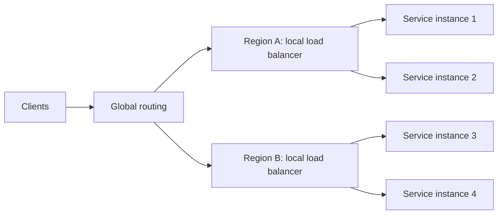
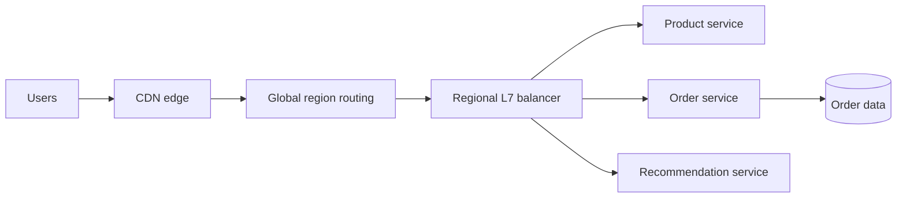

# Load Balancing and Traffic Distribution

## Table of Contents

- [Overview](#overview)
- [Where Balancing Happens](#where-balancing-happens)
  - [Layer 4 vs. Layer 7](#layer-4-vs-layer-7)
  - [Local vs. Global Traffic Distribution](#local-vs-global-traffic-distribution)
- [Backend Selection Algorithms](#backend-selection-algorithms)
- [Reverse Proxy vs. Load Balancer](#reverse-proxy-vs-load-balancer)
- [Common Reverse Proxy Functions](#common-reverse-proxy-functions)
- [CDNs and Origin Traffic](#cdns-and-origin-traffic)
- [TLS Termination](#tls-termination)
  - [How It Works](#how-it-works)
  - [Connection to the Backend](#connection-to-the-backend)
- [Session Affinity](#session-affinity)
- [Health Checks and Failover](#health-checks-and-failover)
- [Autoscaling with Load Balancing](#autoscaling-with-load-balancing)
- [Traffic Routing Policies](#traffic-routing-policies)
- [Worked Example: Flash Sale](#worked-example-flash-sale)
- [Design Checklist](#design-checklist)
- [Key Takeaways](#key-takeaways)
- [Further Reading](#further-reading)

## Overview

**Load balancing** distributes incoming connections, requests, or jobs among eligible backends. Its goals are to use capacity efficiently, avoid overloaded instances, and keep traffic flowing when individual backends fail.



> <u>Load balancing does not create capacity.</u> It distributes work across the capacity that exists. Autoscaling, admission control, caching, and backpressure address sustained overload.

The routing decision has two parts: **which group of backends is eligible** (for example, a region or service) and **which healthy backend within that group receives the work**. Health, performance, location, session state, and business rules may all affect that choice.

## Where Balancing Happens

### Layer 4 vs. Layer 7

**Layer 4 (L4)** balancers route TCP or UDP traffic using connection metadata such as IP addresses and ports. **Layer 7 (L7)** balancers understand application protocols such as HTTP and can route using hostnames, paths, headers, and cookies.

| Aspect | L4: transport level | L7: application level |
| --- | --- | --- |
| **Decision inputs** | IP, port, protocol, connection state | HTTP host, path, headers, cookies, request rules |
| **Suitable traffic** | TCP/UDP services, non-HTTP protocols | Web applications, APIs, service routing |
| **Visibility** | Usually cannot inspect encrypted HTTP content | Can inspect HTTP only when TLS terminates at or before this layer |
| **Typical strength** | Lower processing overhead; protocol agnostic | Fine-grained routing and application controls |
| **Typical trade-off** | No content-based HTTP routing | More processing and configuration complexity |

L4 can forward encrypted traffic without decrypting it. Some L4 products can also terminate TLS; *layer* and *TLS behavior* are separate design choices. L7 routing based on HTTP content requires access to the decrypted request.

### Local vs. Global Traffic Distribution

| Scope | Decision | Common mechanisms |
| --- | --- | --- |
| **Local** | Which instance in a region or cluster should handle this request? | Reverse proxy, service load balancer, service mesh |
| **Global** | Which region, data center, or edge location should receive this user? | DNS policies, anycast, global proxy, traffic manager |

Local balancing spreads work and provides instance-level failover. Global distribution can reduce network delay and support regional failover. A common path is **global region selection → regional load balancer → healthy service instance**.

> Global routing is a policy choice, not always “send everyone to the nearest region.” Data location, available capacity, regional features, and current health may matter more than distance.

DNS-based routing updates the answers given to *new* DNS lookups. Cached DNS answers and existing connections can keep using an old endpoint until they expire or reconnect, so DNS failover is not instantaneous.

## Backend Selection Algorithms

Selection algorithms operate on the *healthy, eligible* backend pool. Different algorithms work best for different request lengths and server capacities.

| Algorithm | Decision rule | Good fit | Main limitation |
| --- | --- | --- | --- |
| **Round robin** | Rotate through backends in order | Similar instances and roughly similar work | Ignores current load and request duration |
| **Weighted round robin** | Send more requests to higher-weight backends | Unequal instance capacity or controlled rollout | Weights need adjustment; request cost can vary |
| **Least connections** | Choose the backend with the fewest active connections | Long-lived or uneven connections | Connection count may not reflect CPU work |
| **Least response time** | Prefer a backend with lower observed latency, often with load considered | Latency-sensitive services | Noisy measurements can cause traffic shifts |
| **IP or key hash** | Map a stable key to a backend | Affinity or cache locality | NAT can group users; mapping changes when nodes change |

For weighted routing, an instance with weight $w_i$ receives approximately this share *over many requests* when all targets remain healthy:

$$
p_i \approx \frac{w_i}{\sum_{j=1}^{n} w_j}
$$

For example, weights `2:1` aim for roughly two-thirds of requests to the first instance and one-third to the second. They do not guarantee equal CPU use or exact percentages in a short sample. **Consistent hashing** can reduce remapping when a node joins or leaves, but it still requires a strategy for hot keys.

## Reverse Proxy vs. Load Balancer

A **reverse proxy** receives requests from clients and forwards them to backend services. **Load balancing** is the function of distributing traffic among multiple backends. One component can do both.

| Aspect | Reverse proxy | Load balancer |
| --- | --- | --- |
| **Primary purpose** | Act as an intermediary between clients and backends | Distribute traffic across backends |
| **Routing** | Forward requests using rules such as hostname or URL path | Select a backend using a policy such as round robin or least connections |
| **Backend count** | One or more | Usually multiple |
| **Typical functions** | TLS termination, caching, authentication, request routing | Traffic distribution, health checks, failover |
| **Typical layer** | Often application layer (Layer 7) | Transport layer (Layer 4) or application layer (Layer 7) |

> **Remember:** *Reverse proxy* describes a component's position and role in the request path; *load balancing* describes what it does with traffic. A reverse proxy need not balance traffic, and a load balancer may work as a reverse proxy.

Neither term requires a dedicated physical server. Implementations include software, hardware appliances, and managed cloud services.

## Common Reverse Proxy Functions

A reverse proxy can perform several functions at once:

1. **Load balancing:** Spread requests across healthy backend instances.
2. **API gateway:** Route API calls, authenticate clients, and enforce rate limits.
3. **Caching:** Serve stored responses without repeatedly calling the backend.
4. **Security filtering:** Apply access rules and block unwanted requests.
5. **TLS termination:** Handle the client-side HTTPS connection.
6. **Application routing:** Send requests to services based on hostname, path, or other request properties.

These are common capabilities, not mutually exclusive types. For example, the same proxy can terminate TLS, check authentication, and then balance requests across an application cluster.

## CDNs and Origin Traffic

A **content delivery network (CDN)** places edge servers near users. An edge can serve a cached response or fetch it from the **origin** (the application's source server). This reduces the distance and number of requests that reach the origin.

| Aspect | Regional reverse proxy | CDN edge |
| --- | --- | --- |
| **Typical placement** | In front of an application or service pool | Distributed near users |
| **Common job** | Route and protect application requests | Cache and deliver content; shield the origin |
| **Cacheable content** | Can cache selected responses | Often used for assets, and sometimes cacheable HTML or API responses |
| **On a cache miss** | Forwards to a backend | Fetches from the origin or another cache tier |

These are overlapping roles: a CDN edge is often itself a reverse proxy and may offer routing, security, and load-balancing features. A common path is **user → CDN edge → regional reverse proxy/load balancer → application**.

Cache only when the response is safe to reuse. Set appropriate cache keys, expiry, and invalidation rules; avoid sharing personalized or private content across users. A CDN also does not replace regional capacity planning for requests it cannot serve from cache.

## TLS Termination

**TLS termination** means the client's encrypted connection ends at an intermediary, such as a reverse proxy, load balancer, or API gateway. That intermediary decrypts the request before processing or forwarding it.

```text
Client ── HTTPS/TLS ──► Proxy or load balancer ── HTTP or new HTTPS/TLS ──► Backend
                      (client TLS connection ends here)
```

### How It Works

1. **Handshake:** The client establishes a TLS connection with the intermediary, which presents its certificate and proves its identity using the associated private key.
2. **Decryption:** The intermediary uses the negotiated *session keys* to decrypt request data.
3. **Processing:** It can inspect the request, apply routing or security rules, and choose a backend.
4. **Forwarding:** It sends the request to the backend over a separate connection, using HTTP or a new HTTPS connection.

> The private key is involved in authenticating the TLS endpoint during the handshake. In modern TLS, application traffic is decrypted with negotiated session keys, not directly with the certificate's private key.

### Connection to the Backend

| Mode | Client to intermediary | Intermediary to backend | Meaning |
| --- | --- | --- | --- |
| **TLS termination with HTTP upstream** | HTTPS | HTTP | The internal hop is unencrypted; use only where that is acceptable for the network and security requirements. |
| **TLS termination with re-encryption** | HTTPS | New HTTPS connection | Both network hops are encrypted, but the intermediary can still inspect the request. |
| **TLS pass-through** | HTTPS | Original TLS traffic forwarded | The backend terminates TLS; the intermediary does not decrypt the application request. |

TLS termination does **not** imply that traffic to the backend must be plaintext. Re-encryption establishes a separate TLS connection for that hop. Pass-through is a different design because TLS ends at the backend.

## Session Affinity

**Session affinity** (or a *sticky session*) tries to send repeat requests from the same client to the same backend. It can help when session state is kept in that backend's memory.

| Method | How it works | Caution |
| --- | --- | --- |
| **Cookie-based affinity** | A cookie identifies the preferred backend or routing group. | The client must retain the cookie; an unhealthy backend still needs failover. |
| **IP-based affinity** | A hash of the client IP selects a backend. | NAT, mobile networks, and proxies can make many users share one IP or change IPs. |
| **Shared session storage** | Any backend reads state from a common store. | The store itself needs capacity, availability, and expiry policies. |

Affinity can simplify a stateful application, but it makes load distribution less even and complicates scaling and failover. Prefer **stateless application instances plus shared or client-held session state** when practical. If affinity is necessary, plan for the backend to disappear mid-session.

## Health Checks and Failover

A balancer should send new work only to backends that can actually serve it. A running process is not necessarily a *ready* process: it may still be starting, overloaded, or disconnected from a critical dependency.

- **Active health checks:** The balancer sends periodic probes to each backend.
- **Passive health checks:** The balancer observes errors and timeouts from real requests.
- **Readiness checks:** Indicate whether an instance should receive new traffic.
- **Failure thresholds:** Require repeated probe failures or successes to avoid flapping.
- **Connection draining:** Stop new requests to a departing backend and allow in-flight work to finish.
- **Timeouts and bounded retries:** Detect failure while avoiding retry storms or duplicate writes.

```text
register → warm up → pass readiness check → receive traffic
                                   ↓
             fail health check or scale in → drain → remove
```

> A health check should reflect the operation being served. A shallow `/health` response can be green while checkout cannot reach its payment dependency. At the same time, making every health check depend on every downstream service can cause correlated mass failover.

At the global layer, failover may move users to another region. That region must have enough spare capacity and access to the data required for correct operation. Routing alone cannot preserve session state, synchronize databases, or guarantee zero downtime.

## Autoscaling with Load Balancing

**Autoscaling** adjusts the number of service instances; the **load balancer** discovers healthy instances and distributes traffic among them. Together they provide elastic capacity.

1. Demand rises, measured by a useful signal such as queue age, requests per instance, CPU, or latency.
2. The scaler adds instances. They start, warm up, and pass readiness checks.
3. The balancer begins sending them traffic.
4. When demand falls, instances are drained before removal.

A rough capacity estimate is:

$$
N_{needed} \approx \left\lceil \frac{\lambda}{\mu \rho_{target}} \right\rceil
$$

where $\lambda$ is incoming requests per second, $\mu$ is sustainable requests per second per instance, and $\rho_{target}$ is the desired utilization fraction. This is a planning approximation: real capacity depends on request mix, queues, startup time, and downstream bottlenecks.

| Scaling signal | Useful for | Watch out for |
| --- | --- | --- |
| **CPU or memory** | Compute-heavy or memory-bound services | May not reveal blocked I/O or queue growth |
| **Requests per instance** | Relatively uniform request workloads | Expensive requests are not equal to cheap ones |
| **Queue depth or age** | Background consumers | Deep queues can take time to drain after scaling |
| **Latency or saturation** | User-facing performance | Often rises after overload has already begun |

Keep headroom for bursts and failures. Scale-out has a delay, so use warm capacity or predictive scheduling for known peaks. Ensure the database, cache, and external services can handle the extra traffic; adding application instances does not scale every dependency.

## Traffic Routing Policies

**Routing policies choose a destination group**—a service, region, or release version. **Selection algorithms choose a backend inside that group.**

| Policy | Example | Main use |
| --- | --- | --- |
| **Path-based** | `/api/orders` → orders service | Route different endpoints to different services |
| **Host-based** | `admin.example.com` → admin service | Serve several applications through one entry point |
| **Latency-based** | Choose a region with lower measured network delay | Reduce user round-trip time |
| **Geographic** | Route by user location or declared market | Localization or regional policy |
| **Weighted** | 95% stable release, 5% new release | Canary rollout or gradual migration |
| **Failover** | Send traffic to a secondary region when the primary fails | Disaster recovery |

For a canary rollout, increase the new version's weight only after checking error rate, latency, and business outcomes. Keep a fast rollback path. Session affinity and caches can make the observed split differ from the configured weight.

> Geo routing can help apply regional policy, but it does not by itself guarantee data residency. Verify where requests, processing, logs, backups, and failover traffic actually go.

## Worked Example: Flash Sale

Suppose a retailer expects a short global traffic spike. Its request path could be:



- The **CDN** serves cacheable product assets, reducing origin requests.
- **Global routing** selects an allowed, healthy region. A secondary region is tested for capacity and data access before it is needed.
- The **regional L7 balancer** sends paths to the right services and excludes unhealthy instances.
- **Autoscaling** adds product or recommendation instances as demand rises; checkout retains reserved capacity and backpressure.
- A **weighted canary** sends a small share of recommendation requests to a new version. It rolls back if quality or error metrics worsen.
- **Session and order state** live outside individual application instances so instance replacement does not erase them.

This architecture improves resilience, but it cannot promise zero downtime. A database bottleneck, stale DNS answer, failed cross-region data dependency, or cache stampede can still affect users; each needs its own mitigation.

## Design Checklist

1. What is being balanced: TCP connections, HTTP requests, or queued jobs?
2. Is the decision local, global, or both? What are the allowed regions?
3. Does routing require HTTP content (L7), or is transport-level routing enough (L4)?
4. Which backends are eligible, and how is readiness measured?
5. Which algorithm fits request duration, instance capacity, and affinity needs?
6. Where does TLS terminate, and is the backend hop encrypted?
7. Which responses can be cached, and how are private responses isolated?
8. How are instances added, warmed up, drained, and removed?
9. What happens when one instance, region, or shared dependency fails?
10. Which metrics trigger scaling, failover, canary rollback, or load shedding?

## Key Takeaways

- Load balancing selects among **healthy, eligible backends**. It improves use of existing capacity; scaling and backpressure handle growth.
- L4 routing uses connection information; L7 routing can use HTTP details when the request is decrypted.
- Global routing chooses a region or edge; local balancing chooses an instance. DNS-based changes are limited by caching and existing connections.
- Algorithms, health checks, session state, and autoscaling must be designed together.
- A reverse proxy describes an intermediary role; load balancing describes traffic distribution. A CDN edge can also be a reverse proxy.
- TLS termination ends the client-side encrypted connection at the intermediary; the backend hop may use HTTP or a new HTTPS connection.
- Failover is only effective when the alternate destination has capacity, correct data, and a tested recovery path.

## Further Reading

- [NGINX: Using nginx as HTTP load balancer](https://nginx.org/en/docs/http/load_balancing.html)
- [F5: What is SSL termination?](https://www.f5.com/glossary/ssl-termination)
- [AWS: HTTPS listeners for Application Load Balancers](https://docs.aws.amazon.com/elasticloadbalancing/latest/application/create-https-listener.html)
- [NGINX: HTTP health checks](https://docs.nginx.com/nginx/admin-guide/load-balancer/http-health-check/)
- [AWS: Target health checks and draining](https://docs.aws.amazon.com/elasticloadbalancing/latest/application/target-group-health-checks.html)
- [AWS: DNS failover and TTL](https://docs.aws.amazon.com/Route53/latest/DeveloperGuide/resource-record-sets-values-failover.html)
- [Cloudflare: CDN caching basics](https://developers.cloudflare.com/cache/get-started/)
